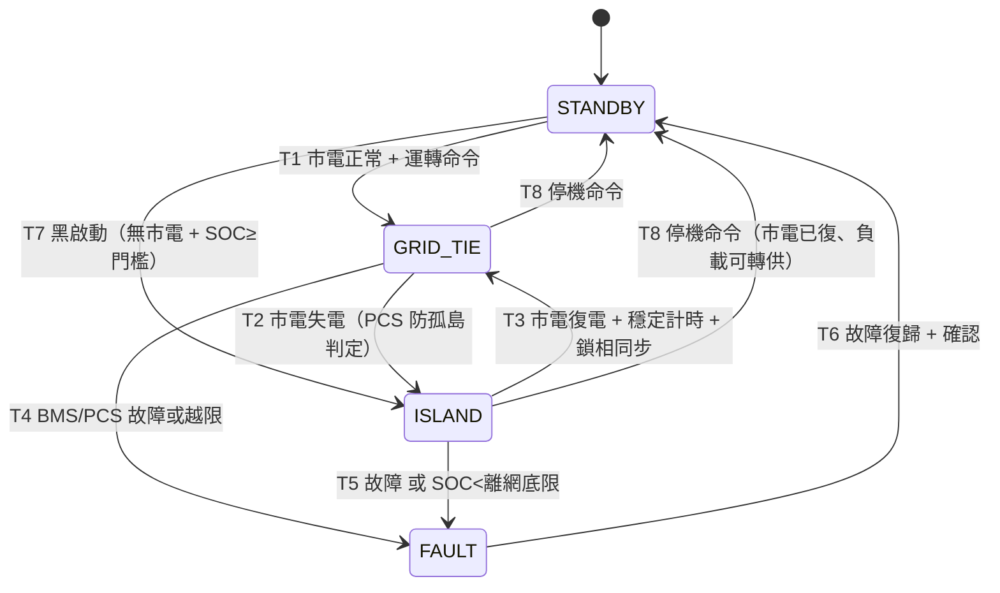

# BESS 運轉模式狀態機規格（併網 / 離網 / 故障）

> 範圍：微電網儲能系統（BESS）之 PCS **運轉模式**狀態機——待機、併網、離網、故障及其轉換。
> 狀態：**Draft**（控制策略討論稿）。對應 [`EMS-Microgrid-Functional-Boundary-Presentation`](../presentation/EMS-Microgrid-Functional-Boundary-Presentation.md) §2.2「最終控制策略規格」**尚未定案**——本文件為討論輸入，非交付承諾。
> 對齊：[`doc/PRD-架構設計-Guideline.md`](../PRD-架構設計-Guideline.md)；device_type 模型見 [ADR-021](../adr/ADR-021-device-type-closed-set-policy.md)；量測模型見 [ADR-011](../adr/ADR-011-device-signals-current-state.md) / [ADR-022](../adr/ADR-022-narrow-measurement-table.md)；圖採 Mermaid（同 `architecture/` 慣例）。
> 建立：2026-07-14

---

## 0. 與 ADR-010 的區別（先釐清，避免混淆）

本專案已有一個名為「狀態機」的 ADR。**兩者正交、不衝突**：

| | [ADR-010](../adr/ADR-010-device-state-machine.md) Device 狀態機 | 本規格 BESS 運轉模式狀態機 |
|---|---|---|
| 軸向 | 裝置在 registry 的**生命週期** | 儲能在能量/併網層面的**即時運轉模式** |
| 狀態 | `candidate/confirmed/active/maintenance/retired` | `STANDBY/GRID_TIE/ISLAND/FAULT` |
| 變更頻率 | 低（登錄、審核、退役） | 高（秒級～事件驅動） |
| 權威執行者 | device-service（DB CHECK 夾箝） | PCS/BESS 本地控制器 |

一台 `confirmed/active` 的 `battery` 裝置（ADR-021 device_type），其**運轉模式**在本狀態機的四狀態間切換。兩張狀態機同時成立。

---

## 1. 範圍與邊界（EMS vs 設備控制器）

**權威性**：本狀態機的**即時執行權威在 PCS/BESS 本地控制器**——含 grid-forming（組網）、鎖相（PLL）、黑啟動、<20 ms 無縫切換。這些是設備側即時控制，**不在 EMS 軟體平台內執行**。

**安全關鍵不屬 EMS**：防孤島**跳脫**、保護電驛整定屬保護層，對齊 presentation §2.2（「保護電驛設計」非 EMS scope）。EMS 只**觀測**電網狀態與模式，不承擔安全跳脫責任。

**EMS 在本狀態機的角色（兩階段，待邊界討論定案）**：

| 階段 | EMS 角色 | 具體行為 |
|---|---|---|
| **Phase 1 — 觀測** | 監看與記錄 | 訂閱/輪詢 BESS 當前 `mode` + SOC/SOH → 入時序庫、告警、儀表板 |
| **Phase 2 — 協調/派工** | 監督式調度 | 下達**模式偏好**、P/Q setpoint、備援 SOC 保留策略；**實際切換仍由 PCS 執行** |

**明確非目標**：本規格不定義保護電驛整定、併網審查、容量設計、PCS 內部控制迴路。

---

## 2. 狀態定義

| 狀態 | PCS 控制型態 | 說明 | 主要進入 / 離開 |
|---|---|---|---|
| `STANDBY` 待機 | 不輸出 | 監測、零充放、接觸器可開 | 開機自檢後進入；收運轉命令離開 |
| `GRID_TIE` 併網運轉 | 電流源**跟隨**市電 | 削峰 / 套利 / PV 自用 / 需量（子策略見 §7） | 市電正常 + 運轉命令；失電或故障離開 |
| `ISLAND` 離網供電 | 電壓源**組網**（V/f） | 市電中斷時撐重要負載；可黑啟動 | 失電偵測或黑啟動進入；復電同步併回離開 |
| `FAULT` 故障保護 | 停止、進安全態 | 開主接觸器、告警、鎖定 | 任一狀態越限進入；復歸後回 `STANDBY` |

> 「黑啟動」不獨立成狀態，視為 `STANDBY → ISLAND` 的一條進入路徑（T7）。

---

## 3. 狀態轉換圖

---

## 4. 轉換表（事件 / 守衛 / 動作 / 時限）

| # | 來源 → 目標 | 觸發事件 | 守衛條件 Guard | 動作 Action | 時限 |
|---|---|---|---|---|---|
| T1 | STANDBY → GRID_TIE | 運轉命令 | 市電正常、SOC 在可用帶、無故障 | 合併網點斷路器、PCS 併網跟隨、恢復 §7 策略 | — |
| T2 | GRID_TIE → ISLAND | 市電失電 | PCS 防孤島判定失電、須維持重要負載 | 斷併網點、PCS 轉組網 V/f、STS 切重要負載盤 | **<20 ms**（PCS 本地，無縫） |
| T3 | ISLAND → GRID_TIE | 市電復電 | 電壓/頻率回窗 + 穩定計時到 + 鎖相成功 | 同步後合併網點、PCS 轉跟隨、補電至備援 SOC | **復電計時 60 s ~ 5 min**（依併網規約） |
| T4 | GRID_TIE → FAULT | 故障/越限 | BMS 故障、過/欠壓、過溫、絕緣異常、PCS 告警 | 開主接觸器、進安全態、告警鎖定 | 立即 |
| T5 | ISLAND → FAULT | 故障 或 電量耗盡 | 同 T4，或 SOC≤離網底限且無 PV 補充 | 分層卸載非關鍵負載後開接觸器、安全態 | 立即 |
| T6 | FAULT → STANDBY | 復歸 | 故障排除 + OPS/自動確認 + 自檢通過 | 重置、回待機（不自動併網） | — |
| T7 | STANDBY → ISLAND | 黑啟動 | 無市電 + SOC≥黑啟門檻 + 人工/自動黑啟准許 | PCS 自建 V/f、帶重要負載 | — |
| T8 | GRID_TIE/ISLAND → STANDBY | 停機命令 | 功率降至零、安全條件滿足 | 零功率、開接觸器、待機 | — |

**失效安全（fail-safe）**：任何守衛不滿足、通訊逾時或看門狗逾時 → 一律導向 `FAULT`（開接觸器）。`FAULT → STANDBY` 之後**不自動**併網（T6 後需再走 T1），避免故障未清即復電。

---

## 5. SOC 分帶與備援保留

| 分界線 | 建議值 | 併網模式 | 離網模式 |
|---|---|---|---|
| 充電上限 `SOC_max` | 95% | 停充（留平衡餘裕） | 停充 |
| **併網放電下限 = 備援線** `SOC_reserve` | **25%** | 削峰/套利用到此為止 | — |
| 備援保留帶 | 25% → 10% | **鎖住不動** | 僅離網動用 |
| 離網卸載/停止 `SOC_island_floor` | 10% | — | 分層卸載、準備停機 |
| 硬底（電芯規格書） | 2.5 V ≈ 5% | BMS 禁放 | BMS 禁放 |

- 併網日常循環在 `SOC_max ↔ SOC_reserve`（95%↔25%，70% DoD）。
- 25%→10% 的 15% 是**留給停電的備援**；市電在但 SOC<`SOC_reserve` 時，EMS 優先補回備援線。
- 所有門檻加 **±3~5% 遲滯**防抖動（見 §9）。

---

## 6. 溫度 / 電氣安全夾箝（對接電芯規格書）

依電芯規格書 `A-CPS-7VH4L4-011`（GFL 7VH4L4 314 Ah LFP）之硬限，狀態機守衛與 EMS 功率命令**必須**服從：

| 條件 | 動作 | 出處 |
|---|---|---|
| cell 電壓 ≥ 3.65 V | 停充 | 規格書 §2.2.7 / §5.8.1 |
| cell 電壓 ≤ 2.5 V（>0°C）/ 2.0 V（≤0°C） | 停放 | §2.3.3 / §5.8.2-3 |
| cell 溫度 < 0°C | **禁充**（可放） | §2.1.4 / §5.11 |
| cell 溫度 > 45°C | 降載 | 運轉裕度 |
| cell 溫度 > 55°C | 暫停充放 | 運轉裕度 |
| cell 溫度 > 65°C | **關機**（→ FAULT） | §6.2 |

> **上位夾箝原則**：BMS 回報的「允許充放電流」（allowable charge/discharge current）為**最高夾箝**。EMS/PCS 的任何功率命令都先被它夾住，策略層（§7）不得越過。此原則與本專案 AI 有界自主（[ADR-015](../adr/ADR-015-ai-bounded-autonomy-correction-loop.md)）之「保護優先於策略」一致。

---

## 7. 併網模式優先權仲裁

`GRID_TIE` 下多目標並存時，EMS 依下列優先權排程（高 → 低）：

1. **安全 / 保護** — BMS 溫度、電壓、絕緣（永遠最高，§6）
2. **備援就緒** — 維持 `SOC_reserve`（§5）
3. **需量管理 / 削峰** — 通常 $ 價值最高
4. **時段套利** — 低價充、高價放
5. **PV 自用** — 吸收多餘光電（微電網含太陽能，presentation §3.1）
6. （選配）**電網輔助服務 / 調頻**

---

## 8. 介面與訊號（對接 EMS 資料模型）

訊號映射到 `device_signals`（[ADR-011](../adr/ADR-011-device-signals-current-state.md)）與窄表量測（[ADR-022](../adr/ADR-022-narrow-measurement-table.md)）；上行走 MQTT topic `ems/devices/{id}/measurements`（[ADR-007](../adr/ADR-007-mqtt-topic-naming.md)）。裝置類型對齊 [ADR-021](../adr/ADR-021-device-type-closed-set-policy.md)。

| 訊號 | 方向 | 來源 device_type | 協定 | 用途 |
|---|---|---|---|---|
| SOC / SOH / cell Vmax,Vmin / Tmax,Tmin | → EMS | `battery`（BMS） | Modbus/MQTT | 監控、夾箝、備援判斷 |
| allowable charge/discharge current | → EMS | `battery`（BMS） | Modbus | 功率命令上位夾箝（§6） |
| 當前 mode / grid status / P / Q | → EMS | `battery`（PCS） | Modbus/SunSpec | 模式觀測、功率量測 |
| PCC 輸入/輸出、電壓、頻率 | → EMS | `grid_meter` | Modbus | 削峰依據、失電輔判 |
| mode preference / P,Q setpoint / start-stop | EMS → | `battery`（PCS） | Modbus | **Phase 2** 協調派工 |
| STS 位置 / 切換命令 | ↔ EMS | STS | DI/DO 或 Modbus | 切換狀態觀測 |

> 微電網其他資產（`ev_charger` V2G、`solar_inverter`、燃料電池——presentation §3.1）以各自 device_type 併入同一觀測模型；本狀態機聚焦 `battery`，但 §7 的能量調度可跨資產（未來 PRD）。

---

## 9. 可調參數（Tunable Parameters）

下列參數應登錄於 [`doc/governance/tunable-parameters.md`](../governance/tunable-parameters.md)，不硬編碼：

| 參數 | 建議預設 | 備註 |
|---|---|---|
| `SOC_max` | 95% | 充電上限 |
| `SOC_reserve` | 25% | 併網放電下限 = 備援線 |
| `SOC_island_floor` | 10% | 離網卸載/停機 |
| `SOC_blackstart_min` | 30% | 黑啟動最低 SOC |
| `soc_hysteresis` | 3~5% | 防抖動 |
| `grid_return_qualify` | 60 s | 復電穩定計時（依台電規約可調） |
| `T_derate / T_pause / T_shutdown` | 45 / 55 / 65°C | 溫度階梯（§6） |

---

## 10. 開放問題（待邊界討論定案）

1. **EMS 執行 vs 觀測邊界**：Phase 1 只觀測，或直接進 Phase 2 派工？（對應 presentation §2.2 未定案控制策略）
2. **無縫切換 <20 ms** 明確歸 PCS 本地，EMS 不介入即時迴路——確認此邊界。
3. **防孤島跳脫**歸保護層（非 EMS）——確認保護與 EMS 觀測的分工。
4. **復電併回計時**依實際併網點台電規約（60 s ~ 5 min）待確認。
5. **多機並聯**（>1 PCS）離網下垂控制策略——未來擴充。
6. **備援 SOC 值**（25%）依案場停電時長需求校準。

---

## 11. 後續治理

- 本 Draft 若推進到「EMS 派工/協調」實作 → 依 Guideline 升格為 **PRD-0007** 或新增 **ADR-027**（架構決策），並觸發四文件同步（`api/openapi.yml` + `doc/operations/容器速查表.md` + `doc/operations/操作手冊.md` + 對應架構圖）。
- 本文件鎖定的關鍵設計（4 狀態、SOC 分帶、EMS 觀測優先、保護不歸 EMS）建議未來以 **ADR 正式化**（ADR 一經 Accepted 不可改、僅新增後續 ADR——見 `doc/adr/README.md`）。
- 安全相關（防孤島、離網組網）應同步登錄 [`risk-register`](../governance/risk-register.md) 與 [`threat-model`](../governance/threat-model.md)。
