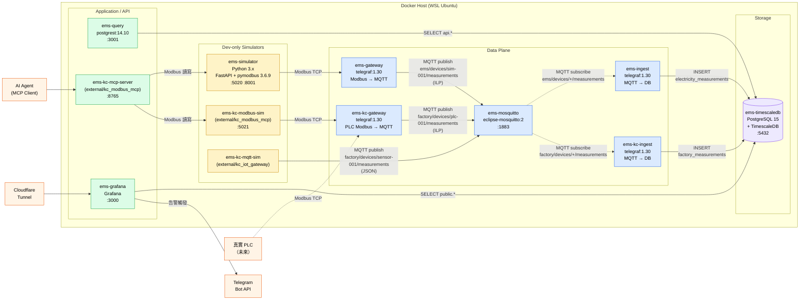

# C4 Level 2 — Container Diagram

> 範圍：EMS 內部所有容器（services + infra）、技術選型、部署位置、Owner。

## 容器索引

| 容器 | 鏡像 | 自寫? | 對外 Port | Owner | Rollback 影響 |
|------|------|------|----------|-------|--------------|
| ems-simulator | local build | ✅ Python | 5020, 8001 | EMS team | dev only |
| ems-gateway | telegraf:1.30 | ❌ config | — | EMS team | 電表流斷 |
| ems-kc-gateway | telegraf:1.30 | ❌ config | — | EMS team | 工廠流斷 |
| ems-mosquitto | eclipse-mosquitto:2 | ❌ | 1883 | EMS team | **全系統中斷** |
| ems-ingest | telegraf:1.30 | ❌ config | — | EMS team | 電表寫入停（Mosquitto QoS1 暫存）|
| ems-kc-ingest | telegraf:1.30 | ❌ config | — | EMS team | 工廠寫入停 |
| ems-timescaledb | timescale/pg15 | ❌ schema | 5432 | EMS team | **全系統中斷** |
| ems-query | postgrest:14.10 | ❌ env | 3001 | EMS team | 歷史查詢停 |
| ems-grafana | grafana | ❌ provisioning | 3000 | EMS team | Dashboard / Alerting 停 |
| ems-kc-modbus-sim | external/kc_modbus_mcp | external | 5021 | KC | dev only |
| ems-kc-mqtt-sim | external/kc_iot_gateway | external | — | KC | dev only |
| ems-kc-mcp-server | external/kc_modbus_mcp | external | 8765 | KC | AI 控制功能停 |

## 技術選型摘要（連結 ADR）

- 服務全採開源工具：[ADR-001](../adr/ADR-001-open-source-first.md)
- pymodbus 鎖 3.6.9：[ADR-002](../adr/ADR-002-pymodbus-version-pin.md)
- Telegraf request 新語法：[ADR-003](../adr/ADR-003-telegraf-modbus-request-syntax.md)
- PostgREST 連線格式：[ADR-004](../adr/ADR-004-postgrest-connection-string-format.md)
- DB schema 雙層隔離：[ADR-005](../adr/ADR-005-db-schema-isolation.md)
- KC 鏈路獨立：[ADR-006](../adr/ADR-006-kc-factory-separate-pipeline.md)
- MQTT topic 命名：[ADR-007](../adr/ADR-007-mqtt-topic-naming.md)
- Grafana 對外 Cloudflare Tunnel：[ADR-008](../adr/ADR-008-cloudflare-tunnel-grafana-public-access.md)

## 關鍵性等級

| 容器 | 失效衝擊 | 備援 |
|------|---------|------|
| timescaledb | 🔴 全系統中斷 | 無（單點，待補：streaming replica） |
| mosquitto | 🔴 全資料流斷 | 無（QoS1 短時暫存） |
| gateway / kc-gateway | 🟠 該域資料流斷 | 無 |
| ingest / kc-ingest | 🟡 短時延遲（QoS1 buffer） | 無 |
| grafana | 🟢 視覺化停，資料仍寫入 | 無 |
| query (postgrest) | 🟢 歷史查詢停 | 可重啟 |
| simulator | 🟢 測試流斷 | 無（dev only） |
