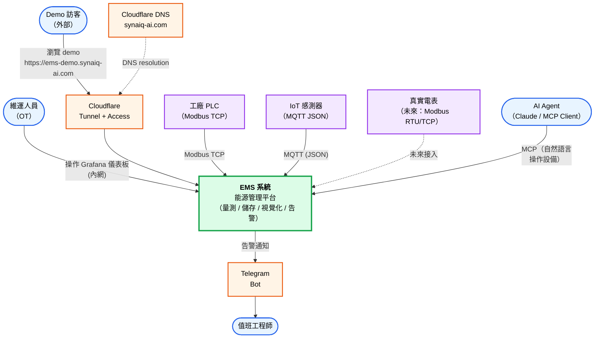

# C4 Level 1 — System Context

> 範圍：EMS 作為一個整體，與外部 Actor / System 的互動關係。

## 圖例與說明

| 顏色 | 類別 | 範例 |
|------|------|------|
| 🟦 藍 | Human Actor | 維運、訪客、值班 |
| 🟧 橘 | External System | Cloudflare、Telegram |
| 🟩 綠 | The System (EMS) | 本次設計範圍 |
| 🟪 紫 | External Device | PLC、感測器、電表 |

## 關鍵互動

| 互動 | 通道 | 同步性 | 認證 |
|------|------|--------|------|
| 維運操作 Grafana | HTTP 內網 | 同步 | Grafana 帳密 |
| Demo 訪客瀏覽 | HTTPS / Cloudflare | 同步 | One-time PIN（CF Access） |
| PLC 量測上行 | Modbus TCP | 輪詢（同步） | 無（內網） |
| MQTT 感測器上行 | MQTT | 非同步 | 目前 anonymous（dev） |
| 告警下行 | Telegram Bot API | 非同步 | Bot Token |
| AI Agent 控制 | MCP（HTTP/stdio） | 同步 | Token（待強化） |

## 邊界備註

- 本圖為 **L1 概念圖**，不畫容器/服務細節（見 `c4-container.md`）
- 「未來接入」的真實電表已在 ADR-006 規劃同模式（domain-pipeline）擴展
- Cloudflare Tunnel 為 outbound long-poll，**不開 inbound port**（見 ADR-008）
