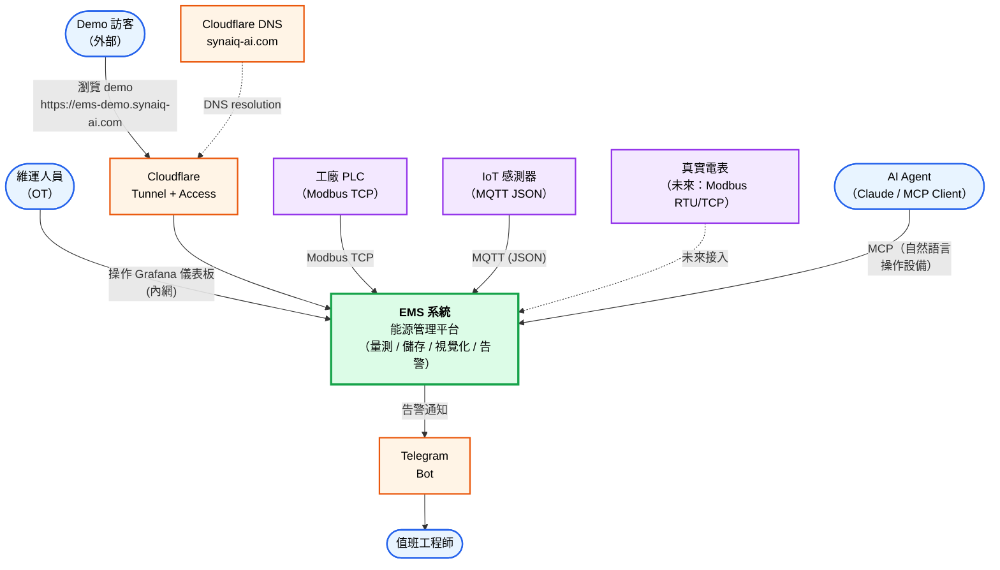
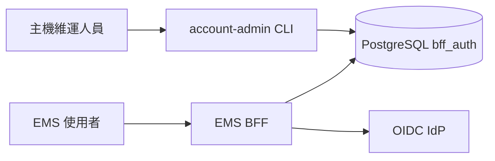

# C4 Level 1 — System Context

> 範圍：EMS 作為一個整體，與外部 Actor / System 的互動關係。

```mermaid
flowchart TB
    %% Actors
    operator(["維運人員<br/>（OT）"])
    demo_user(["Demo 訪客<br/>（外部）"])
    ai_agent(["AI Agent<br/>（Claude / MCP Client）"])
    oncall(["值班工程師"])

    %% External Systems
    cf["Cloudflare<br/>Tunnel + Access"]
    telegram["Telegram<br/>Bot"]
    cf_dns["Cloudflare DNS<br/>synaiq-ai.com"]

    %% External Devices (現/將來)
    meters["真實電表<br/>（未來：Modbus RTU/TCP）"]
    plc["工廠 PLC<br/>（Modbus TCP）"]
    sensors["IoT 感測器<br/>（MQTT JSON）"]

    %% The system
    ems["<b>EMS 系統</b><br/>能源管理平台<br/>（量測 / 儲存 / 視覺化 / 告警）"]

    operator -- "操作 Grafana 儀表板<br/>(內網)" --> ems
    demo_user -- "瀏覽 demo<br/>https://ems-demo.synaiq-ai.com" --> cf
    cf --> ems
    cf_dns -. "DNS resolution" .-> cf

    plc -- "Modbus TCP" --> ems
    sensors -- "MQTT (JSON)" --> ems
    meters -. "未來接入" .-> ems

    ai_agent -- "MCP（自然語言<br/>操作設備）" --> ems

    ems -- "告警通知" --> telegram
    telegram --> oncall

    classDef actor fill:#e8f4ff,stroke:#2563eb,stroke-width:2px,color:#000
    classDef external fill:#fff4e6,stroke:#ea580c,stroke-width:2px,color:#000
    classDef system fill:#dcfce7,stroke:#16a34a,stroke-width:3px,color:#000
    classDef device fill:#f3e8ff,stroke:#9333ea,stroke-width:2px,color:#000

    class operator,demo_user,ai_agent,oncall actor
    class cf,telegram,cf_dns external
    class ems system
    class meters,plc,sensors device
```

## 圖例與說明

| 顏色 | 類別 | 範例 |
|------|------|------|
| 🟦 藍 | Human Actor | 維運、訪客、值班 |
| 🟧 橘 | External System | Cloudflare、Telegram |
| 🟩 綠 | The System (EMS) | 本次設計範圍 |
| 🟪 紫 | External Device | PLC、感測器、電表 |

## 關鍵互動

| 互動 | 通道 | 同步性 | 認證 |
|------|------|--------|------|
| 維運操作 Grafana | HTTP 內網 | 同步 | Grafana 帳密 |
| Demo 訪客瀏覽 | HTTPS / Cloudflare | 同步 | One-time PIN（CF Access） |
| PLC 量測上行 | Modbus TCP | 輪詢（同步） | 無（內網） |
| MQTT 感測器上行 | MQTT | 非同步 | 目前 anonymous（dev） |
| 告警下行 | Telegram Bot API | 非同步 | Bot Token |
| AI Agent 控制 | MCP（HTTP/stdio） | 同步 | Token（待強化） |

## 邊界備註

- 本圖為 **L1 概念圖**，不畫容器/服務細節（見 `c4-container.md`）
- 「未來接入」的真實電表已在 ADR-006 規劃同模式（domain-pipeline）擴展
- Cloudflare Tunnel 為 outbound long-poll，**不開 inbound port**（見 ADR-008）

## 2026-09-23 歷史查詢擴充（ADR-027）
既有資料流不变：Browser → BFF（OPS session）→ device-service（gateway解析）→ PostgREST（唯讀RPC）→ TimescaleDB。新增有界history/records，無OT控制、無新容器、無既有table修改；詳PRD-0018。
### Telegram 示範警報（PRD-0019 / ADR-028）
維運使用者 → EMS 警報中心 → Telegram Bot API → 既有私人接收對象。跨外部 IT 邊界只傳固定 DEMO 訊息、事件 UUID 與時間，不含設備讀值/登入資料，不涉及 OT 控制。

## Delta OT 邊界（PRD-0020 / ADR-029）
Delta設備透過本地TCP或隔離RS485 RTU由Pi唯讀採集；SIM7600G-H提供OS層4G outbound IP。Pi只傳MQTT telemetry至EMS，不接收遠端控制。硬體、TLS入口及接收端payload身份綁定待現場驗收。

### RTU 實體模擬邊界（ADR-031）
在測試環境，PC原生Delta simulator透過指定串口扮演設備從站，Pi為唯一主站；兩顆隔離USB–RS485連接。PC模擬器不開網路listener；Pi以既有outbound網路路徑進入EMS。真實逆變器與模擬來源不可使用同一上傳身分。

### Simulator 控制邊界（PRD-0022 / ADR-033）
OPS → BFF session/Origin → 四個固定 demo simulator。真設備與 Pi edge 不在控制 registry。
本文件先前「AI/MCP 操作模擬器」寫入路徑由此取代；MCP 對 demo Modbus 僅讀。

## PRD-0023：本機帳號管理

```mermaid
flowchart LR
  Operator[主機維運人員] --> CLI[account-admin CLI]
  User[EMS 使用者] --> BFF[EMS BFF]
  CLI --> AuthDB[(PostgreSQL bff_auth)]
  BFF --> AuthDB
  BFF --> IdP[OIDC IdP]
```
帳號資料不再從 .env 提供；OIDC 維持既有流程。詳 PRD-0023 / ADR-035。
