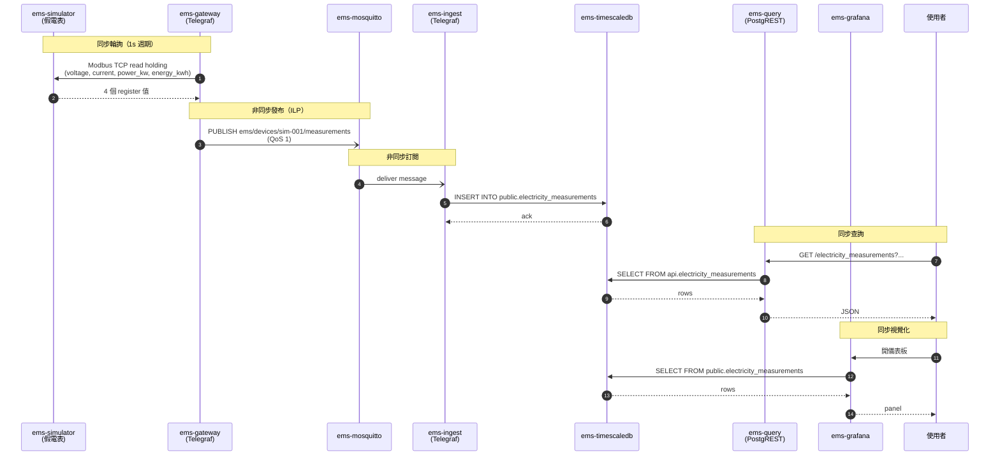
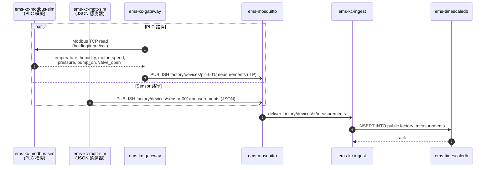
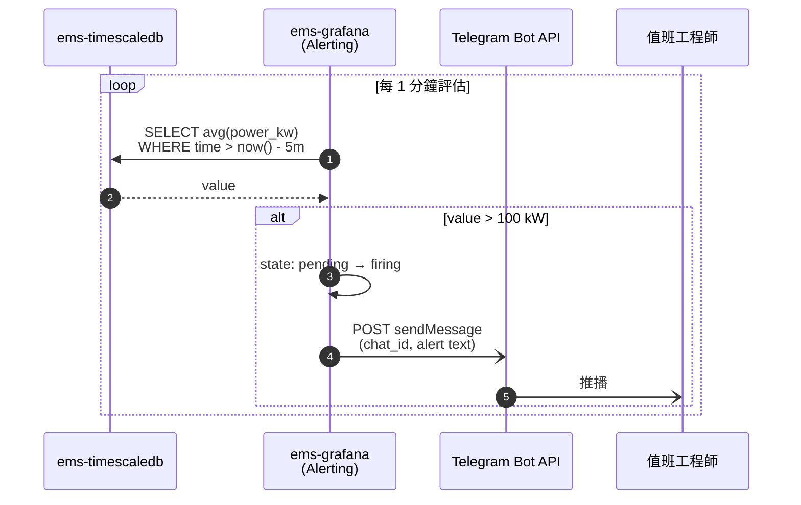
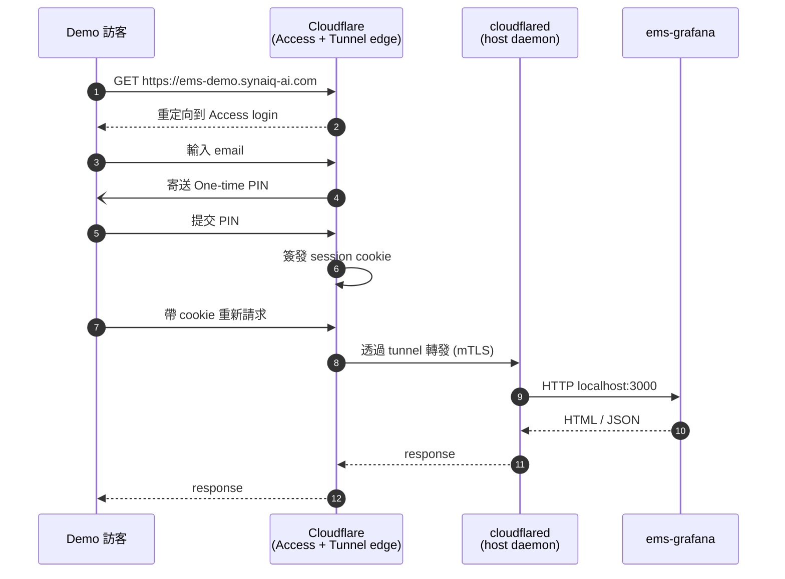
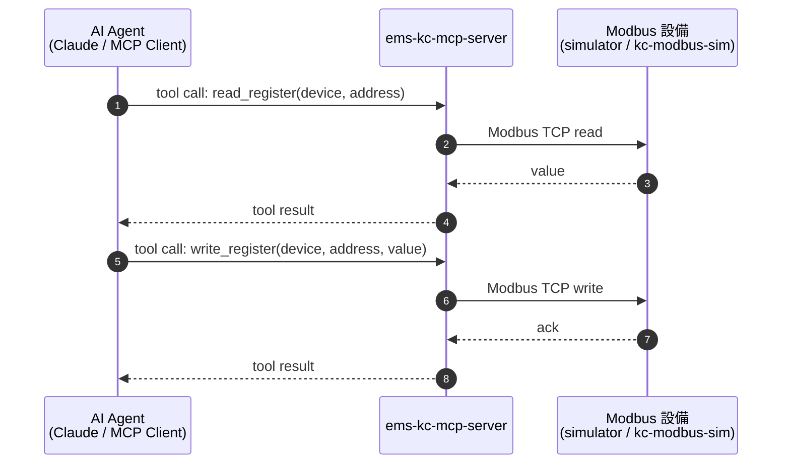

# Data Flow Diagram

> 範圍：關鍵業務流程的資料流向。實線 = 同步、虛線 = 非同步 / event-driven。

## 流程一：量測資料上行（電表）

## 流程二：工廠 PLC 資料上行

## 流程三：告警觸發與通知

## 流程四：Demo 訪客存取（Cloudflare Tunnel）

## 流程五：AI Agent 控制設備（MCP）

## 同步性與資料一致性摘要

| 路徑 | 模式 | 一致性等級 | 失效行為 |
|------|------|-----------|---------|
| Gateway → MQTT | 非同步、QoS 1 | At-least-once | broker 重啟 → 短時暫存後續傳，重啟期間發布的訊息可能丟 |
| MQTT → Ingest → DB | 非同步、5s flush buffer | At-least-once | ingest 強殺 → 丟最後 5 秒 buffer |
| Query / Grafana → DB | 同步 | Read-after-write | DB 慢 → 查詢逾時 |
| Grafana → Telegram | 非同步 | Best-effort | Telegram 不可達 → 告警丟（無重試佇列） |
| MCP → Modbus | 同步 | Strong（單次寫） | 設備斷線 → tool call 失敗 |

## 邊界備註

- 所有 ILP timestamp 採 broker 端產生（Telegraf 預設），非設備端時間
- TimescaleDB 為 hypertable，**append-only**；資料不可變更，僅可整批刪除（保留期管理）
- 所有 measurement 表的 `time` 欄為 PRIMARY KEY 一部分，重複時間 ingest 會以最後到者為準（PostgREST 寫入路徑暫關閉，因此實務不會發生衝突）
