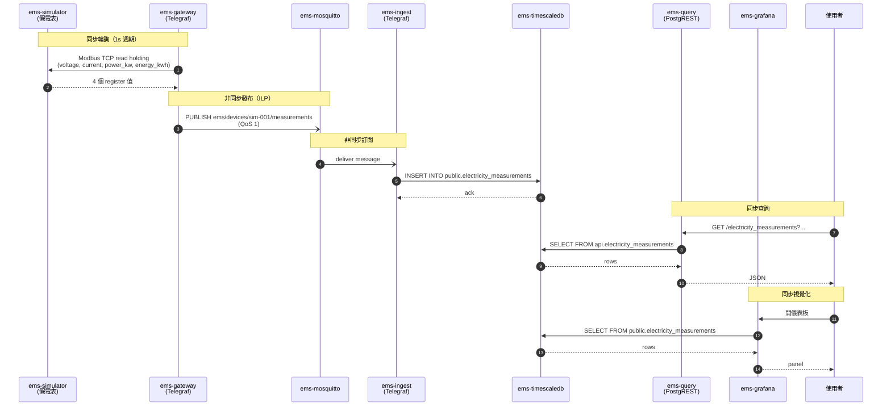
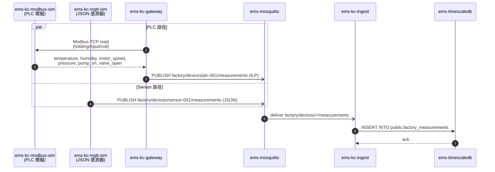
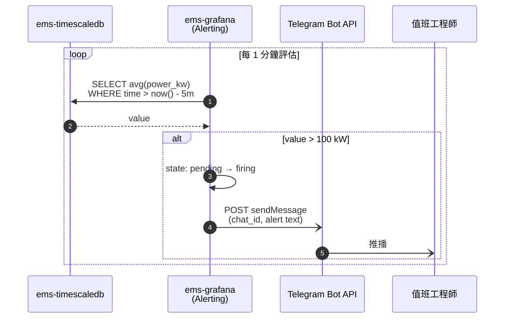
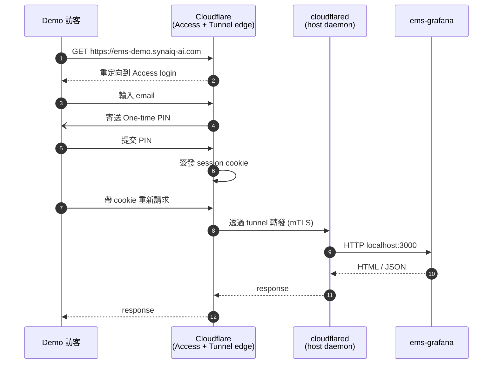
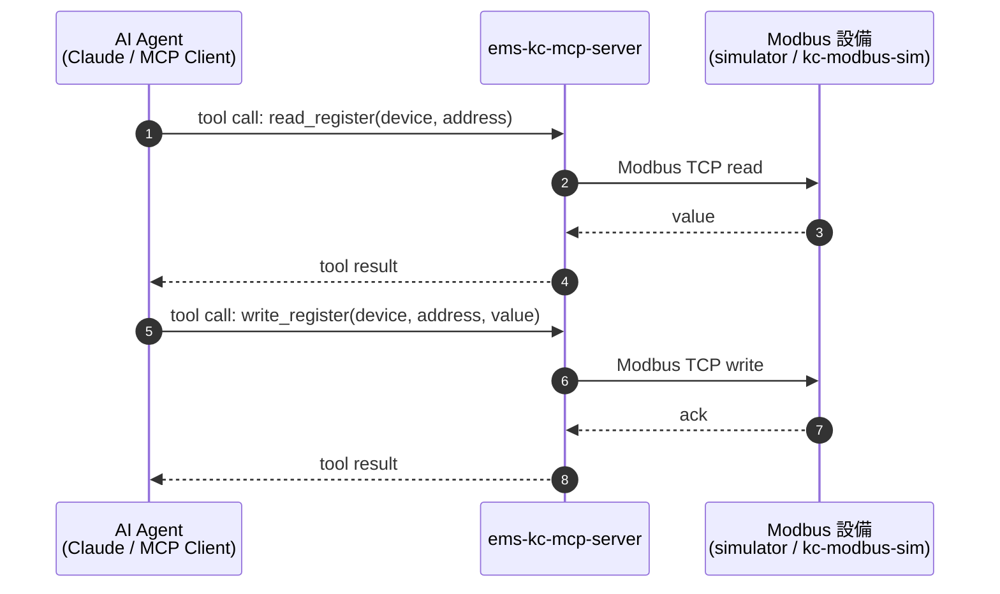
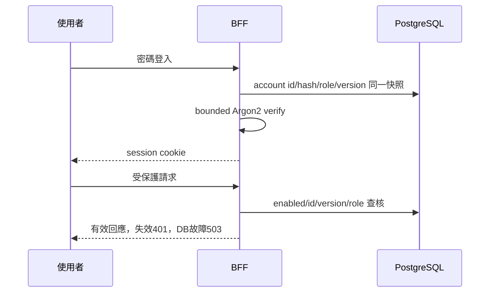

# Data Flow Diagram

> 範圍：關鍵業務流程的資料流向。實線 = 同步、虛線 = 非同步 / event-driven。

## 流程一：量測資料上行（電表）

```mermaid
sequenceDiagram
    autonumber
    participant SIM as ems-simulator<br/>(假電表)
    participant GW as ems-gateway<br/>(Telegraf)
    participant MQ as ems-mosquitto
    participant IN as ems-ingest<br/>(Telegraf)
    participant DB as ems-timescaledb
    participant API as ems-query<br/>(PostgREST)
    participant GF as ems-grafana
    participant USER as 使用者

    Note over SIM,GW: 同步輪詢（1s 週期）
    GW->>SIM: Modbus TCP read holding<br/>(voltage, current, power_kw, energy_kwh)
    SIM-->>GW: 4 個 register 值

    Note over GW,MQ: 非同步發布（ILP）
    GW-)MQ: PUBLISH ems/devices/sim-001/measurements<br/>(QoS 1)

    Note over MQ,IN: 非同步訂閱
    MQ-)IN: deliver message
    IN->>DB: INSERT INTO public.electricity_measurements
    DB-->>IN: ack

    Note over USER,API: 同步查詢
    USER->>API: GET /electricity_measurements?...
    API->>DB: SELECT FROM api.electricity_measurements
    DB-->>API: rows
    API-->>USER: JSON

    Note over USER,GF: 同步視覺化
    USER->>GF: 開儀表板
    GF->>DB: SELECT FROM public.electricity_measurements
    DB-->>GF: rows
    GF-->>USER: panel
```

## 流程二：工廠 PLC 資料上行

```mermaid
sequenceDiagram
    autonumber
    participant PLC as ems-kc-modbus-sim<br/>(PLC 模擬)
    participant SENSOR as ems-kc-mqtt-sim<br/>(JSON 感測器)
    participant KGW as ems-kc-gateway
    participant MQ as ems-mosquitto
    participant KIN as ems-kc-ingest
    participant DB as ems-timescaledb

    par PLC 路徑
        KGW->>PLC: Modbus TCP read<br/>(holding/input/coil)
        PLC-->>KGW: temperature, humidity, motor_speed,<br/>pressure, pump_on, valve_open
        KGW-)MQ: PUBLISH factory/devices/plc-001/measurements (ILP)
    and Sensor 路徑
        SENSOR-)MQ: PUBLISH factory/devices/sensor-001/measurements (JSON)
    end

    MQ-)KIN: deliver factory/devices/+/measurements
    KIN->>DB: INSERT INTO public.factory_measurements
    DB-->>KIN: ack
```

## 流程三：告警觸發與通知

```mermaid
sequenceDiagram
    autonumber
    participant DB as ems-timescaledb
    participant GF as ems-grafana<br/>(Alerting)
    participant TG as Telegram Bot API
    participant ONCALL as 值班工程師

    loop 每 1 分鐘評估
        GF->>DB: SELECT avg(power_kw)<br/>WHERE time > now() - 5m
        DB-->>GF: value
        alt value > 100 kW
            GF->>GF: state: pending → firing
            GF-)TG: POST sendMessage<br/>(chat_id, alert text)
            TG-)ONCALL: 推播
        end
    end
```

## 流程四：Demo 訪客存取（Cloudflare Tunnel）

```mermaid
sequenceDiagram
    autonumber
    participant USER as Demo 訪客
    participant CF as Cloudflare<br/>(Access + Tunnel edge)
    participant CFD as cloudflared<br/>(host daemon)
    participant GF as ems-grafana

    USER->>CF: GET https://ems-demo.synaiq-ai.com
    CF-->>USER: 重定向到 Access login
    USER->>CF: 輸入 email
    CF-)USER: 寄送 One-time PIN
    USER->>CF: 提交 PIN
    CF->>CF: 簽發 session cookie
    USER->>CF: 帶 cookie 重新請求
    CF->>CFD: 透過 tunnel 轉發 (mTLS)
    CFD->>GF: HTTP localhost:3000
    GF-->>CFD: HTML / JSON
    CFD-->>CF: response
    CF-->>USER: response
```

## 流程五：AI Agent 控制設備（MCP）

```mermaid
sequenceDiagram
    autonumber
    participant AI as AI Agent<br/>(Claude / MCP Client)
    participant MCP as ems-kc-mcp-server
    participant DEV as Modbus 設備<br/>(simulator / kc-modbus-sim)

    AI->>MCP: tool call: read_register(device, address)
    MCP->>DEV: Modbus TCP read
    DEV-->>MCP: value
    MCP-->>AI: tool result

    AI->>MCP: tool call: write_register(device, address, value)
    MCP->>DEV: Modbus TCP write
    DEV-->>MCP: ack
    MCP-->>AI: tool result
```

## 同步性與資料一致性摘要

| 路徑 | 模式 | 一致性等級 | 失效行為 |
|------|------|-----------|---------|
| Gateway → MQTT | 非同步、QoS 1 | At-least-once | broker 重啟 → 短時暫存後續傳，重啟期間發布的訊息可能丟 |
| MQTT → Ingest → DB | 非同步、5s flush buffer | 非durable端到端保證 | ingest 強殺 → 丟最後 5 秒 buffer |
| Query / Grafana → DB | 同步 | Read-after-write | DB 慢 → 查詢逾時 |
| Grafana → Telegram | 非同步 | Best-effort | Telegram 不可達 → 告警丟（無重試佇列） |
| MCP → Modbus | 同步 | Strong（單次寫） | 設備斷線 → tool call 失敗 |

## 邊界備註

- ILP timestamp 由採集端提供：既有Telegraf gateway使用採集時間；Delta edge使用來源UTC時間且重送不改。MQTT broker不產生或改寫ILP時間戳
- TimescaleDB 為 hypertable，**append-only**；資料不可變更，僅可整批刪除（保留期管理）
- 以目前init.sql為準，electricity_measurements沒有PRIMARY/UNIQUE key；重複時間可能新增重複列，不能宣稱最後到者覆寫或exactly-once

## 2026-09-23 歷史查詢擴充（ADR-027）
既有資料流不变：Browser → BFF（OPS session）→ device-service（gateway解析）→ PostgREST（唯讀RPC）→ TimescaleDB。新增有界history/records，無OT控制、無新容器、無既有table修改；詳PRD-0018。
### 示範通知（PRD-0019）
`POST /api/alarms/demo {request_id:UUID4}` → session/OPS/Origin/schema → 全域冷卻與 UUID 去重 → Telegram sendMessage → 驗證 HTTP 200 + ok + message_id + chat.id → 回傳 sent/固定錯誤。8 秒上限、不自動重送；GET 僅回最近十筆成功紀錄與冷卻，重啟清空。

## Delta 來源時間與斷線回補（PRD-0020 / ADR-029）
Delta→FC04 parser→來源UTC時間→SQLite→QoS1 MQTT→既有Telegraf→DB→BFF/Monitor。採集和sender分執行緒；重送保留payload與時間，只有對應PUBACK才刪除。PUBACK非資料庫commit，既有ingest buffer仍可能丟失、DB仍可能重複。僅持久化L1 V/A、總kW、累計kWh；其他decoded資料止於CLI/未ACKsnapshot。

### RTU 模擬資料流（ADR-031）
Pi主站FC04 request → USB–RS485 #2 → bus → PC USB–RS485 #1 → simulator從站 → raw registers + RTU CRC原路回應 → Pi既有parser → SQLite → MQTT → 後台 → EMS。站號1–247單一站；其他站號/廣播/錯CRC不回應，非法讀寫不能改資料。後續PUBACK/DB限制沿用ADR-029。

### 統一 simulator 控制（ADR-033，取代流程五的模擬器寫入）
OPS + Origin + typed command/CAS → BFF SQLite commit intent → 內部token agent → atomic apply/revision/receipt → SQLite commit outcome。
timeout/crash → unknown、封鎖該台後續指令；receipt證明成功才補記，換instance只解除封鎖不假稱成功。查詢目前設定相同不算對帳證據。
既有電表/PLC/sensor/Delta上行topic及schema不改；applied不表示遙測已落DB。PLC原有不同register request會產生分欄資料列，查單欄最新值須排除不含該欄的資料列。

## PRD-0023：帳號與 session

```mermaid
sequenceDiagram
  participant U as 使用者
  participant B as BFF
  participant D as PostgreSQL
  U->>B: 密碼登入
  B->>D: account id/hash/role/version 同一快照
  B->>B: bounded Argon2 verify
  B-->>U: session cookie
  U->>B: 受保護請求
  B->>D: enabled/id/version/role 查核
  B-->>U: 有效回應，失效401，DB故障503
```
管理異動與 audit 共用 transaction；READ COMMITTED + advisory lock 防止最後 OPS 並行停用。Argon2 工作完成後才釋放slot，HTTP取消不提前解除資源上限。
