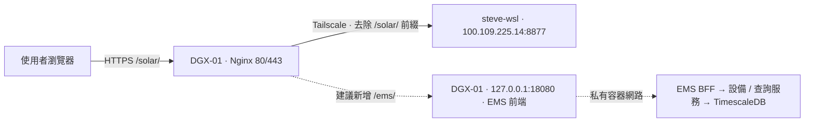

# DGX-01 網站部署調查與 EMS 上線方案

調查日期：2026-09-23。狀態：已使用 `nick` 登入 DGX-01，完成唯讀調查；未部署 EMS、未變更閘道、未新增 SSH 授權金鑰。

## 1. 結論

`https://synaiq-ai.com/solar/` 的 HTTPS 入口確實在 DGX-01；Solar 應用本身位於另一台 `steve-wsl`。DGX-01 以 Docker Nginx 反向代理，經 Tailscale 將 `/solar/` 轉送到 `http://100.109.225.14:8877/`，並去掉 `/solar/` 前綴。

EMS 可以新增獨立 `/ems/` 路由並共用現有憑證，不需另開網域或將 EMS 的資料庫/API 管理埠公開。建議把 EMS 前端、BFF、設備服務、查詢服務與資料庫部署成 DGX-01 上的獨立 Compose 專案，避免使用者電腦關機導致網站離線。這是待實作方案，尚未完成 ARM64 建置或上線驗證。

## 2. 已核實的現況

| 項目 | 實際結果 / 證據 |
| --- | --- |
| 公開網址 | `GET https://synaiq-ai.com/solar/` 回應 200，標題「光電模擬與設計」 |
| 登入邊界 | `GET /solar/api/me` 回應 401；未執行登入或寫入 Solar 資料 |
| 公開 DNS | `synaiq-ai.com` A 記錄為 `114.35.86.211`；未稽核外部 NAT/路由器設定 |
| SSH / Tailscale | `nick@100.64.84.58` 密碼登入成功；主機 `prod-dgx-01`，Tailscale 在線 |
| 主機架構 | NVIDIA DGX Spark，`aarch64`，DGX OS 7.3.1，Linux 6.14.0-1015-nvidia |
| 網站入口容器 | `dgx-gateway-nginx`，映像 `nginx:stable-alpine`，host network，restart=always |
| HTTPS / 憑證 | Nginx 监听 80/443；80 除 ACME 外轉 HTTPS；使用既有 Let's Encrypt 憑證 |
| Certbot | `dgx-gateway-certbot` 已運作，restart=always；自動續約流程見既有 handover 文件，本次未觸發續約 |
| 閘道 Compose | `/home/nick/projects/YIYI-Global-Gateway/docker-compose.yml`（容器 Compose label 驗證） |
| 實際生效站點設定 | `/home/nick/projects/YIYI-Global-Gateway/config/nginx/conf.d/synaiq-ai.com.conf` |
| Nginx 設定掛載 | 主機 `config/nginx` → 容器 `/etc/nginx` |
| Solar 路由 | 站點設定第 330 行 `/solar` redirect；第 332–333 行 `/solar/` proxy → `100.109.225.14:8877/` |
| Solar 上游 | Tailscale peer 證實 `100.109.225.14` 為 `steve-wsl`，在線；從 DGX GET 首頁 200、`/api/me` 401 |
| 設定檢查 | `docker exec dgx-gateway-nginx nginx -t` 成功 |
| 閘道工作目錄 | 已有多筆未提交修改與備份；本次全部保留，不能用 git reset/checkout 或整檔覆蓋更新 |
| 可用空間 | 根檔案系統約 459 GiB 可用（當下快照） |
| 可用記憶體 | `free -h` 顯示 MemAvailable 約 10 GiB、Swap 已用約 2.5 GiB；AI/GPU 工作負載會變動，不能把 Docker 個別容器用量相加當作可用量 |
| 建議 EMS 私有入口埠 | 調查時 18080 未监听；實際部署前須重查，僅綁 `127.0.0.1:18080` |



虛線是提議中的 EMS 路徑，並非既有服務。Solar 的 systemd/Compose 啟動方式、原始碼目錄與發布流程位於 steve-wsl，本次沒有登入該主機，故未查證。

## 3. 現有網站如何更新

1. 生效設定是上述 `config/nginx/conf.d/synaiq-ai.com.conf`，不是主機原生 Nginx 的舊備份。主機 `systemctl is-active nginx` 為 inactive，實際入口由容器提供。
2. Compose 將整個 Nginx 設定目錄 bind mount 進容器。更新路由可在備份目前檔案後作局部修改，再 `nginx -t`，通過後只 reload Nginx；不需重建映像、不需停止整個 gateway Compose。
3. 既有文件 `/home/nick/projects/YIYI-Global-Gateway/docs/handover.md` 第 673、676 行列出設定驗證與 reload；文件亦記錄 Certbot webroot 續約方式。
4. 已存在 `config/nginx/backup/` 與多個站點備份。EMS 應新增自己的具時間戳備份，不能用其他歷史備份覆蓋目前仍在運作的路由。
5. 這個 gateway 同時承載其他網站與服務。改動應限定在新 `/ems/` 區塊；不能直接執行 gateway `docker compose down`。

## 4. SSH 登入方式與金鑰狀態

已實際使用以下方式登入：

```sh
ssh nick@100.64.84.58
```

啟用 Tailscale / MagicDNS 的環境亦可使用 `prod-dgx-01` 名稱；IP 方式已確認可用。

主機 ED25519 公鑰指紋：`SHA256:2tJO+DmA0HeG5UmWiOKDwUytXBqFd0jXwmlfJGiOLy8`（由登入後 `/etc/ssh/ssh_host_ed25519_key.pub` 核實）。

`~/.ssh` 權限 700、`authorized_keys` 權限 600，均屬 nick。現有 authorized_keys 只有一行監控用 ED25519 金鑰，指紋 `SHA256:ZfSQt9GK4JDADKmbDZiJQPIDcXm6UtbVfCqpDoKr6p8`。目前 Windows 與 WSL 的既有 ED25519 公鑰同為 `SHA256:g1PXrqe0wQo4wWEKIuE79DKNs+lN5tGBZTt01ThX4d4`，未列入遠端授權，因此先前以既有金鑰登入失敗。

後續自動發布可採專用部署金鑰：僅把公鑰追加到 nick 的 authorized_keys，保留既有監控金鑰，再以 `BatchMode=yes` 測試。私鑰留在發佈端，不上傳、不納入 repo；本次未產生或註冊新金鑰，未更改 sshd。密碼未寫入本文件、腳本或環境檔。

## 5. EMS 目前不能直接複製上線的地方

### 實際要部署的前端

使用者目前看到的新畫面位於：

- `output/ems-design-preview-20260923/public/`
- 即時 / 歷史頁：`public/live/Monitor.html` 與 `history-live.mjs`
- 本機預覽伺服器：`output/ems-design-preview-20260923/server.mjs`，綁 loopback 4178

現有 `frontend/Dockerfile` 建置的是 `frontend/` React 專案，不包含上述新版預覽。直接執行原本 `frontend-prod` 會部署不同畫面。

上線包必須明確包含目前已驗證的圖表與歷史頁；保留其他示範頁的「示範資料」標示，不能把示範數值描述為即時設備數據。

### 子路徑、登入與 CSP

- `history-live.mjs` 現在使用根路徑 `/api/...`。部署到 `/ems/` 時須改成可配置且一致的 `/ems/api/...`，再由 gateway 去掉 `/ems/`。不能碰到既有網站根目錄的 `/api/`。
- 同步檢查 iframe、導覽、資源、下載與重新整理路徑；預覽中的相對/根路徑不能僅以首頁成功判定完成。
- BFF Origin 應設為 `https://synaiq-ai.com`（不含 path），Secure cookie 保持 true。
- `services/bff/bff/security.py` 目前登入及登出 cookie Path 均固定 `/`；應使兩者一致限定 `/ems/`。可用後端設定或明確的代理 cookie rewrite，需實測發出與清除 cookie 都正確。Path 範圍不等同獨立 origin 隔離。
- 預覽使用 iframe，Claude `public/boards/support.js` 又含 `new Function`。正式 `frontend/nginx.conf` 的 CSP 與 `frame-ancestors 'none'` 不相容，不能直接套用，也不能為了預覽而放寬整個既有網站的 CSP。應把需要的畫面轉成可建置的靜態 bundle，移除動態執行依賴，並明確設計同源 iframe 政策或移除 iframe。

### ARM64、容器與資料

- 2026-09-23 直接查 Docker registry manifest，`timescale/timescaledb:latest-pg15`、`postgrest/postgrest:latest`、`telegraf:1.30` 均包含 linux/arm64。這只證實提供架構映像，不代表整套已在 DGX 執行成功。
- BFF / device-service 的 Dockerfile 使用 python:3.11-slim；正式發布仍需 ARM64 build、依賴安裝、健康檢查與整合測試。確認版本後鎖定 tag/digest，避免浮動 latest 改變行為。
- 原 Compose 把 DB、MQTT、模擬器與多個服務綁到所有介面，且 3001 已被 DGX 上 Open WebUI 使用。不能直接把原 Compose 原封不動啟動；改用獨立 production Compose，只發布 loopback 的 EMS 網站埠，其他走容器網路。
- 只部署監控所需服務；若使用現有三種模擬設備，須同時部署其資料生產/接收鏈，並保持資料來源標示。實體設備接入則需另外驗證現場網路路由。
- 歷史頁依賴既有 schema/view 及 migration 017；新資料庫要按專案規定安裝完整適用 migration，不可只執行 017。若搬既有歷史資料，应採一致性邏輯備份/還原，不直接複製正在寫入的 volume。
- 正式帳號/密鑰獨立設定，不將本機 `.env`、`.local/ems-preview-login.json` 或瀏覽器 session 複製入映像。
- 公開前設定歷史查詢頻率與資料庫 statement timeout；既有範圍/筆數上限不能取代總資源限制。新部署不需啟動 EMS LLM 工作負載。

## 6. 具體部署位置與回復方式（提案，尚未建立）

| 用途 | 建議位置 / 值 |
| --- | --- |
| 公開入口 | `https://synaiq-ai.com/ems/` |
| 發布根目錄 | `/home/nick/projects/EMS` |
| 版本包 | `/home/nick/projects/EMS/releases/<release-id>/`，附版本與 SHA256 清單 |
| 目前版本 | `/home/nick/projects/EMS/current` 指向通過驗證的 release |
| 狀態資料 | EMS 專用 Docker volumes，獨立於 release 與 gateway |
| 密鑰 | `/home/nick/projects/EMS/shared/` 下權限受限的執行環境檔，不進 Git/映像 |
| Compose 專案名稱 | 固定 `ems-prod`，避免每個版本建立另一組狀態 volume |
| 私有入口 | `127.0.0.1:18080` → EMS frontend（部署前再檢查占用） |
| 需局部編輯 | Gateway 的 `config/nginx/conf.d/synaiq-ai.com.conf`，新增 EMS 專屬路由 |
| 網站路由回復 | 移除新 EMS 區塊或還原這次修改前的完整備份，先比對其他人的同期修改，再 `nginx -t` / reload |
| 應用版本回復 | 切回前一個已驗證 release/映像，再以固定 Compose project 啟動；保留資料 volume，不以 `down -v` 回復 |
| DB 回復 | 依具體 migration 的相容性決定是否僅回復應用；若需還原備份，必須處理備份後新增資料，不能自動覆蓋 |

建議新路由的邏輯為 `/ems` 轉 `/ems/`，`location ^~ /ems/` 將請求送往 `http://127.0.0.1:18080/`，保留 Host、Origin 與代理標頭。精確設定待 production package 完成後，以該 package 的路徑和 cookie 行為實測產出；本文件的埠位不是已存在的服務。

## 7. 上線驗收順序

1. 在本機以最終 `/ems/` 子路徑及正式 CSP 跑同一個 production package：登入、三種設備、圖表、24h/7d、自訂時間、分頁、CSV、登出、手機寬度全部通過。
2. ARM64 建置及必要服務啟動，設定專屬密鑰、固定 project name、資源限制、持久資料與備份；先只提供私有入口。
3. 驗證歷史資料/新量測來源以及資料庫函式，不能以模擬 fixture 當作 DGX 接到現場設備的證據。
4. 保留當下 gateway 設定備份，局部加入 `/ems/`，`nginx -t` 通過後 reload（不停止其他服務）。
5. 以正式 HTTPS 驗證所有 API、登入 cookie、圖表、歷史、下載、重新整理與錯誤狀態；確認 `/solar/` 及原首頁仍正常。
6. 留存發布版本、映像 digest、實際健康檢查結果、路由備份與回復命令。未完成正式 URL 驗證前，不標記部署完成。

## 8. 本次未執行的動作

未上傳 EMS 程式或秘密到 DGX；未啟動 EMS 容器；未修改 Nginx、DNS、防火牆、SSH 授權或現有網站；未進行 DB 搬遷。未登入 steve-wsl，所以 Solar 應用自身的發布機制仍是未核實項目。

## 後續決策與執行（2026-09-23）

使用者選擇 EMS 留在本機、DGX-01 只轉送。已完成 /ems/ 公開入口，詳見 [本機發布紀錄](ems-public-local-20260923.md)。上文為部署前調查快照，整套移至 DGX 的方案未採用。

