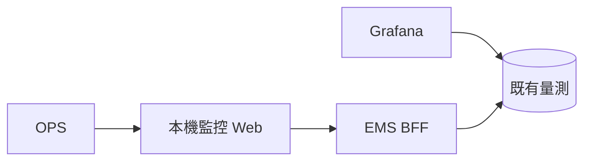
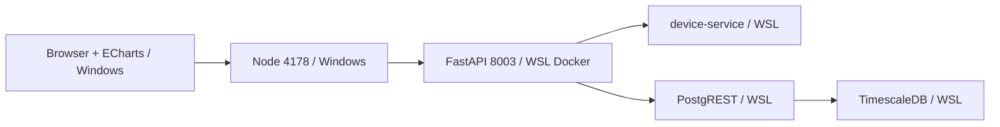
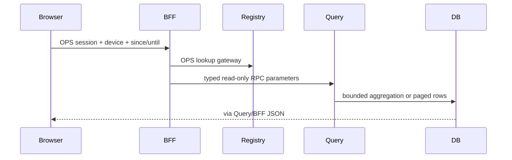

# PRD-0018：監控趨勢與歷史紀錄
狀態：Implemented in local preview（2026-09-23，正式 React 整合另批）；遵循 PRD Guideline，延伸 PRD-0005 FR-520/521。

## 1. Overview & Context
目前只能看最新 1,000 筆與 8 列紀錄，無法查過去指定時段。參考既有 Grafana ems-overview.json 的時間篩選、各訊號趨勢、布林狀態與資料表。
## 2. Goals / Non-Goals
完成 15m/1h/6h/24h/7d 與自訂歷史範圍、所有有資料的訊號面板、可翻頁原始紀錄。保留本機既有品牌視覺。不做控制下發、告警引擎、電費分析；不宣稱接入現場硬體。
## 3. User Stories & Personas
OPS 選設備與時段，檢查尖峰、回查原始讀值、匯出目前頁；可暫停自動更新避免歷史查詢漂移。
## 4. Functional Requirements
- FR-1801：三類設備易讀標籤，15m/1h/6h/24h/7d、自訂含時區時間範圍。
- FR-1802：完整區間的伺服器聚合（mean/min/max/last/count），累計電量用 last、布林顯示 last 與區間混合狀態，缺值不補零、不跨缺桶連線。
- FR-1803：原始紀錄每頁 100 筆，前後翻頁，CSV 匯出目前頁、無誤稱完整匯出。
- FR-1804：5s/30s/暫停，固定歷史範圍不移動；401 顯示登入，錯誤或無資料不沿用錯誤設備的舊圖。
- FR-1805：使用者可滑鼠查看時間/數值、以時間滑桿縮放。
## 5. Non-Functional Requirements
最大單次範圍 7 天；圖形 points 60..1200，桶數依 ceil(span/points) 決定；records limit <=1000、offset <=1000000。本機 API 目標 <5s；沿用上游 HTTP timeout。首次不加登入繞過。
## 6. System Architecture
Owner 均 EMS；沿用 WSL Docker API/DB 與 Windows loopback 預覽，不改 OT 採集。
### 6.1 Context

### 6.2 Container

### 6.3 Data Flow

## 7. Data Model
沿用 electricity_measurements / factory_measurements append-only、無新增儲存表。migration 017 新增唯讀 INVOKER functions，016 保留既有 PRD-0006 草案編號。無 PII、無保留期修改。相同 timestamp 可有多列，records 用完整 row JSON 作次序 tie-break；完全相同列語意相同；晚到插入仍可能改變分頁，非交易快照。
## 8. API Contract
GET /api/devices/{id}/history?since&until&points=600 回傳 {device_id,since,until,bucket_seconds,series:[{time,signal,value,min,max,last,samples,last_time}]}。
GET /api/devices/{id}/records?since&until&offset=0&limit=100 回傳 {rows,has_more}。UTC half-open [since,until)，時區必填，7 天上限；OPS-only；未知/重複參數 422；GET 冪等，重試讀取安全；沿用 session，不新增 rate limiter。
## 9. Security & Privacy
僅 BFF；不外露任意 SQL、domain 或服務 key。DB RPC 只 SELECT 既有 api views，SECURITY INVOKER、固定 search_path，EXECUTE 僅 web_anon；雙層範圍校驗。CSV 只固定欄位時間與數字/布林。PostgREST 保持內網。
## 10. Observability
沿用 BFF HTTP 狀態/延遲與 PostgreSQL log；不記帳密。畫面顯示查询範圍、桶粒度、最後成功時間。
## 11. Risks & Mitigations
| 風險 | 機率 | 衝擊 | 緩解 |
|---|---|---|---|
| 大範圍重查 | M | M | 7d/1200 桶，30s 建議，無並行輪詢 |
| 平均隱藏尖峰 | H | M | min/max 同時繪製 |
| 布林平均誤解 | M | M | last 狀態 + min/max 提示混合 |
| 空值被補零 | M | H | 缺桶 null，缺欄不製造值 |
| 範圍切換競態 | M | M | AbortController + epoch |
| 晚到插入影響翻頁 | L | M | 固定 until、文件揭露非交易快照 |
## 12. Rollout & Migration Plan
先加唯讀函數，再部署 BFF（既有 memory session 清空須重登），再預覽。原表資料不改。回滾保留不使用函數、恢復 BFF/預覽備份。查詢錯誤或 >5s 持續發生即停止自動刷新、回查原始資料與 query plan。
## 13. Test Strategy
RED→GREEN：ASGI 參數/授權/轉譯；SQL synthetic transaction 回滾檢查邊界、尖峰、布林與分頁，migration 重跑；E2E 真實時段/設備/紀錄翻頁/錯誤/手機寬度。
## 14. Open Questions
正式 React frontend 整合另批；更長保留期與報表匯出另批。
## 15. Appendix
ADR-027；Grafana provisioning ems-overview.json。採用本機已鎖定 Apache ECharts 5.6.0（Apache-2.0）。

### 2026-09-29 FR-1802 顯示規則增補
依使用者要求，逆變器與其他設備統一使用折線：正常稀疏採樣點依觀測間距連接，較長缺口仍斷線；不補零、不新增樣本，原始紀錄及 API 不變。具體門檻、少量樣本限制與驗證見 [ADR-032](../adr/ADR-032-monitor-sampling-lines.md)，本增補優先於原 FR-1802 的逐空桶斷線規則。