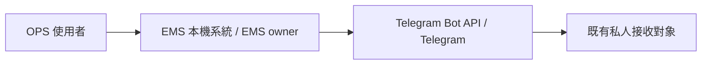
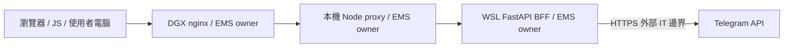
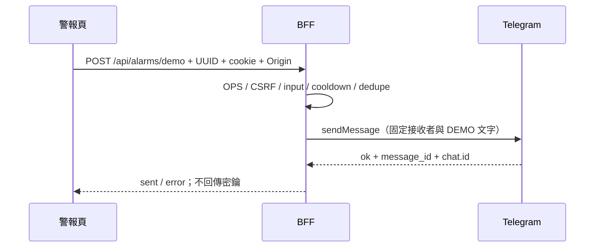

# PRD-0019：警報中心 Telegram 示範通知

狀態：Implemented（2026-09-23；使用者授權，已部署驗證）；決策：[ADR-028](../adr/ADR-028-telegram-demo-alarm.md)。遵循 PRD 架構 Guideline §2/3/4/10。補充 PRD-0005；與 PRD-0004 自動 Grafana 告警並存。

## 1. Overview & Context
警報中心目前為示意頁，使用者需要可點擊的「觸發警報」按鈕，透過既有 Telegram Bot 向已設定的私人對象送出示範訊息。
## 2. Goals / Non-Goals
Goal：登入 OPS 後，一次點擊發送一則明確標示 DEMO 的通知，頁面顯示 Telegram 接受結果。Non-goals：不製造設備故障、不變更 Grafana 規則、PLC 控制或真實警報狀態；不提供任意接收者或自由訊息發送。
## 3. User Stories & Personas
OPS（含 demo 帳號）在警報中心展示通知；未登入者能直接登入；無權角色不可發送。
## 4. Functional Requirements
- FR-1901：警報頁有「觸發警報」按鈕、登入狀態、sending/sent/error 狀態及最近成功發送紀錄。
- FR-1902：BFF 使用既有 Bot Token/Chat ID，伺服器組合固定 DEMO 訊息、事件 UUID、台北時間，僅送設定的接收者。
- FR-1903：OPS session + Origin CSRF；GET 只讀狀態，POST 只收 UUID4 request_id，拒絕額外欄位與 query。
- FR-1904：共用接收者每 30 秒最多一次嘗試；UUID 在 10 分鐘記憶體視窗內防重複，失敗與不確定結果也不自動重送；同時請求不重送。
- FR-1905：只在 HTTP 200、ok=true、有效 message_id 與正確 chat.id 時顯示成功；timeout/拒絕/未設定均明確提示。
## 5. Non-Functional Requirements
外部請求總等待上限 8 秒（可調 1–10）；冷卻預設 30 秒（可調 5–3600）。最多保留 64 個去重項目、10 筆近期成功紀錄，記憶體 TTL 10 分鐘。新增邏輯 unit coverage ≥80%。320px 與桌機可操作；所有密鑰僅後端，回應/日誌/前端無 Token。
## 6. System Architecture
### 6.1 Context

### 6.2 Container

### 6.3 Data Flow

同步呼叫；無新增容器，OT 設備、MQTT、DB 寫入均不涉及。Grafana 自動通知路徑保持獨立。
## 7. Data Model
不新增 DB 表。記憶體 immutable delivery DTO：event_id（UUID 主鍵）、sent_at（含時區）、channel、status。去重 key=request_id（10min/64筆），成功列表10筆，重啟清空；無個別設備、帳號或其他 PII。Chat ID/Token 只在後端環境變數。
## 8. API Contract
- GET /api/alarms/demo：OPS；200 configured/cooldown_seconds/recent。無外部發送。
- POST /api/alarms/demo：OPS+Origin；JSON request_id UUID4；200 sent/event_id/sent_at/channel/cooldown_seconds。401/403/409/422/429/502/503 明確錯誤；429 提供 Retry-After。
- 既有 4178/4179 proxy 僅增列這個精確 GET/POST 路徑。請求不接受 destination/text/token。
## 9. Security & Privacy
Token SecretStr、env-only；HTTP URL 含 Token 的 log 必須遮蔽，異常不輸出原文。固定 api.telegram.org 與接收者、無 redirect、無 SSRF 面。成功需上游 ACK，不宣稱使用者已讀。
## 10. Observability
記錄 event_id、sent/failed 和延遲；不記錄 Token、Chat ID、完整 request/response/exception。前端即時提示結果與冷卻。排查未設定/封鎖 Bot/timeout，見操作手冊。
## 11. Risks & Mitigations
| 風險 | 機率 | 衝擊 | 緩解 |
|---|---|---|---|
| 重複發送 | M | M | disabled + cooldown + UUID去重；無自動重送 |
| Token 日誌外洩 | M | H | 遮蔽 HTTPX URL、SecretStr、錯誤固定字串 |
| 未授權發送 | M | M | OPS、CSRF、精確代理白名單 |
| 外部 timeout 但已送達 | M | M | 明確不確定提示，同 UUID 不再送 |
| Demo 誤認真警報 | M | M | 固定 DEMO／無需處置文字；不改真實設備 |
| 重啟失去去重 | L | M | 單進程 demo 邊界；不自動補送，水平部署前用共用儲存 |
## 12. Rollout & Migration Plan
先寫測試 RED，再完成 GREEN。只重建/重啟 BFF；會清除既有登入 session。UI 新版本保留前版 v6 回復，代理精確放行。認證回歸或密鑰外洩立即回復 BFF image 與前端/代理備份；不變更設備或 DB。
## 13. Test Strategy
Unit：格式、去重、冷卻、併發、錯誤、timeout、log遮蔽。ASGI integration：OPS/CSRF、schema、HTTP契約、回應不含 secret。Browser E2E：登入、按鈕、冷卻、手機；mock 測不發真訊息，最後只送一則真人 DEMO，記 Telegram ACK（不聲稱已讀）。回歸 BFF suite 和既有監控。
## 14. Open Questions
無阻塞事項。未來多工作程序須共享去重/冷卻與持久紀錄。
## 15. Appendix
Telegram sendMessage 官方契約：https://core.telegram.org/bots/api#sendmessage。使用既有 Synaiq_ems_bot 與既有私人接收對象；不另建 Bot。架構/安全以人工程式檢查與測試執行，本次 harness 禁止自主新增審查代理，未宣稱 agent 審查通過。

驗收：BFF 196 tests、新邏輯94% coverage，mock UI/RWD與正式站單次 Telegram ACK 均通過；15:03:14 +08:00 事件 78d4e2b8-fe13-4bf5-b2fa-0c77e6e3eb2e。回歸即時監控/歷史與導覽通過。詳細發佈/回復證據見 [本機公開部署紀錄](../operations/ems-public-local-20260923.md)。
