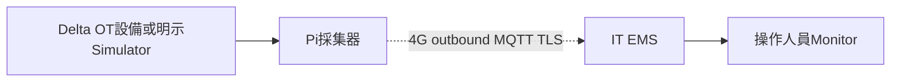
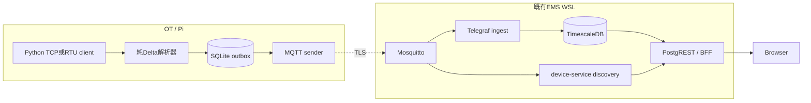
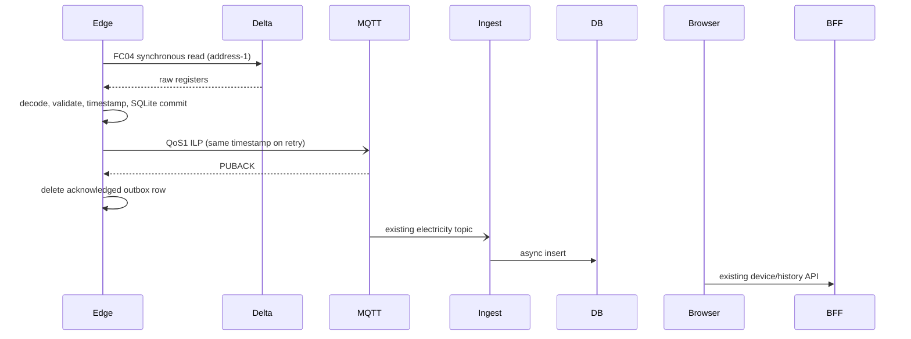
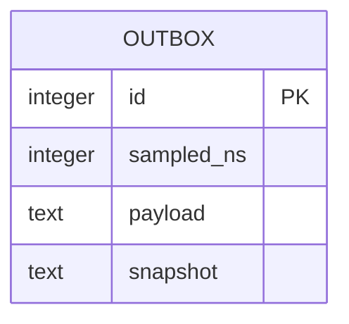

# PRD-0020：Delta 模擬器、協定解析與 4G 邊緣採集

狀態：Implemented（local scope；field deployment pending），2026-09-29；使用者授權新增 simulator / parser，後續部署 Raspberry Pi + SIM7600G-H。遵循 PRD Guideline；ADR-029。

## 1. Overview & Context
既有 EMS 只有通用 Modbus TCP 模擬電表。Delta Protocol Definition V1.35 (2025-11-06) 需要 Base-1 位址、low-word-first energy、動態倍率。樹莓派在 OT 現場採集，SIM7600G-H 只提供 Linux IP 網路；EMS 位於 IT 端。先完成可執行本機管線，現場硬體驗收另列。
## 2. Goals / Non-Goals
Goals：同一純解析器服務 simulator 驗證與現場 TCP/RTU poller；可重現模擬器；四個相容量測可在既有 EMS Monitor/歷史查看；SQLite 斷線緩存、重連、TLS field 配置與 systemd 安裝範本。
Non-Goals：不實作遠端 OT 控制、併網參數寫入、IV 曲線、完整59頁協定全功能；不新增 solar 寬表或提前實作 Draft PRD-0006；不變更現有公開部署；無實機時不宣稱現場/4G 已驗收。
Constraints：WSL 正式來源、保留既有 dirty work；Pi Zero/Zero 2 W 與 HAT 具體版型、Delta 型號/韌體未定；原生 Python 3.9+ systemd 兼容 ARMv6，不要求 Pi Docker。
## 3. User Stories & Personas
開發者以本機 Delta simulator 驗證正確電量；維運在既有 EMS 介面選 delta-sim-001 看曲線；安裝者修改 TCP/RTU 設定後在 Pi 採集並主動經 4G 上傳，斷線不阻塞持續採樣。
## 4. Functional Requirements
- FR-2001：唯讀 Delta FC04 simulator (Modbus TCP)，可重現 day/night/alarm 情境及動態倍率；未支援位址回 exception 2，寫入回例外。
- FR-2002：純解析器：Base-1→PDU、16-bit AC V/A/W/Hz、32-bit low-word-first today/lifetime energy、state、temperature；Scale Factor bit0/各群組/illegal-address fallback、新 today-energy scale=0 時依 IR40962；不將逾時視作預設倍率。
- FR-2003：read-only poller 使用同一解析器，TCP 或 RTU (19200/8N1 default)；配置 unit id、address base (0/1 only)、timeout、poll interval；未知/短回應 fail，不補零、不沿用過時讀值。
- FR-2004：phase-1 相容投影：voltage=L1 phase V、current=L1 A、power_kw=三相總有功 kW、energy_kwh=累計電量 kWh；詳細三相/溫度/state 保留於 CLI snapshot 與待送佇列，不誤稱已存入 EMS 寬表。
- FR-2005：SQLite outbox 原始 UTC 量測時戳不變，MQTT QoS1 確認後刪除；採集與傳送兩執行緒解耦；重啟可續傳；限制 queue rows 與 batch，滿時拒絕新樣本並記錄警報，不悄悄刪舊資料。承諾限 broker-ack at-least-once，不是 DB ACK；可能重複，現有 DB 無 unique key。
- FR-2006：field mode 強制 TLS 驗證與帳密或 mTLS，不開 inbound Modbus/管理 port；plaintext 只限明示 demo mode；TLS broker ACL 範本只能發布自己的 device topic。機密以環境變數傳遞且不入 log。
- FR-2007：opt-in Compose delta-demo profile 加 simulator/edge，既有 ingestion/discovery/BFF 不改動；device_id delta-sim-001；metadata/標籤明示模擬，UI 對此設備顯示 L1 定義；本機管線 E2E 驗證。
## 5. Non-Functional Requirements
預設10s採樣，1..3600s可調；Modbus timeout 3s；outbox預設10000 rows，最多1000000；單一 ILP <1KB、rich JSON <16KB；flush batch <=100；本機 MQTT→API目標15s內；純邏輯測試覆蓋>=80%。時戳 UTC 微秒精度、來源主機須NTP同步；4G modem/APN由OS管理，不由採集程式撥號。量测非PII但屬營運資料。
## 6. System Architecture
Owner：EMS；現場軟體Python/systemd，開發WSL Docker，SIM7600 OS networking。
### 6.1 Context

### 6.2 Container

### 6.3 Data Flow

## 7. Data Model
SQLite outbox(id INTEGER PK, sampled_ns INTEGER, payload TEXT, snapshot TEXT)。retention=至PUBACK；容量滿拒新樣本；無PII/無credentials；自增id不對外傳。既有public.electricity_measurements(time,device_id,voltage,current,power_kw,energy_kwh)及api view不變，實際無PK，原文件PK描述不成立。本批不引入migration/dedup，重送可能多列。

## 8. API Contract
MQTT ems/devices/{device_id}/measurements，Influx Line Protocol，固定measurement=electricity_measurements，唯一tag=device_id，四個float，ns timestamp (microsecond aligned)，QoS1 retain=false。禁止任意topic/field config。registry gateway_id沿既有topic解析為ems-gateway（domain routing ID，不表示physical Pi identity）；實際gateway識別保留部署設定。CLI --once 輸出JSON，不發布；simulator只有Modbus TCP，無HTTP API。REST不變，api/openapi.yml以x-delta-telemetry記錄本契約。不得透過公網裸露1883；field需要TLS authenticated listener/私有通道，範本提供但不修改現有broker。
## 9. Security & Privacy
OT唯讀，FC04白名單；TCP/RTU端点僅operator配置，不接遠端命令。Field TLS驗cert及hostname，username/password env或mTLS；限制device_id regex防ILP/topic注入；payload固定schema且finite；outbox mode0600、directory0700。Pi服務無DB/OPS金鑰。4G CGNAT以outbound連線處理。Broker端按device ACL，server-side identity binding/DB ingestion ACK屬field上线前剩餘項，不能把client限制視為接收端安全。
## 10. Observability
結構化log：sample_queued/sample_rejected、broker_ack/delivery_failed、queue_full、pending_rows；不記密碼、原始exception body或完整環境；--once診斷僅量測。斷線資料不補零；field觀察RSS/queue容量/訊號與NTP。
## 11. Risks & Mitigations
|風險|機率|衝擊|緩解|
|---|---|---|---|
|Base1與韌體差異|M|H|可調base、PDF獨立golden vector、現場交叉讀值|
|錯誤倍率/低高字|M|H|scale bit群組與特殊energy測試|
|4G中斷或Pi重启|H|M|SQLite先存、重連續傳、容量可見|
|PUBACK後IT資料丟失/重複|M|M|明示非DB ACK；production需後續durable ingest/去重|
|憑證/偽造設備|M|H|TLS/mTLS + broker ACL，field部署檢查|
|模擬值混入現場|M|H|delta-sim-001與明示metadata；field拒sim裝置ID|
|RTC/NTP錯誤|M|M|UTC來源時間檢查、field NTP確認|
|Pi USB/UART資源不足|M|M|HAT版型待確定；保留TCP及隔離RS485；不猜接腳|
## 12. Rollout & Migration Plan
先RED測試、GREEN解碼與socket integration；delta-demo profile本機啟動且不重建既有服務；驗证existing API與Monitor；最後交Pi範本。停止新增兩容器即回滾，保留outbox與歷史；不改DGX/公網/既有credentials。field需確認機型、HAT版型/供電、隔離RS485、APN、TLS入口、ACL、NTP及真機校驗，未驗證不可宣稱production ready。
## 13. Test Strategy
RED→GREEN→REFACTOR。Unit：PDF獨立golden vectors、scale bit ranges/fallback、low words、signed temperature、錯誤/短讀、timestamp/ID、TLS fail-closed、queue滿/重啟/未ACK。Integration：真實TCP simulator+poller (unsupported/read-only)、SQLite重開、MQTT ACK/重連、本機既有MQTT→DB→API並確認原sim-001仍寫入。E2E：Monitor選Delta查四訊號/歷史；Pi RTU/4G標未驗證。控制/寫入禁止。
## 14. Open Questions
Delta實際機型/韌體、Pi Zero或Zero2W、7600G-H HAT是B或其他板型、SIM/APN/電信商、RS485 adapter或TCP閘道、現場TLS broker和憑證；目前只有SIM7600G-H與雙介面需求已確認。
## 15. Appendix
Delta V1.35 59頁 SHA256 2c608619614bc7d14da64ab4be9528ae3506f13b93de7cba1ff5ffb5b7251bfc；p1/6/7/11/12/17/30；官方https://solarstorageaccount.blob.core.windows.net/pvi/manual/modbus/DELTA_Three-phase_products_protocol.pdf 。既有PRD0001/0002/0003/0005/0018。§10 checklist：上述15章與三圖/8項風險具備；API/operations四同步於實作時完成；architect/security/code review approved，MQTT ACK競態與SQLite關閉修復後復核通過。

實作補充：field採樣需存在可信OS同步標記；UTC早於2025或<=上一採樣時間時拒絕。最新時戳持久化於metadata，不因ACK刪除而遺失。模擬identity與L1語意透過既有OPS確定性註冊，不依賴AI分類。本機preview稀疏歷史數值改顯示2px點，仍保留connectNulls=false；未改已發布靜態版本。

### 15.1 2026-09-29 變更：RTU 從站模擬
使用者授權新增 RS485 實體模擬測試及第二顆隔離 USB–RS485。FR2001 與 §8 的 simulator TCP-only 限制由本变更擴充為 TCP（預設）或 RTU（二擇一）；既有 parser/edge/雲端契約不變。決策見 [ADR-031](../adr/ADR-031-delta-rtu-simulator.md)。

FR2008：PC simulator 必須以指定本機串口、站號 1–247、9600/19200/38400 baud、8N1 回應 Pi 的 FC04 查詢；共用既有情境與倍率。RTU 不開網路 listener、拒絕 network serial URL，開啟失敗需立即退出。錯誤 CRC、其他站號、廣播不得回應；非白名單操作不得改寫資料。

驗收：獨立 raw RTU bytes 測試（CRC、位址、站號、非法讀寫及錯誤恢復），再既有 TCP/decoder/edge 回歸。Linux PTY 為軟體驗收；Windows COM、兩顆轉接器電氣連線、Pi 與 4G 必須另行到貨驗收，不能以 PTY 通過取代。只模擬 V1.35 子集，非兩款指定機型的真機認證。

### 2026-09-29 監控折線格式增補
先前稀疏採樣僅顯示點的 UI 呈現，依使用者要求更新為正常間距連線；共用規則與缺口處理見 [ADR-032](../adr/ADR-032-monitor-sampling-lines.md)。採樣、協定、API 與原始資料均不變。

### 2026-09-29 每秒採樣與量測誤差增補
使用者要求 Delta sim 參照 sim-001：本機 demo 每秒採樣，電壓/電流加入有界可重現誤差，同秒多段讀取共用快照；既有 field 預設 10 秒及協定不變。FR-2001/2003/2007 與 NFR 的 demo 例外見 [ADR-034](../adr/ADR-034-delta-one-second-noise.md)。

### 2026-09-29：Simulator 控制改由 PRD-0022 / ADR-033
四台固定模擬器的設定與故障注入統一至 BFF OPS API/CLI、持久 SQLite audit。舊 meter :8001 POST、PLC/MCP raw Modbus 寫入停用，遙測與真機唯讀採集不變。runtime 設定重啟還原，操作紀錄保留；詳 operations/simulator-control.md。
