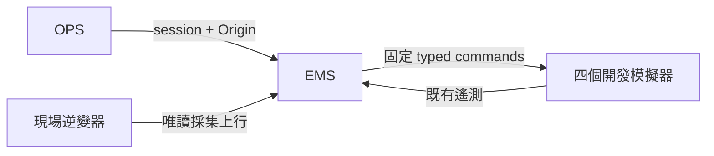
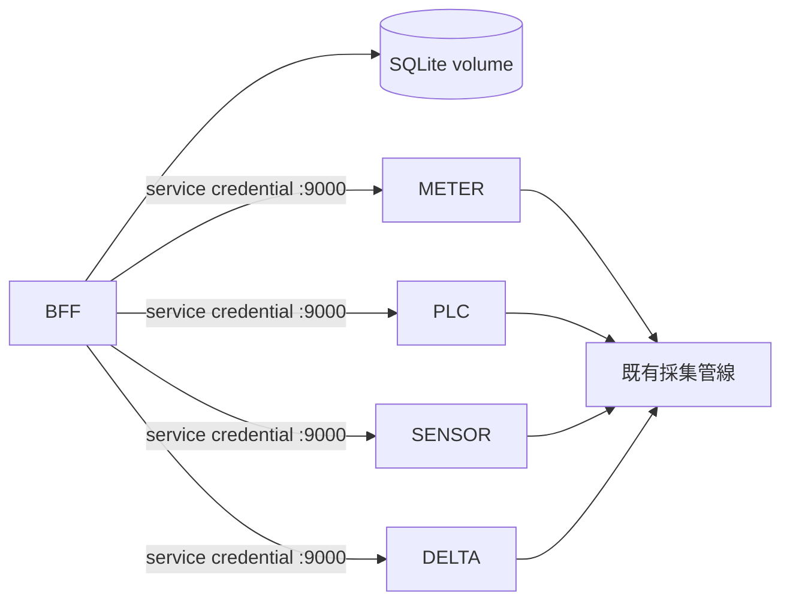
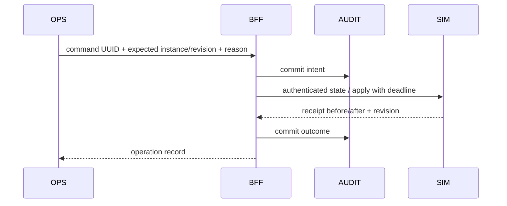
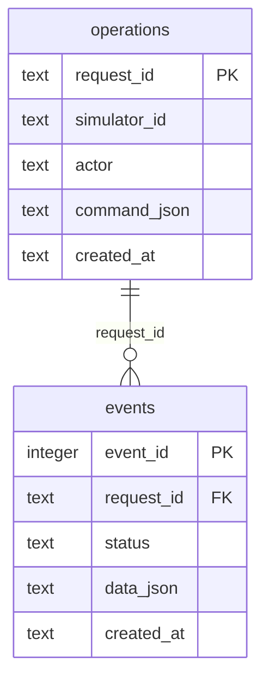

# PRD-0022：統一模擬器控制與操作紀錄

狀態：Implemented（本機部署與驗收完成）；2026-09-29。依 PRD 架構設計 Guideline §2/3/4/10。決策：ADR-033。

## 1. Overview & Context
既有四個模擬器分別透過未認證 REST、Modbus/MCP raw write、硬編碼 MQTT 與 Delta 啟動參數控制，無共同稽核。使用者要求統一控制入口及操作紀錄。採用既有 BFF OPS 登入作為唯一應用控制入口。

## 2. Goals / Non-Goals
Goals：四個固定 simulator ID 的查詢、設定、持久操作紀錄、冪等、故障結果對帳。
Non-Goals：真實設備寫入、任意 host/register/topic、Docker/程序啟停、排程、前端控制面板、跨主機高可用、密碼學不可竄改。
模擬器設定仍為記憶體狀態，重啟還原預設；操作紀錄持久。既有 RTU CLI 不開網路控制入口。

## 3. User Stories & Personas
OPS 以同一登入控制四台模擬器；開發者可查命令前後設定與結果；維運者可辨識逾時未明結果與重啟，不誤判失敗後自動重送。

## 4. Functional Requirements
| ID | 行為 | 驗收 |
|---|---|---|
| FR-2201 | 固定 sim-001 / plc-001 / sensor-001 / delta-sim-001 registry，GET 列表與 state/capabilities | 無任意目的地輸入 |
| FR-2202 | OPS + Origin + typed configure；expected instance/revision 避免覆蓋 | 401/403/422/409 |
| FR-2203 | 電表 6 參數+fault；PLC 絕對輸出；sensor enabled+interval；Delta scenario | 四 adapter + 遙測測試 |
| FR-2204 | side effect 前 durable intent；append-only 結果與對帳事件 | 儲存失敗不派送 |
| FR-2205 | UUID 全域去重；actor/內容不同 409；同台串行 | 並發/重啟測試 |
| FR-2206 | timeout/crash -> outcome_unknown；不重送；同台阻擋至 receipt 證明或 instance 重啟 | 對帳事件保留原 unknown |
| FR-2207 | 封鎖舊 REST 與 Modbus 寫入；上游 submodule 不修改 | FC05/06/15/16/22/23 |
| FR-2208 | 有界操作列表、單筆查詢與 explicit reconcile | OPS 身分來自 session |

## 5. Non-Functional Requirements
既有量測延遲 NFR 繼續適用。控制 HTTP 每 hop 3 秒；同台 busy 立即 409，不累積等待佇列。
每頁 1–100 筆、reason 1–200 字、最多 7 個受限設定欄位；body <= 4096 bytes。
單 active BFF process，以 audit file lock 防止多 worker；SQLite DELETE rollback journal + synchronous FULL（低頻控制，不採 WAL）。
最多 100000 個 commands，達上限停止新命令而保留查詢/對帳；不自動刪除 UUID。
目標端每 instance 至多 4096 receipts，滿時拒絕新命令；重啟釋放並產生新 instance。
BFF endpoint 行覆蓋 >=80%；模擬公式 >=90%。控制成功與 EMS 收到遙測分開驗證。

## 6. System Architecture
### 6.1 Context

### 6.2 Container

### 6.3 Data Flow

共用 typed contract；各版本 pymodbus adapter 隔離，EMS wrapper COPY 明確上游檔案；不引入獨立控制服務。既有 MCP 模擬器寫入能力由此入口取代。

## 7. Data Model

設定快照不是遙測快照；事件含 before/after、result/error、對帳操作者/reason。時間 UTC。
actor 帳號及 reason 可能為 PII；只 OPS 可讀；不得輸入密碼或個資。整份 volume 備份；保留至人工歸檔，無自動清除或刪除 API。SQLite trigger 拒绝 UPDATE/DELETE；主機管理員仍可改檔，非防竄改保證。
單台未明結果封鎖後续 configure。重啟新 instance 允許以 reconcile 明確解除封鎖，歷史 status 仍 unknown；不以當前設定相等推定成功。

## 8. API Contract
BFF :8003：
- GET /api/simulators
- GET /api/simulators/{simulator_id}
- POST /api/simulators/{simulator_id}/commands
- GET /api/simulators/operations?limit=50&before=&simulator_id=
- GET /api/simulators/operations/{request_id}
- POST /api/simulators/operations/{request_id}/reconcile {reason}
command：request_id(UUID4)、expected_instance_id(UUID4)、expected_revision(integer>=0)、changes(object)、reason。
合法請求即建立紀錄；返回 200 operation（status succeeded/failed/outcome_unknown），相同 UUID pending 可返回 202；target 拒絕不等於 HTTP transport 錯誤。403/409/422/503 為入口拒絕。
內部 GET /state、GET /receipts/{UUID}、POST /apply，皆 bearer credential，無 host port；/health 無敏感資訊。
完整 schema 見 api/openapi.yml。無新的 MQTT topic 或資料庫量測欄位。

## 9. Security & Privacy
沿用 BFF OPS session 與 exact Origin；actor 不接受 body/header。固定 registry，不讀可修改 device host。
service token 僅 env、>=32 字元、constant-time compare；缺 token fail closed。禁止 redirects/proxy/retry。
只內部 :9000，sim Modbus 限 loopback host。HTTP body 限長、欄位嚴格、數字 finite/range。
真正實體設備、Pi edge 不接受 command；raw MCP simulator 寫入被 protocol 層拒絕。主機 Docker 管理行為是受信任維運邊界，不能宣稱也被此 audit 攔截。

## 10. Observability
操作列表/單筆含 actor、UTC、ID、reason、changes、before/after、result、reconciliation。錯誤採固定代碼，不把上游 raw body 或 secret 存入資料庫。容器 log rotation max-size 10m/max-file 3。GET 不可用回 available=false；資料庫不可寫 -> 503 且不執行。

## 11. Risks & Mitigations
| 風險 | 緩解 |
|---|---|
| 舊 API / raw FC 旁路 | target 層拒絕所有寫 FC、移除舊 POST |
| timeout 其實已生效 | unknown、無自動重送、receipt 對帳 |
| BFF crash 與多 worker | startup pending->unknown、OS file lock |
| SQLite 磁碟滿 | fail closed、volume 備份、命令上限 |
| simulator 重啟重設 | instance UUID、CAS、明確紀錄不冒認成功 |
| Delta scenario 能量倒退 | 切換分段積分與測試 |
| 遙測延遲 | applied 與 DB delivery 分離、四條 pipeline 驗收 |

## 12. Rollout & Migration Plan
先測試新 wrapper + BFF，再重建五個服務，保存既有 DB/edge volume。生成新的 env service token（不提交）。
刪除舊 meter host8001 mapping；Modbus保留loopback讀取。delta-demo仍 opt-in，CLI RTU不變。
rollback：停用 BFF_SIM_CONTROL_ENABLED，保留 audit volume 與 hardened targets；不得為回滾重新開未記錄寫旁路。volume 禁止 down -v。

## 13. Test Strategy
先 RED 契約/權限/DB/冪等/CAS/unknown 測試，後 adapters；隔離 Docker TCP tests 驗證寫 FC 拒絕/合法讀；Delta piecewise energy；既有 BFF/Delta/simulator regression；compose config/build；四路 Modbus/MQTT->DB E2E。測試使用合成帳號與隨機 request ID。

## 14. Open Questions
前端控制頁、持久化模擬設定、跨副本管理、長期稽核歸檔及實體 RTU runtime 控制均留後續 PRD。本次不影響 user 所選 1/5/10/15/30 秒採集規格，sensor 的 publish interval 為獨立模擬來源設定。

## 15. Appendix
相關：PRD-0001/0002/0005/0020、ADR-023/029/031/033。§10 自查：Goals、量化 NFR、三圖、ER、API、PII/retention、>=5 risks、rollback、test matrix 已列；架構、Python、一般程式碼及安全 agent review 已完成；所有必修項目已修正並複驗。BFF 228 tests、四路 pipeline 35 tests 通過；BFF 新控制模組整體行覆蓋 94%。完整矩陣、限制與部署證據見 [驗收紀錄](../operations/simulator-control-verification.md)。

### 2026-09-29 CLI 登入回歸修正（FR-2201/2202）
ADR-033 補充既有本機 HTTP CLI 與 Secure cookie 的相容處理。實際登入200/列表401問題已重現；20 unit + 1 HTTP integration 通過，CLI 行覆蓋87%。另以 Secure=True 的真實臨時 BFF、合成 OPS 帳號查詢四個運行中 target，list/state/history/logout 通過，無 simulator command。BFF 契約及認證設定不變。
