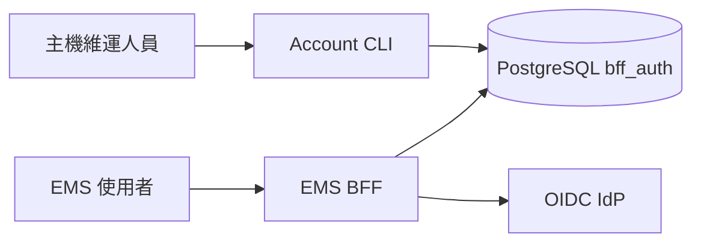
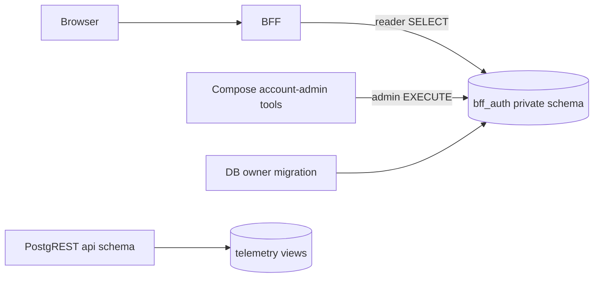
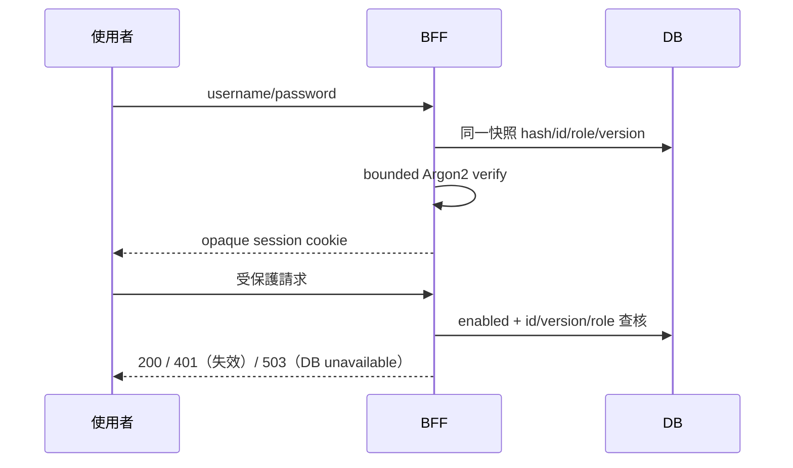
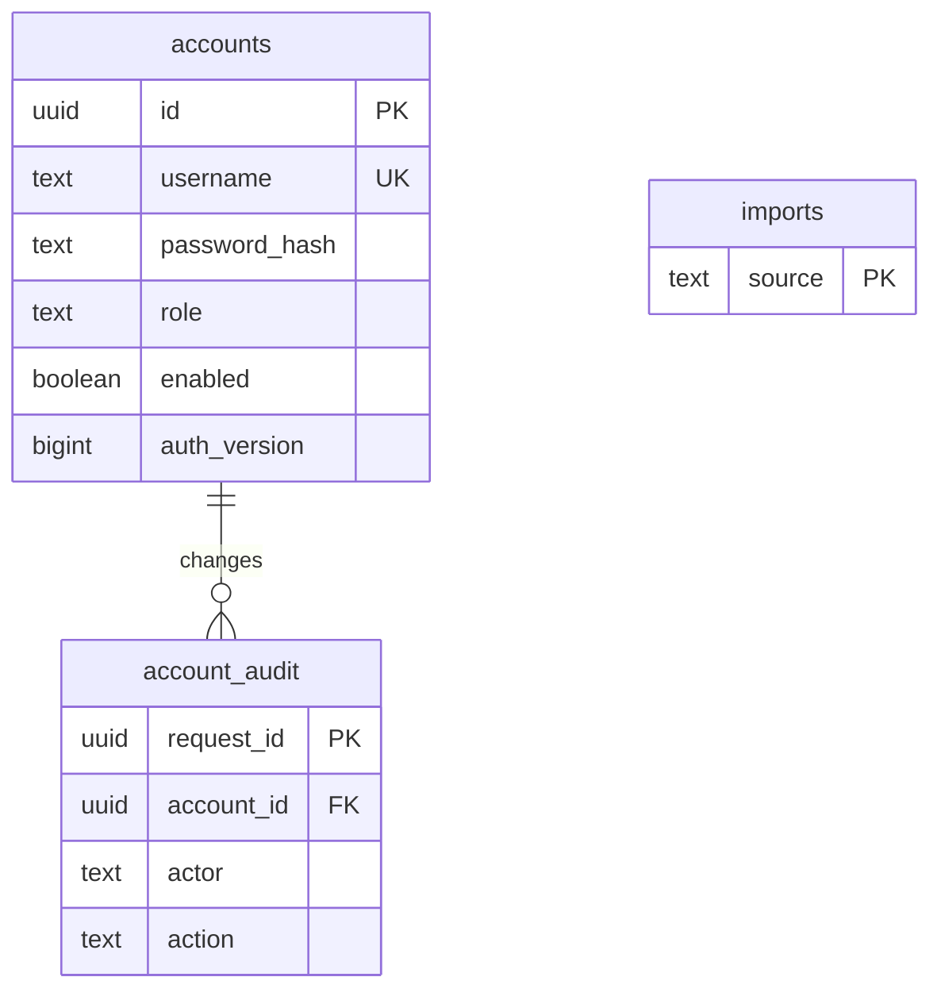

# PRD-0023：資料庫帳號管理

Status: Implementing | Owner: EMS | 2026-09-30 | ADR-035
依 doc/PRD-架構設計-Guideline.md §2/3/4/10；架構與安全設計已完成 agent review。

## 1. Overview & Context
使用者要求帳號不再記錄於 .env。現有 PostgreSQL/TimescaleDB 為本機帳號唯一來源，保留 demo 密碼及現有登入介面。

## 2. Goals / Non-Goals
Goals：DB 保存帳號、Argon2id、角色、啟用狀態、版本及異動稽核；可安全新增、停用、重設密碼。
Non-Goals：新增網頁帳號管理、改寫 OIDC、持久化 session、公開帳號 API、硬刪除帳號。

## 3. User Stories & Personas
維運人員透過主機上的管理 CLI 建立個人帳號；使用者沿用登入頁與 simulator CLI；稽核人員可查詢變更原因與 DB 操作者。

## 4. Functional Requirements
| ID | Requirement | Verification |
|---|---|---|
| FR-2301 | local 登入只讀 DB，沒有 env fallback | auth/config tests |
| FR-2302 | create/list/enable/disable/set-role/reset-password/history | CLI + DB integration |
| FR-2303 | 舊 Argon2id 一次性原樣匯入，transaction、durable marker、重跑不覆寫 | import integration |
| FR-2304 | 每次異動與不可修改稽核同 transaction；request UUID 冪等 | DB integration |
| FR-2305 | 禁止停用或降權最後一個 enabled OPS（並行亦成立） | concurrent DB tests |
| FR-2306 | session 綁 account UUID/version/provider，每次請求驗證；變更撤銷舊 session | auth tests |
| FR-2307 | OIDC 保持獨立；POST /auth/role 仍只撤銷 session | regression suite |

## 5. Non-Functional Requirements
DB connect/acquire/statement 各最多 5 秒；pool 最多 5 個連線；Argon2 最多 2 個工作並行，避免阻塞 event loop。CLI query/transaction 設有限 timeout。
密碼長度 12–256，輸入不回顯；匯入保留原密碼。Hash 上限 memory 256 MiB、time 10、parallelism 16，避免 PHC 耗盡資源。測試 hash 可較低成本，正式新增使用 argon2-cffi 預設。
單機驗收目標登入 <2 秒、一般 session DB 查核 <200ms；測試紀錄實測而非宣稱 SLA。auth 邏輯 coverage >=80%。

## 6. System Architecture
### 6.1 Context

### 6.2 Container

### 6.3 Data Flow

## 7. Data Model
bff_auth.accounts：UUID PK、username UNIQUE、password_hash、role CHECK、enabled、auth_version、created_at/updated_at。
bff_auth.account_audit：request_id UUID UNIQUE、account_id、username、action、reason、actor=session_user、before/after（排除 hash）、created_at。
bff_auth.imports：source PK、imported_at；匯入 transaction 最後寫入，不可重複執行。

## 8. API Contract
HTTP paths/JSON 保持相容。local login 401 不區分未知/停用/密碼錯誤；DB 故障 503。
受保護 API 每次驗 DB；版本或角色不符 401。POST /api/auth/role 不修改 DB 角色。
CLI 為主機管理介面，不向公網開放。

## 9. Security & Privacy
private schema 不授予 PUBLIC/web_anon；BFF reader 僅 SELECT。admin 只能讀非敏感 view/audit、EXECUTE 固定 SECURITY DEFINER functions，不能直接改表。
函數固定 search_path、參數化 SQL、共用 transaction advisory lock、audit 同 transaction；revoke PUBLIC EXECUTE。
.env 只保留 DB DSN/API 等服務憑證，不保存使用者帳號/hash；管理 DSN 不傳給 BFF。
無密碼 argv/log；CLI 顯示固定錯誤，不外洩 DSN/hash。DB owner 為可信復原邊界。
同一快照驗證並簽入舊版本，密碼重設競態無法取得新版 session。

## 10. Observability
account_audit 可依 username 查詢；記錄 DB principal（不是假稱 EMS 使用者）。request UUID 可查詢操作結果，未知結果不可換 UUID 重送。
DB unavailable 有固定錯誤；密碼、hash、DSN 不進稽核與標準輸出。

## 11. Risks & Mitigations
DB unavailable → fail closed 503；復原 DB。
最後 OPS 鎖死 → advisory lock + guard；DB owner 可受控復原。
migration 部分失敗 → SQL/匯入 transaction；匯入驗證後才刪 env。
DB owner/備份外洩 → 保護 volume、DSN 及 pg_dump；應用權限不可修改稽核。

## 12. Rollout & Migration Plan
先 isolated DB 驗收，再備份 bff_auth（首次為空）、migration 018、配置 reader/admin credentials、一次性匯入舊 env。
比對 hash 原樣保留與 OPS 數量後，移除 env users/Compose注入，再重建 BFF。記憶體 session 需重新登入。
Rollback：保留 DB/稽核、停止 BFF 並修復或回復已驗證 DB-compatible image；不自動回退 env auth、不 DROP 表。

## 13. Test Strategy
先 RED 再 GREEN。unit 使用注入 fake repository，不引入 env fallback。migration 真 DB 跑兩次、grants、atomic rollback、last OPS concurrency、import replay、audit append-only。
ASGI 驗證停用/啟用/角色回改/重設後舊 session 永久失效、DB 503、登入競態、OIDC。既有 BFF、simulator CLI、pipeline 回歸。

## 14. Open Questions
網頁帳號管理與個別管理人員 DB principal 可另案擴充；本次無阻擋問題。

## 15. Appendix
ADR-035；操作手冊 account-management.md；四文件/API/風險/威脅/依賴清單同步。
Checklist：Goals/Non-Goals、FR、NFR、三圖+ER、風險、遷移/rollback、TDD、安全及架構審查已列入。

### 2026-09-30 審查落地

SQL管理函數拒絕非READ COMMITTED與NULL匯入；PHC須strict/canonical Base64。Argon2 slot由驗證task完成callback釋放，不受HTTP重複取消影響。
架構、安全、Python、code review均已完成；兩項Python block與兩項測試隔離問題已修正並複核。
