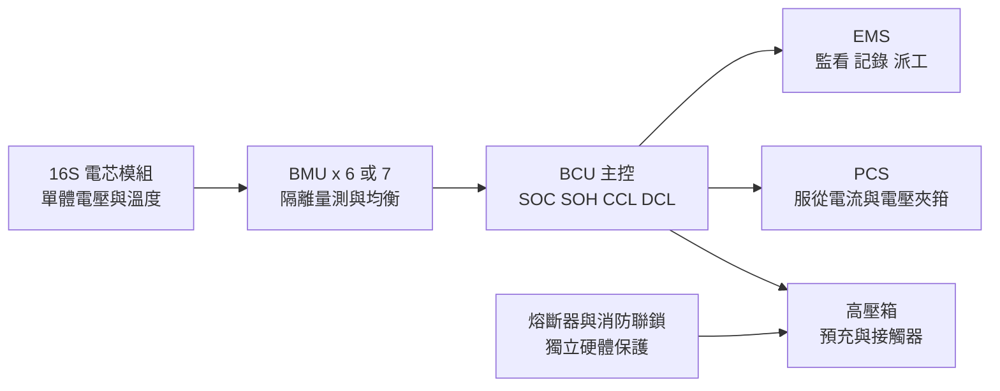
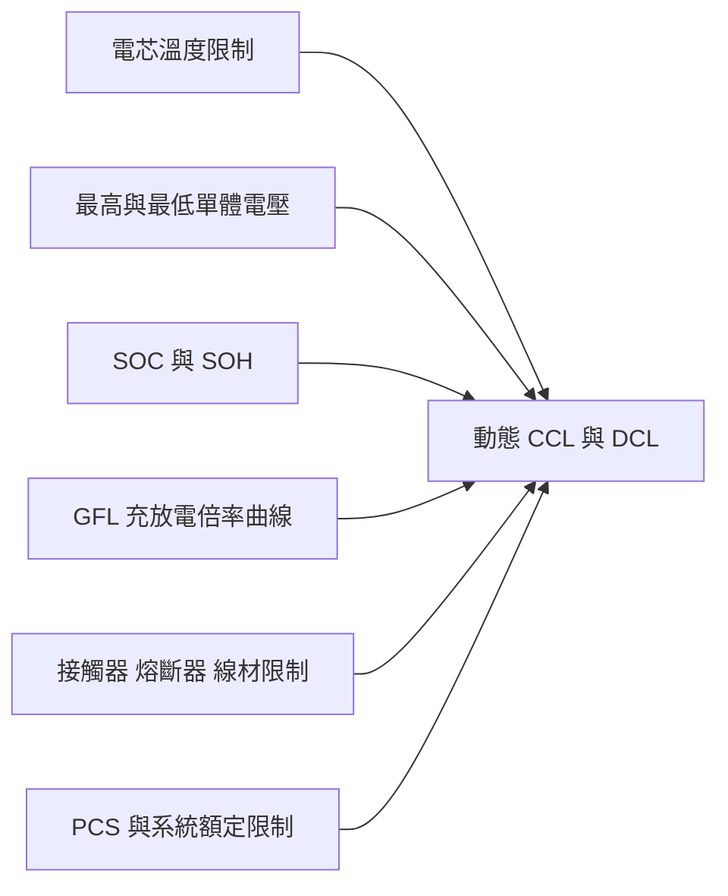
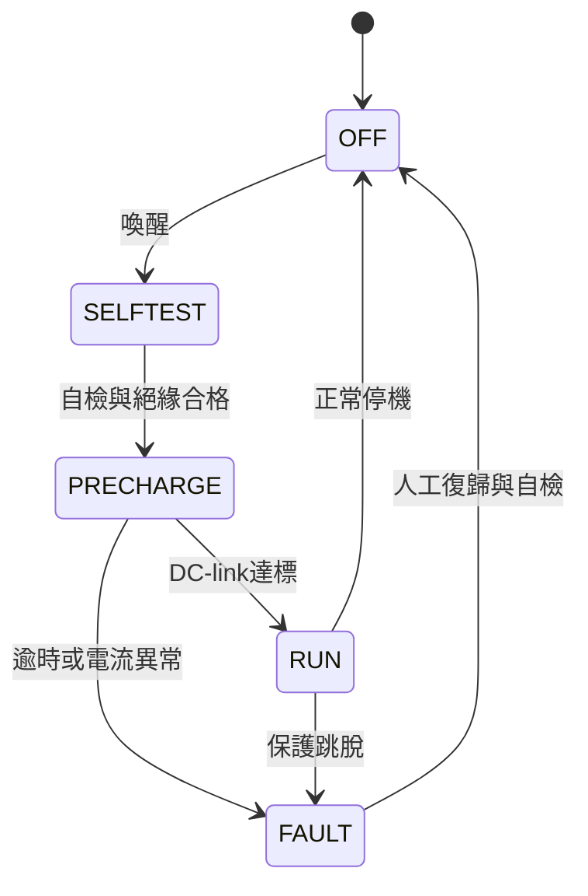

# 100 kWh 級儲能系統（BESS）電池管理系統規格書

### 適用 1P96S / 1P112S GFL 314 Ah LFP：BMS、對外介面、高壓箱與驗收要求

作者：＿＿＿＿　　日期：2026-08-17　　版本：v0.1

---

## 摘要

本文規範一套適用於 100 kWh 級儲能櫃的電池管理系統（Battery Management System, BMS），電池採 GFL 7VH4L4 3.2 V／314 Ah 磷酸鐵鋰（Lithium Iron Phosphate, LFP）電芯，支援 1P96S 與 1P112S 單簇組態。系統由 6 或 7 片 16S 電池監測單元（Battery Monitoring Unit, BMU）及 1 台電池控制單元（Battery Control Unit, BCU）組成，涵蓋單體電壓、溫度、簇電壓、簇電流與絕緣量測，以及荷電狀態、健康狀態和動態充放電能力估算。

規格內容包含量測精度與更新時序、分級保護、均衡、預充與接觸器控制、高壓聯鎖、PCS／EMS 通訊、故障安全、資料記錄、環境與電磁相容性要求，並定義工廠允收試驗與現場允收試驗的驗證基準。單體電壓準確度以 ±5 mV、全串同步更新週期不大於 100 ms 為基準；功率轉換系統（Power Conversion System, PCS）須在 BMS 發布的充放電電流與電壓邊界內運轉，能源管理系統（Energy Management System, EMS）負責監看、資料保存與監督式派工。

---

## 一、目的與適用範圍

本規格用於 BMS 詢價、選型、設計審查、BMS↔PCS 整合、工廠允收試驗（FAT）與現場允收試驗（SAT）。範圍包含：

- 6 或 7 片 16S BMU、1 台 BCU,以及其內部通訊。
- 96–112 顆串聯電芯之電壓、溫度、簇電壓、簇電流與絕緣監測。
- SOC、SOH、允許充電電流（CCL）與允許放電電流（DCL）計算。
- 主正／主負接觸器、預充、高壓聯鎖與故障切斷控制。
- 對 PCS、EMS、消防／EPO 與維護工具之介面。
- 全服役期資料保存、事件黑盒子與保固證據鏈。
- 功能安全、環境、EMC、FAT／SAT 與供應商交付文件。

本規格不取代 PCS 內部電流控制、防孤島保護、併網電驛整定、消防設計與電機技師簽證。相關設備仍須服從 BMS 提供的電池安全限制。

---

## 二、設計基準

### 2.1 電芯與系統配置

| 項目 | 96S 方案 | 112S 方案 |
|---|---:|---:|
| 電芯 | GFL 7VH4L4,3.2 V / 314 Ah LFP | 同左 |
| 模組 | 1P16S,51.2 V / 16.1 kWh | 同左 |
| 模組數／BMU 數 | 6 | 7 |
| 串數 | 1P96S | 1P112S |
| 標稱簇電壓 | 307.2 V | 358.4 V |
| 標稱能量 | 96.5 kWh | 112.5 kWh |
| 依 2.50–3.65 V 計算之簇電壓 | 240–350.4 V | 280–408.8 V |
| 0.5C 基準電流 | 157 A | 157 A |
| 1C 基準電流 | 314 A | 314 A |

表列簇電壓範圍是由單體電壓換算的系統工作邊界,不可取代單體 OV／UV 保護。任何單體先達門檻時,即使簇總電壓仍在正常範圍,BMS 仍須執行降載、禁止充放電或跳脫。

### 2.2 電芯規格硬條件

| 項目 | GFL A2 條件 | BMS 要求 |
|---|---|---|
| 絕對充電電壓 | 單體最大 3.65 V | 實際電芯不得因量測誤差、通訊延遲或 PCS overshoot 超過此值 |
| 放電截止 | 2.50 V（>0°C）；2.00 V（-20～0°C） | 正常 DCL 應提早降載；低溫策略另經 GFL 確認 |
| 充電溫度 | 0–60°C | <0°C 禁充；達上限停止充電 |
| 放電溫度 | -30–60°C | 超出範圍停止放電 |
| 高溫最終關機 | 65°C | 鎖定故障並使電池系統進入安全態 |
| 充電逾時 | 8 h | 停止充電並記錄為異常充電終止 |
| 壽命終止 | 內阻達初始值 150% 或容量低於 70% | 停用並產生不可忽略之維護告警 |
| 監測資料 | 整個服役期 | 建立 BMS 本地緩衝＋EMS／歷史資料庫長期保存 |

> **【待核】** 採購前須向 GFL 取得與實際料號、批次及銷售合約相符的受控最新版規格書,並取得 BMS 架構、保護設定、資料格式與後續變更程序之書面確認。公開 A2 文件僅作本版設計基準。

---

## 三、系統架構與責任邊界

本系統採兩層主從架構：每個 1P16S 模組配置 1 片 BMU,單簇配置 1 台 BCU。96S 使用 6 片 BMU,112S 使用 7 片 BMU；BMU 數量與串數須由受控參數設定,不得以不同硬體版本鎖死配置。

| 功能 | 權威執行者 | EMS 權限 |
|---|---|---|
| 單體 OV／UV、過溫、低溫禁充 | BMS 本地 | 唯讀、告警 |
| CCL／DCL 與允許電壓 | BMS 本地 | 唯讀,派工不得超越 |
| 接觸器、預充、黏著檢測 | BMS／高壓箱 | 可要求啟停,不可直接驅動 |
| PCS 電流迴路、P/Q、grid-forming | PCS 本地 | 可下達監督式設定值 |
| 短路與極端過流 | DC 熔斷器／硬體保護 | 無 |
| 防孤島、併網保護 | PCS／保護電驛 | 觀測 |
| 歷史資料與營運排程 | EMS | 主要執行者 |

分工原則：**BMS 決定電池當下能不能充放、最多能充放多少；PCS 負責在限制內即時轉換功率；EMS 決定系統要做什麼,但不得改寫安全邊界。**

---

## 四、電氣與硬體規格

### 4.1 BCU／BMU 基本能力

| 項目 | 最低要求 | 備註 |
|---|---|---|
| 可管理串數 | 96–112S 可組態 | 單一韌體／料號支援兩案 |
| BMU 通道 | 每片 16S | 不使用通道須可受控停用並診斷 |
| 簇電壓量測 | 0–500 VDC | 建議同時量測電池側與 PCS DC-link 側 |
| 簇電流量測 | 至少 ±500 A | 連續工作涵蓋 ±350 A；保護路徑不得在過流點前飽和 |
| 絕緣耐受 | 依最高工作電壓、污染等級與適用標準設計 | BMU 通訊、24 V與高壓量測須適當隔離 |
| BMU 通訊 | 隔離式 daisy-chain 或隔離 CAN | 須有 CRC、序號、逾時與節點定位 |
| 韌體更新 | 受控更新、完整性檢查、失敗回復 | 版本與設定變更須留下稽核紀錄 |
| 自我診斷 | 上電自檢＋週期自檢 | 含 ADC、記憶體、時鐘、watchdog與通訊 |

### 4.2 單點故障原則

- 任一 BMU 失聯、量測鏈斷線或資料失真時,不得以最後值無限期維持運轉。
- 單一軟體程序失效不得使過充、過放或過溫保護完全失效。
- 安全關鍵輸出採 de-energize-to-trip；斷線、失電或控制器重啟時進入已定義的安全態。
- BMS重啟後不得自動閉合主接觸器；須重新完成自檢、絕緣確認、接觸器檢查與預充。
- 參數校驗失敗、韌體映像損壞或時鐘異常須產生明確故障碼,不得靜默使用預設值運轉。

---

## 五、量測與感測器

| 量測項目 | 最低要求 | 建議／驗收重點 |
|---|---|---|
| 單體電壓範圍 | 0–5 V | 涵蓋斷線與異常診斷區間 |
| 單體電壓準確度 | ±5 mV | 目標 ±2 mV；須含 AFE、線束、溫漂與校正誤差 |
| 單體相對通道誤差 | ≤3 mV | 均衡判斷以通道間一致性為重點 |
| 電壓解析度 | ≤1 mV | 解析度不得冒充準確度 |
| 全串更新週期 | ≤100 ms | 96S與112S均須符合 |
| 通道時間差 | ≤10 ms | 不強制真正同時取樣,但須有一致時間戳或可證明的最大偏差 |
| 電壓感測開線診斷 | ≤1 s | 不得因開線產生假正常電壓 |
| 溫度準確度 | ±1°C | 含感測器、線束與ADC誤差 |
| 溫度點數 | 每16S模組至少4點 | 最終數量以熱模擬與滿功率熱測試確認 |
| 溫度位置 | 電芯大面、進／出風端與預期熱點 | 另監測匯流排、熔斷器或接觸器熱點 |
| 溫度感測診斷 | 開路、短路與不合理跳變 | 任一安全關鍵溫度點失效須降載或停機 |
| 簇電流準確度 | ±0.5% reading ±0.1% FS | 適用全工作溫度；零點偏移另行驗收 |
| 電流取樣週期 | ≤10 ms | 快速硬體過流保護不得只依賴軟體輪詢 |
| 零點漂移 | 校正後 ≤0.1 A 或供應商證明等效 SOC 表現 | 長期待機與小電流積分的主要誤差來源 |
| 簇電壓準確度 | ±0.5% reading ±0.1% FS | 用於預充、接觸器黏著與單體加總合理性檢查 |

電流感測可採高精度分流器搭配隔離量測；若另加霍爾感測器,其角色應定義為獨立保護或交叉診斷,不應僅以「雙量程」描述而未定義各自量程、精度與失效處置。

---

## 六、SOC、SOH 與動態能力計算

### 6.1 SOC

- SOC 以庫倫積分為主,搭配有效滿充／滿放端點、靜置 OCV 與溫度模型修正。
- 中段 LFP OCV 平台不得作為唯一 SOC 來源。
- 系統斷電、RTC失效或更換 BCU 後,須定義 SOC 恢復與重新校正程序。
- SOC不得作為單體 OV／UV 的唯一保護依據；即使SOC資料無效,單體電壓與溫度硬保護仍須有效。
- 電流積分使用的可用容量應隨已確認之容量／SOH更新,並保留歷次校正紀錄。

### 6.2 SOH 與壽命終止

- SOH 至少包含容量 SOH 與內阻 SOH,兩者須分開輸出。
- 系統須追蹤每顆電芯內阻趨勢；GFL要求的 1 kHz AC內阻量測方法與判定程序須由雙方確認。
- 任一電芯內阻達初始值150%,或實測容量低於新電芯70%時,產生 EOL 鎖定告警並禁止繼續正常服役。
- 電芯容量、內阻與異常次數資料須能與電芯序號、模組序號及更換紀錄對應。

### 6.3 CCL／DCL

允許充電電流 CCL 與允許放電電流 DCL 須至少由下列限制取最小值：

- 0.5C版本在合格溫度與SOC下,連續 CCL／DCL 上限以157 A為基準。
- 1C版本在合格溫度與SOC下,連續 CCL／DCL 上限以314 A為基準。
- 以上是正常允許電流,不是過流跳脫點。
- PCS以定功率運轉時,電池電壓降低會使電流上升；PCS必須以CCL／DCL夾箝功率,不得為維持額定kW而越過BMS電流限制。
- CCL／DCL變化須限制斜率並標示原因碼,避免通訊雜訊造成PCS功率跳動。

> **【待核】** GFL規格中的溫度／SOC連續與脈衝倍率表須轉換成受版本控制的 CCL／DCL 查表或演算法,並由GFL與PCS供應商共同確認。-30～-20°C之放電截止與倍率需取得書面說明。

---

## 七、保護等級與初始門檻

保護分為四級,每一項均須在供應商故障矩陣中定義門檻、延遲、遲滯、回復條件、是否鎖定及復歸權限：

| 等級 | 名稱 | 系統動作 |
|---|---|---|
| L1 | 告警 | 記錄並上報,可繼續運轉 |
| L2 | 降載 | 動態降低CCL／DCL,PCS平滑降功率 |
| L3 | 方向禁止 | CCL或DCL降至0,禁止充電或放電 |
| L4 | 緊急跳脫 | 使PCS停流、開接觸器、鎖定故障；極端事件直接硬體切斷 |

### 7.1 電壓與溫度

| 保護項目 | 初始設定 | 動作 | 備註 |
|---|---:|---|---|
| 單體高壓預警 | 3.55–3.60 V | L1／L2 | 進入CCL降載區,最終值由充電策略確認 |
| 單體充電禁止 | 名義設定須保證實際電壓不超過3.65 V | L3 | 計入±5 mV誤差、延遲與PCS overshoot |
| 單體持續過壓／PCS不服從 | 達3.65 V且仍有充電電流 | L4 | 多層過充失效安全 |
| 單體低壓預警 | 2.80 V | L1／L2 | DCL逐步降低 |
| 單體放電禁止 | 2.60 V | L3 | 保留量測誤差與放電慣性裕度 |
| 單體絕對低壓 | >0°C不得低於2.50 V | L4 | 低溫2.00 V條件須另行核准,不得作為日常工作點 |
| 低溫充電 | 任一電芯 <0°C | L3 | 回復需遲滯與穩定時間 |
| 高溫降載 | >45°C | L2 | 依最高電芯溫度計算CCL／DCL |
| 高溫停止充放 | ≥55°C | L3 | 本專案採較保守值；GFL 55–60°C曲線仍保留於設計審查 |
| 絕對操作溫度 | ≥60°C | L4 | 停止充放並進入故障處置 |
| 最終高溫關機 | ≥65°C | L4鎖定 | 系統安全關機,需人工檢查復歸 |
| 模組／簇溫差 | >8°C | L1 | 風道或感測異常告警 |
| 模組／簇溫差 | >12°C | L2 | 降載並要求維護 |

### 7.2 電流、絕緣與系統故障

| 保護項目 | 要求 | 動作 |
|---|---|---|
| 連續過流 | 依當下CCL／DCL、溫度與SOC判定 | 延時降載／方向禁止 |
| 瞬時過流 | 依PCS脈衝、接觸器分斷與熔斷器曲線協調 | 快速禁止；必要時開接觸器 |
| 短路 | 依最大預期短路電流與DC熔斷器分斷能力設計 | 硬體切斷,不得依賴EMS或一般CAN |
| 絕緣下降 | 專案初始值：1 MΩ告警／500 kΩ跳脫 | 實際值依接地拓撲、PCS與適用標準確認 |
| BMU失聯／資料CRC持續錯誤 | 不得使用最後正常值持續運轉 | 受控停流後開接觸器 |
| 單體感測開線 | 定位到通道與模組 | 禁止相關方向或停機,不得以估算值取代保護 |
| 電流感測失效 | 雙感測不一致、飽和或零點異常 | 停止充放,視嚴重度開接觸器 |
| 接觸器黏著 | 命令開啟後由輔助接點及兩側電壓判定 | 鎖定故障,禁止再次預充 |
| 預充失敗 | 時限內未達電壓比或電流未衰減 | 中止預充並鎖定故障 |
| 充電逾時 | 累計充電超過8 h | 停充並標記異常充電終止 |
| 異常充電終止 | 過壓、過流或逾時導致停充 | 禁止後續充電,經合格人員查明原因後復歸 |
| 消防／EPO硬線動作 | 外部乾接點或安全迴路失效 | 立即進入定義之緊急安全態 |

> **【待核】** 過流的延時／瞬時數值、時間電流曲線與熔斷器選型須在PCS型號、電芯脈衝倍率、線材與接觸器確定後完成短路與選擇性協調計算。157 A與314 A不得直接填作過流跳脫值。

---

## 八、均衡

314 Ah大容量電芯的均衡需求以可驗收的修正能力表示,不單以「被動」或「主動」作為合格判斷。

| 項目 | 要求 |
|---|---|
| 最低性能 | 在定義的均衡條件下,將1% SOC差異（3.14 Ah）於12 h內修正至驗收範圍 |
| 被動均衡參考 | 連續有效均衡電流≥300 mA；須證明熱設計與可用均衡時窗 |
| 主動均衡參考 | 供應商可提出1–5 A方案；須說明效率、方向、故障隔離與待機功耗 |
| 啟動條件 | 高SOC且充電電流低於門檻、充電尾段或經確認的靜置條件 |
| 判定依據 | 單體電壓差＋工作狀態；不得僅依LFP中段OCV判斷 |
| 停止條件 | 達目標壓差、離開允許SOC／電流區、任一溫度或BMU板溫超限 |
| 熱要求 | 供應商提出最壞條件溫升；BMU板溫、電阻表面溫度與電芯溫升均不得超過元件與電芯限制 |
| 資料 | 記錄各通道均衡狀態、累計時間、電流與異常 |

100 mA修正1% SOC約需31.4 h,此計算可作比較基準；但是否能追上電芯差異仍取決於實際自放電差、配組品質、均衡時窗與維護週期。因此採購應以12 h修正能力與熱測試驗收,而非直接宣稱某一架構必然不合格。

> **【待核】** 均衡方式由全壽命成本、櫃內熱負荷、循環工況與高SOC停留時間共同決定。供應商須提交計算與實測資料後定案。

---

## 九、高壓箱與執行機構

高壓箱由BMS控制,至少包含主正接觸器、主負接觸器、預充接觸器／繼電器、預充電阻、DC熔斷器、MSD維修開關、HVIL、電流感測器、電池側／PCS側電壓量測及絕緣監測介面。

### 9.1 接觸器與熔斷器

- 接觸器須標示DC額定工作電壓、連續電流、溫升、機械／電氣壽命與在指定電流下的分斷能力。
- 接觸器選型須涵蓋1C連續314 A、環境溫度、櫃內溫升與端子降額；「400 A級」僅作初始尺寸估算。
- 主正／主負接觸器須有輔助接點,並以電壓交叉判斷黏著或拒動。
- DC熔斷器須標示額定電壓、額定電流、最大分斷能力與I²t；須依最大預期短路電流、線材、匯流排、接觸器與PCS DC-link完成協調。
- 熔斷器不得由一般接觸器或軟體過流判斷取代。

### 9.2 預充流程

- 預充電阻依PCS DC-link電容量、初始壓差、目標時間、單次能量、重複週期與最壞溫度選型。
- 預充成功判據初始建議為PCS側電壓達電池側90–95%,且預充電流降至門檻以下。
- 預充須有最大時間、最短重試間隔與最大重試次數；失敗後不得反覆無限重試。
- 正常停機先命令PCS降至零電流,確認電流低於安全門檻後再開接觸器。
- 緊急狀況允許接觸器直接分斷時,其能力須由型式試驗與故障計算證明。
- 系統須定義DC-link放電至安全電壓的路徑、時間與驗證方式。

---

## 十、對外介面與失效安全

### 10.1 BMS↔PCS

| 項目 | 要求 |
|---|---|
| 實體層 | 隔離CAN 2.0B；位元率與終端電阻依PCS協定確認 |
| 即時週期 | CCL、DCL、允許電壓、enable、SOC與故障狀態≤100 ms |
| 訊息完整性 | CRC／checksum、alive counter、rolling counter、版本識別 |
| 必要訊號 | CCL、DCL、最大允許充電電壓、最小允許放電電壓、SOC、SOH、簇V/I、cell Vmax/Vmin、Tmax/Tmin、接觸器與故障狀態 |
| 協定文件 | 提供受版本控制的DBC或同等訊息定義,含倍率、偏移、端序、單位、無效值與逾時行為 |
| 硬線 | 至少1組常閉式、失電跳脫的PCS enable／battery permissive |

BMS↔PCS失聯時：

1. 連續3～5個即時週期遺失或資料無效,PCS須將允許功率平滑降至零。
2. 失聯持續超過協定定義時間,在確認電流已降至安全門檻後由BMS開接觸器。
3. 若同時發生過壓、短路、消防或其他L4故障,不等待通訊恢復或正常停流程序。

### 10.2 BMS↔EMS

- 優先採 Modbus TCP；若使用CAN或閘道器,須提供完整暫存器／訊息表。
- EMS可讀取全單體電壓、全部溫度、簇V/I、SOC、SOH、CCL／DCL、絕緣、均衡、接觸器、告警與故障。
- 保護設定、校正值、接觸器直接控制與故障旁路預設為不可由EMS寫入。
- 遠端復歸若開放,須有角色授權、事件稽核、現場條件檢查與不可復歸故障清單。
- EMS失聯不等於BMS失聯。併網模式可由PCS降至零功率；離網模式須由PCS／本地控制器維持供電、依SOC與負載本地卸載,不得僅因EMS離線而立即停機。

### 10.3 外部安全介面

- 消防、可燃氣體、煙霧、EPO與門禁／HVIL訊號應有硬線安全路徑。
- 常閉式安全迴路斷線視同動作；須能診斷回路狀態。
- 外部EPO與一般BMS故障須使用不同故障碼與復歸程序。
- BMS故障輸出到PCS稱為 `battery trip` 或 `PCS permissive`,不以一般故障濫用人工EPO迴路。

---

## 十一、資料記錄、保固與時間同步

GFL要求完整的BMS監測資料涵蓋每顆電芯的整個服役期。因此資料架構採「BMS本地緩衝＋EMS／獨立歷史資料庫長期保存」,任一層單獨保存12個月均不足以形成完整保固證據。

| 項目 | 要求 |
|---|---|
| 常態資料 | 全單體電壓、全部溫度、簇V/I、SOC、SOH、CCL/DCL、絕緣、接觸器與均衡狀態 |
| 常態週期 | ≤1 s |
| BMS本地保存 | 至少12個月循環緩衝,斷電不失資料 |
| 長期保存 | EMS／歷史資料庫保存整個設計壽命；支援斷線補傳與缺口標記 |
| 事件黑盒子 | 故障前後各30 s,取樣≤100 ms |
| 事件內容 | 原始V/I/T、CCL/DCL、PCS命令／回報、接觸器、故障位、通訊狀態與觸發原因 |
| 保固事件 | 急充次數、過壓／過流／過溫、充電逾時、異常充電終止、低溫充電嘗試、深度放電與長期停機 |
| 維護資料 | 電芯／模組序號、內阻、容量、校正、零件更換、韌體與參數版本 |
| 時間 | UTC時間戳＋單調遞增序號；支援NTP並記錄校時事件 |
| 匯出 | 公開、具欄位說明的機器可讀格式；不得依賴單一專有軟體才能取證 |
| 完整性 | CRC或雜湊、存取權限與參數變更稽核 |

供應商須提交容量估算,證明在112S、全部溫度通道、1 s常態取樣與100 ms事件記錄下仍滿足保存期間,並說明儲存媒體壽命、磨耗平均與資料損毀復原機制。

---

## 十二、電源、待機與環境要求

### 12.1 24 V與長期停機

- BMS優先使用受監控的外部24 VDC輔助電源；須定義電壓範圍、突波、反接與brownout行為。
- 若任何電源由高壓電池直接取得,deep-sleep時之等效簇電流目標≤2 mA,並須提交從SOC、靜置時間與自放電推導的安全停機期限。
- 接觸器釋放後不得保留不必要的線圈功耗。
- 系統須支援喚醒輸入、排程喚醒或維護喚醒,並避免無限重啟耗盡電池。
- 預計靜置超過30天時,依GFL條件將SOC維持於25–40%,並建立至少每3個月一次的維護提醒與紀錄。

### 12.2 環境與可靠度

| 項目 | 要求 |
|---|---|
| BMS電子元件工作溫度 | 至少涵蓋 -30～70°C；供應商提出降額曲線 |
| 儲存溫度 | 建議 -40～85°C |
| 濕度 | 5–95% RH,無凝露；戶外櫃須配合防凝露設計 |
| PCBA | 三防塗覆或等效防潮、防塵與抗腐蝕措施 |
| 連接器 | 防呆、鎖固、端子保持力與維修防誤插 |
| EMC | 工業環境抗擾度與發射要求,並驗證安全功能在干擾下不失效 |
| 振動／衝擊 | 依運輸、安裝位置與風扇振動條件驗證 |
| 設計壽命 | 與電池系統目標壽命一致；關鍵元件壽命與降額須可追溯 |

---

## 十三、功能安全與認證

若系統落地於台灣戶外併網案場,BMS與電池系統之證明文件至少依當時有效的標準檢驗局技術規範確認：

| 層級 | 主要要求方向 |
|---|---|
| 單電池／電池系統 | CNS 62619；電池系統依適用要求執行延燒試驗 |
| BMS功能安全 | IEC／UL 60730-1 Annex H Class B或C、IEC 61508 SIL 2、UL 991＋UL 1998、或ISO 13849 PL c等合格路徑擇一 |
| 儲能系統／案場 | CNS 62933-5-2、風險評鑑、FAT／SAT與適用之大型燃燒測試 |
| PCS | CNS／IEC 62477-1、併聯規範與工業EMC要求 |
| 外箱 | 戶外至少IP54,並依實際案場防腐蝕、防凝露與消防要求 |
| 運輸 | UN 38.3適用於鋰電芯與電池運輸,不取代BMS或案場安全驗證 |

UL 1973可作固定式電池產品的國際市場要求；若目標市場或業主要求完整UL系統認證,另確認UL 9540及UL 9540A測試／評估。不同標準路徑不得僅以零組件證書推定整套BESS已取得系統認證。

> **【待核】** 本案採用的BMS功能安全路徑、證書涵蓋之BMS型號、韌體版本、串數與電芯型號須在採購前確定。變更BMS韌體或安全參數時,須評估是否影響既有證書與案場驗證。

---

## 十四、FAT／SAT與驗收

### 14.1 FAT

供應商至少完成下列試驗並提交原始數據：

1. 96S／112S組態切換、節點地址與錯配偵測。
2. 全電壓通道於低、中、高電壓與溫度點的精度、通道差與開線測試。
3. 溫度通道精度、開短路與熱點對應測試。
4. 電流量測精度、零點漂移、動態響應、飽和與交叉診斷。
5. SOC參考循環、斷電恢復、滿充／滿放校正與誤差統計。
6. CCL／DCL對電壓、溫度、SOC、SOH與通訊異常的動態響應。
7. 單體OV／UV、低溫充電、高溫、溫差、過流、充電逾時與異常充電終止故障注入。
8. BMU失聯、CRC錯誤、CAN斷線、EMS斷線與時鐘失效。
9. 預充成功、逾時、電阻過熱、主接觸器拒動與黏著。
10. 絕緣下降、IMD自檢與PCS內建絕緣功能協調。
11. 均衡修正能力、最壞熱條件與異常停止。
12. 事件黑盒子、斷電保存、匯出、斷線補傳與時間對齊。
13. 韌體更新中斷、回復、版本識別與參數完整性。
14. 消防／EPO與常閉式PCS permissive硬線測試。

### 14.2 SAT

- 使用實際電池簇、PCS、EMS、消防與24 V輔助電源執行端到端測試。
- 驗證PCS確實服從CCL／DCL,包含低電壓下定功率命令的電流夾箝。
- 驗證BMS↔PCS與EMS↔PCS失聯在併網、離網兩種模式下的不同處置。
- 量測預充波形、接觸器切換電流、DC-link放電時間與停機殘壓。
- 於0.5C連續工況完成溫升與溫差測試；1C方案另完成額定持續時間或等效熱測試。
- 驗證NTP、事件順序、EMS歷史資料完整性及BMS補傳。
- 所有安全參數、DBC／Modbus版本、BMS韌體與證書版本須與竣工文件一致。

### 14.3 SOC驗收條件

SOC驗收不得只寫單一百分比,須同時定義參考容量、校正狀態、溫度、工況與老化程度。本案初始建議：

| 條件 | 建議驗收值 |
|---|---|
| 新電池、25±2°C、有效滿充校正後 | 全工作區SOC誤差≤±5% |
| 低溫／高溫或SOH降至70%以上 | 誤差≤±8%,供應商提出適用範圍 |
| 有效端點校正完成後 | 端點誤差≤±3% |
| BCU斷電重啟 | 不得無故跳變；恢復誤差符合供應商聲明 |

參考SOC以校正電流與實測容量積分建立；LFP中段OCV平坦是誤差來源,但不得直接宣稱中段必然無法達到某一精度。

---

## 十五、供應商交付文件

1. BMS系統架構、BMU／BCU規格、接線圖與安全關鍵BOM。
2. 電壓、溫度、電流、簇電壓與絕緣量測的誤差預算及校正程序。
3. 完整故障矩陣：門檻、延遲、遲滯、回復、鎖定與故障碼。
4. SOC／SOH／CCL／DCL功能說明、測試方法與版本識別。
5. GFL充放電限制對應表及GFL設計審查／同意文件。
6. CAN DBC、Modbus register map、硬線I/O表與通訊逾時狀態機。
7. 高壓箱原理圖、預充計算、接觸器與熔斷器協調計算。
8. 功能安全分析、FMEA／FMEDA或等效文件與適用證書。
9. EMC、環境、電氣安全、電池系統與案場驗證證明。
10. FAT／SAT程序、原始數據、問題清單與結案報告。
11. 韌體更新、參數備份／還原、資安權限與維護手冊。
12. 資料格式、容量估算、匯出工具與全服役期保存方案。

文件、韌體、參數檔與通訊協定須有唯一版本號；出貨設定須以唯讀清單交付,並能由現場匯出與竣工文件比對。

---

## 十六、需要進一步確認的項目

| 項目 | 目前代入 | 不確定的原因 | 如何定案 |
|---|---|---|---|
| 串數（96S／112S） | 兩案並陳 | 取決於名義容量與PCS DC窗 | 確認容量要求與PCS型號 |
| 功率（0.5C／1C） | 兩案並陳 | 牽動電流、熱、接觸器與熔斷器 | 確認主要用途與連續工況 |
| GFL受控規格版本 | 公開A2作基準 | 實際訂單料號與條款可能更新 | 取得GFL書面最新版與BMS審查同意 |
| 低溫UV與倍率 | 2.60 V保守停放 | -30～-20°C條件未完整 | 由GFL提供書面曲線與截止條件 |
| 均衡方式 | 性能式規格 | 主動／被動成本、熱與工況不同 | 供應商提交12 h修正與熱測試 |
| BMS↔PCS協定 | CAN 2.0B | PCS支援協定未定 | 選PCS前取得協定清單與DBC |
| 過流門檻 | 尚未填固定值 | 需PCS脈衝、GFL曲線與保護協調 | 完成時間電流與短路計算 |
| 絕緣告警／跳脫 | 1 MΩ／500 kΩ初始值 | 取決於DC接地拓撲與PCS IMD | 電機設計＋標準＋供應商協調 |
| SOC驗收 | ±5%／±8%分條件 | 需共同參考測試程序 | FAT前簽核SOC驗收規範 |
| 24 V來源 | 外部24 V優先 | 影響黑啟動、待機耗電與喚醒 | 完成輔助電源與UPS架構 |
| 功能安全路徑 | 尚未指定 | 供應商證書路徑不同 | 依台灣驗證與採購證書定案 |
| 全服役期資料 | BMS 12月＋EMS長期 | 儲存容量與保固年限未定 | 定義設計壽命、容量與備份策略 |

---

## 十七、小結

本系統採 6／7片BMU加1台BCU的兩層架構,同時支援1P96S與1P112S。BMS直接負責電芯監測、動態CCL／DCL、預充、接觸器與安全跳脫；PCS在本地執行功率控制並服從BMS夾箝；EMS負責監看、保存與監督式派工,不承擔即時電芯保護。

採購時最重要的不是單一OV／UV數字,而是取得完整的「感測精度＋動態限制＋故障矩陣＋高壓切斷＋通訊失效＋全服役期資料」閉環。GFL受控規格與BMS設計核准、PCS協定、保護協調、功能安全證書及SOC驗收方法定案後,本文件即可升版為可簽約的技術附件。

---

## 參考文件

- GFL,`A-CPS-7VH4L4-011`,314 Ah LFP Product Specification,Rev. A2。
- 經濟部標準檢驗局,《戶外電池儲能系統案場驗證技術規範》及相關修訂公告。
- CNS 62619,應用於產業之二次鋰單電池及電池組安全要求。
- CNS 62933-5-2,併網式電能儲存系統之安全要求－電化學系統。
- IEC 63056,Secondary lithium cells and batteries for use in electrical energy storage systems。
- IEC 61557-8,Insulation monitoring devices for IT systems。
- UL 1973,Stationary and motive auxiliary power batteries。
- UL 9540／UL 9540A,Energy storage systems and thermal runaway fire propagation evaluation。
- UN Manual of Tests and Criteria,Subsection 38.3,Lithium cells and batteries for transport。
