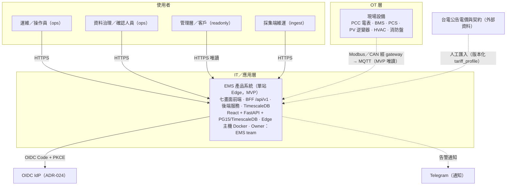
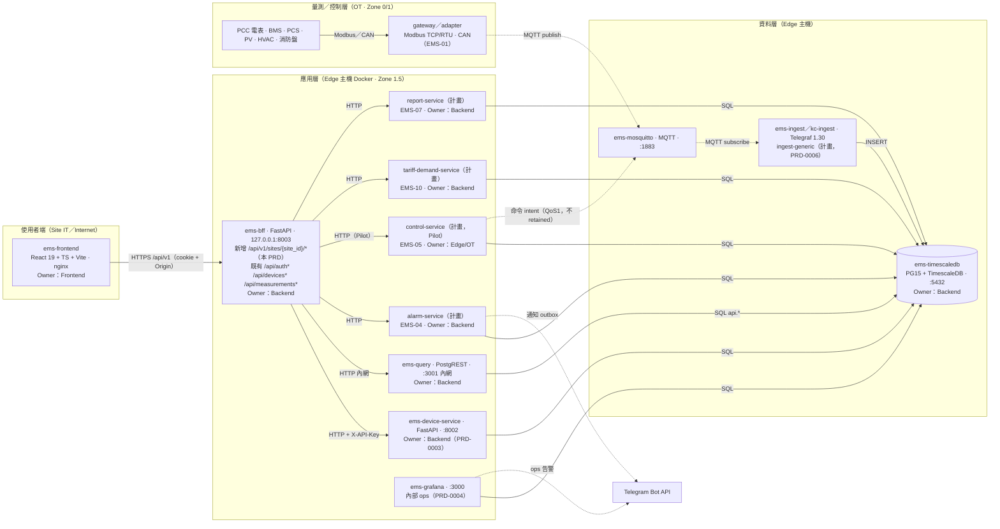
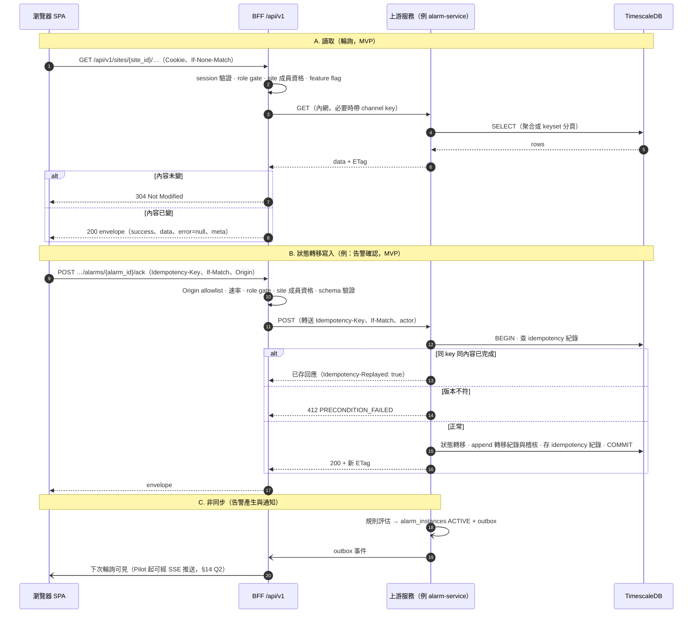
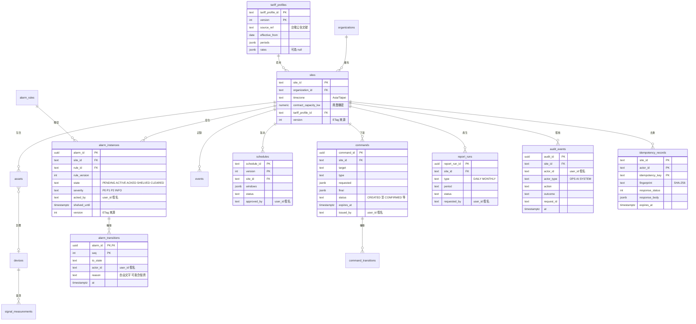

<!-- SKELETON (scratchpad draft 2026-09-23): fill every [FROM-MAPPING] marker from API-MAPPING.md Part 3, then delete this comment before writing to doc/prd/. -->
# PRD-0017：七畫面操作台資料 API 缺口 — 後端產品 API 需求

| 欄位 | 內容 |
|------|------|
| 狀態 | **Draft v1**（2026-09-23；未經 architect／security-reviewer 審查，見 §15.B）|
| 起案日期 | 2026-09-23 |
| 最後修訂 | 2026-09-23 v1：初稿；缺口端點取自 `API-MAPPING.md` Part 3（[FROM-MAPPING：文件版本／日期]）|
| 對應決策紀錄 | owner 決策（2026-09-23）：編號 PRD-0017；BFF namespace `/api/v1/sites/{site_id}/…`，第一版即 site-scoped（單站）；envelope `{success, data, error:{code,message}, meta}`；事件與時序清單採 cursor 分頁；寫入採 `Idempotency-Key` + `If-Match`；既有 `/api/devices*`、`/api/measurements*` 不變（遷移列 §14 Q1）；本階段不派審查 agent |
| 取代 / 補充 | **補充** [PRD-0005](PRD-0005-ems-frontend.md)（前端消費端；Approved 鎖定，本 PRD 不修改其主體）。需求歸屬之模組 PRD（EMS-02/04/05/07/10，暫定 PRD-0008/0010/0011/0013/0016）尚未立案；立案時以引用方式承接本 PRD 之 FR |
| 相依 ADR | [ADR-023](../adr/ADR-023-bff-session-and-role-channel-key-authz.md)、[ADR-024](../adr/ADR-024-bff-auth-oidc-first-argon2id-fallback.md)、[ADR-025](../adr/ADR-025-measurement-product-facade.md)、[ADR-026](../adr/ADR-026-bff-device-create-update-facade.md)；鎖定時之新決策自 ADR-029 起（ADR-027／028 已由 PRD-0005 Wave 3 計畫預留；§14 Q10）|
| 邊界釐清 | 本 PRD = 後端產品 API 需求（BFF `/api/v1` 對瀏覽器契約 + 上游能力相依）；七畫面 UI 規格、互動與視覺不在本 PRD |

---

## 1. Overview & Context

### 1.1 問題陳述

七畫面操作台（能源總覽 · 即時監控 · 需量管理 · 儲能管理 · 警報中心 · 設備分析 · 報表中心）的資料需求超出現有後端契約。瀏覽器目前僅能經 BFF 取得設備管理、人工確認、單裝置量測與登入（PRD-0005）；操作台所需之能源流、15 分鐘需量、儲能狀態、告警生命週期、報表與稽核資料皆無產品 API，底層亦缺 site 模型、時序聚合、告警狀態與控制服務（§1.4）。缺乏正式需求時，後端無法估算與排程，前端只能以示意資料呈現，產品停留於 Dev/Demo（[架構草案](../architecture/ems-edge-cloud-platform-architecture.md) §0、§1.2）。

### 1.2 約束條件

- 保護權威在 BMS／PCS／保護電驛；EMS 為監督式控制；瀏覽器與 BFF 不得直寫 field bus（架構草案 §3.1）。
- PRD-0005 §9 已鎖定：BFF 強制、session cookie、Origin CSRF、role→channel key；瀏覽器不直連 PostgREST／MQTT／Modbus。
- MVP 為單站唯讀：非致動寫入（例：告警確認）可於 MVP；致動設備之命令屬 Pilot 且以 HIL 為前置（架構草案 §9.1、§16）。
- 無任何台電費率數值；所有金額僅能為估算，不得作計費依據。
- API 變更遵循 [api-contract-governance](../governance/api-contract-governance.md)（semver、CHANGELOG、drift gate）；可調參數遵循 project_rules §19。
- 時程前提 7–8 FTE／12 個月（架構草案 §0）；2–3 人需 18–24 個月。

### 1.3 現況盤點（2026-09-23 查證）

| 面向 | 現況 | 來源 |
|------|------|------|
| 瀏覽器可達 API | BFF `127.0.0.1:8003`：`/api/auth/*`（本地＋OIDC）、`/api/devices*`（清單／詳情／signals／human-review／confirm／override／reject／corrections）、`/api/devices/{id}/measurements`（ADR-025）、`/api/measurements/{domain}`（legacy）；無 `/api/v1` | `services/bff/bff/routes/` |
| 回應慣例 | bare JSON；錯誤 `{"detail": …}`；未知 query 參數 422；上游 401/403→502 | 同上；ADR-023 |
| 契約文件 | `api/openapi.yml` 1.3.0 僅含 Simulator／Query／Grafana／Device Service，**無 BFF 路由**；drift gate 僅比對 Device Service tag | `tests/contract/test_openapi_drift.py` |
| Session／角色 | cookie `ems_bff_session`（HttpOnly、Secure、SameSite=Strict；idle 30 min、上限 8 h）；角色 `ops`／`ingest`／`readonly`，`readonly` 無 channel key | `bff/config.py`、`bff/roles.py` |
| 量測儲存 | 寬表 `electricity_measurements`、`factory_measurements`；窄表 `signal_measurements`（PRD-0006）未建，migration 最大 015；無 continuous aggregate | `infra/timescaledb/migrations/` |
| 告警 | Grafana provisioned 4 群 10 條（功率、管線健康、分類安全、預算）→ Telegram；無產品告警狀態 | `infra/grafana/provisioning/alerting/rules.yaml` |
| 可觀測性 | BFF 無 metrics、request_id、trace | `services/bff/bff/main.py` |

### 1.4 後端能力相依（D1–D12）

| # | 相依能力 | 現況 | 影響畫面 | 歸屬模組（暫定 PRD）|
|---|---------|------|---------|------------------|
| D1 | Organization／Site 範疇 | DB/API 無 site 欄位；`devices.device_id` 全域主鍵 | 全部 | EMS-02（0008）|
| D2 | BESS／PCS／PV／PCC 產品級遙測 | 僅模擬電表與 KC 工廠；無 BMS／PCS／PV adapter | 能源總覽、即時監控、儲能管理 | EMS-01/03（0007/0009）＋ PRD-0006 |
| D3 | 時序聚合（1 min／15 min／1 h／1 d）| 無 continuous aggregate；Grafana 以即時 SQL 聚合 | 能源總覽、即時監控、需量管理、報表中心 | EMS-03/10（0009/0016）|
| D4 | 產品告警生命週期 | 僅 Grafana 規則；無 ACKED／SHELVED 狀態與歷史 | 警報中心、能源總覽 | EMS-04（0010）|
| D5 | 監督式控制／命令生命週期 | 無 control-service；MCP 直寫僅限 dev | 儲能管理、報表中心（命令紀錄）| EMS-05（0011）|
| D6 | 排程版本化 | 無資料模型 | 儲能管理 | EMS-05/10（0011/0016）|
| D7 | 電價與契約容量資料 | 無費率數值；無契約容量欄位 | 需量管理、能源總覽、報表中心 | EMS-10（0016）|
| D8 | 報表產生與匯出 | 無報表服務與匯出 | 報表中心、即時監控 | EMS-07（0013）|
| D9 | 產品稽核 | `device_audit_log`（migration 014）僅涵蓋 device-service 事件 | 報表中心 | EMS-09（0015）＋各模組 |
| D10 | 產品 RBAC | 僅 channel role（ops／ingest／readonly）| 全部寫入端點 | EMS-09（0015）|
| D11 | 即時推送 | 無；PRD-0005 §14 Q3 預設輪詢 | 能源總覽、即時監控、警報中心 | EMS-06（0012）|
| D12 | 裝置通訊健康與可用率 | 有 `last_seen_at` 與 stale 軟旗標（ADR-010）；無可用率統計 | 設備分析 | EMS-01/03（0007/0009）|

> 各缺口端點之相依以 D 編號標註於 §4 與 §15.A [FROM-MAPPING]。端點上線階段 = 其相依能力中最晚就緒者（§12.1）。

### 1.5 上下游與端點統計

- 上游：device-service（PRD-0003）、PostgREST（內網）、TimescaleDB、Grafana 告警（過渡期來源）、各模組服務（計畫）。
- 下游：七畫面前端；TS client 由 `api/openapi.yml` 以 `npm run gen:api`（openapi-typescript）生成，禁止手刻型別（api-contract-governance §4）。
- 統計：widget [FROM-MAPPING: N_WIDGETS]；已對應既有端點 [FROM-MAPPING: N_MAPPED]；缺口端點 [FROM-MAPPING: N_GAP]（依畫面：[FROM-MAPPING]）。

---

## 2. Goals / Non-Goals

### Goals

| ID | 目標 | 驗收指標 |
|----|------|---------|
| G1 | 單一產品 API 面 | 七畫面所需資料 100% 經 BFF `/api/v1/sites/{site_id}/…` 或既有 BFF 路由取得；瀏覽器不呼叫其他 origin 或內網服務 |
| G2 | 缺口需求完整 | [FROM-MAPPING: N_GAP] 個缺口端點各有 FR-17xx，§4.10 模板欄位齊備 |
| G3 | 一致契約 | 所有 `/api/v1` 回應符合 §8.2 envelope；錯誤碼屬 §8.2 目錄；事件與時序清單採 §8.3 cursor 分頁 |
| G4 | 安全寫入 | 所有 POST 具 `Idempotency-Key`；修改既有資源具 `If-Match`；重放第二次副作用 = 0；每筆寫入有稽核（§5）|
| G5 | 可追溯 | 每個 widget → 端點 → FR → 模組 → 階段 → 測試案例（§15.A）|
| G6 | 可量化效能 | §5 各端點類別之 p99 與新鮮度目標於負載測試達標 |

### Non-Goals

- 不規範七畫面 UI、互動與視覺（前端範圍；UI 範圍歸屬見 §14 Q12）。
- MVP 不開放致動設備之命令（P/Q、啟停、模式）；此類端點屬 Pilot，以 EMS-05 control-service 與 HIL 為前置。
- 不提供台電費率數值；API 輸出之金額不作計費依據。
- 不讓 AI／最佳化器直接產生命令（架構草案 §2.3、§8.3）。
- 不修改既有 `/api/auth*`、`/api/devices*`、`/api/measurements*` 之路徑、回應形狀、錯誤格式與分頁。
- 不在本 PRD 修改 `api/openapi.yml`、程式碼或 DB schema；契約隨各實作 PR 同步（§12.4）。
- 不實作多站 UI／fleet 視圖；API 先 site-scoped，多站由 EMS-02／07 承接。
- 不取代 Grafana 內部 ops 觀測與告警（PRD-0004）。
- 不涉售電契約。

---

## 3. User Stories & Personas

### 3.1 Personas 與角色對照

| Persona | 目前 session role | 目標 product role（架構草案 §11.1）| 主要畫面 |
|---------|------------------|-------------------------------|---------|
| 運維／操作員 | `ops` | operator | 全部 |
| 資料治理／確認人員 | `ops` | maintainer | 設備分析 |
| 管理層／客戶（唯讀）| `readonly` | viewer | 能源總覽、需量管理、報表中心 |
| 採集端維運 | `ingest` | maintainer | 即時監控、設備分析 |
| 調度員（Pilot 起）| —（EMS-09）| dispatcher | 儲能管理 |
| 稽核人員（Pilot 起）| —（EMS-09）| auditor | 報表中心（稽核）|

### 3.2 User Stories（畫面層級）

| 畫面 | 使用者故事 | 階段 |
|------|-----------|------|
| 能源總覽 | 管理層要一眼看到電網、太陽能、儲能、負載之即時功率，本月最高需量對契約容量，系統狀態與本日負載曲線，以判斷場域是否正常 | MVP |
| 即時監控 | 運維要選量測點、指標、時間範圍與彙總粒度查詢歷史並匯出 CSV，以排查異常 | MVP |
| 需量管理 | 能源管理者要看 15 分鐘需量對契約容量、本月最高需量、時間電價時段與電費估算（僅顯示）| MVP |
| 儲能管理 | 運維要看 SOC／SOH、運轉模式、排程與實際功率、BMS／PCS 狀態與保護門檻；調度員要編修排程並送出受控命令 intent | MVP 讀／Pilot 寫 |
| 警報中心 | 運維要看進行中告警、確認（ACK ≠ 清除）、查閱 runbook 與 7 日歷史；並可擱置（有期限與理由）| MVP 確認／Pilot 擱置 |
| 設備分析 | 運維與資料治理要看設備 KPI、清單（生命週期、通訊品質、最後上線、可用率）與 AI 確認佇列 | MVP |
| 報表中心 | 管理層要產生並下載日報／月報；稽核人員要查詢稽核與命令紀錄 | MVP 查詢／Pilot 稽核匯出 |

> 每則故事對應之 FR 見 §15.A [FROM-MAPPING]。

### 3.3 目標 permission 與第一版角色對照（EMS-09 前以 role 實作）

| permission | ops | ingest | readonly | 階段 |
|-----------|:---:|:------:|:--------:|------|
| `site.read`、`telemetry.read`、`demand.read`、`bess.read`、`schedule.read`、`alarm.read` | ✓ | ✓ | ✓ | MVP |
| `device.read`（OT 連線端點欄位僅 ops）| ✓ | ✓ | ✓ | MVP |
| `device.review`（既有 FR-510–513）| ✓ | — | — | MVP |
| `alarm.ack` | ✓ | — | — | MVP |
| `export.create`（時序 CSV）| ✓ | ✓ | — | MVP |
| `report.read`、`report.generate` | ✓ | — | ✓ | MVP |
| `audit.read`、`command.read` | ✓ | — | — | MVP |
| `alarm.shelve` | ✓ | — | — | Pilot |
| `schedule.edit`、`schedule.deploy`、`command.pcs.setpoint` | —（dispatcher）| — | — | Pilot |
| `command.approve`（雙人覆核）| —（dispatcher／site_admin）| — | — | Production |

> 每個端點最終之角色閘以 §4 FR 與 §8.11 為準 [FROM-MAPPING]。`readonly` 之讀取路徑受 ADR-023（無 channel key）限制，見 §14 Q3。

---

## 4. Functional Requirements

> 編號 FR-17xx（PRD-0017 命名空間）。〔MVP／Pilot／Prod〕為 §12 階段；〔S／M／L〕為工作量級；〔EMS-0x〕為歸屬模組；〔D#〕為 §1.4 相依。

### 4.0 編號與分組

| 區段 | 內容 |
|------|------|
| FR-1700–1709 | 共通需求（§4.1，已定稿）|
| FR-1710–1719 | 能源總覽 [FROM-MAPPING] |
| FR-1720–1729 | 即時監控 [FROM-MAPPING] |
| FR-1730–1739 | 需量管理 [FROM-MAPPING] |
| FR-1740–1749 | 儲能管理 [FROM-MAPPING] |
| FR-1750–1759 | 警報中心 [FROM-MAPPING] |
| FR-1760–1769 | 設備分析 [FROM-MAPPING] |
| FR-1770–1779 | 報表中心 [FROM-MAPPING] |
| FR-1780–1789 | 跨畫面共用／即時傳輸 [FROM-MAPPING] |
| FR-1790–1799 | 溢位保留 |

規則：同一端點只編一次（歸主要消費畫面），其他消費畫面於 §15.A 追溯；區段溢位時自 FR-1790 續編並註記原畫面。

### 4.1 共通需求（FR-1700–1709）

- **FR-1700 Namespace 與 site 範疇**〔MVP,M,EMS-02,D1〕：所有新端點位於 `/api/v1/sites/{site_id}/…`，`site_id` 符 `^[a-zA-Z0-9_-]{1,64}$`；第一版僅一個 site（§14 Q4）。請求之 site 不在 session 可存取集合 → 404 `NOT_FOUND`（不揭露存在與否）。端點依 §12.1 階段以 feature flag 開放，未開放 → 403 `FEATURE_DISABLED`。**驗收**：他 site_id → 404；未開放端點 → 403；既有 `/api/devices*` 回歸測試全綠。
- **FR-1701 回應 envelope 與錯誤模型**〔MVP,S〕：`/api/v1` 所有回應（304 除外）為 §8.2 envelope；`error.code` 屬 §8.2 目錄；`error.message` 不含上游主機、SQL、金鑰（T-25）。**驗收**：每端點之成功回應與每個已列錯誤皆通過 envelope schema 測試；未預期錯誤回 500 `INTERNAL_ERROR` 或 502 `UPSTREAM_ERROR`。
- **FR-1702 Cursor 分頁**〔MVP,M〕：事件類清單（告警、事件、稽核、命令、報表執行紀錄）與時序點序列採 §8.3 keyset cursor；清單 `limit` 預設 50、上限 200；時序每序列每頁 ≤ 5,000 點。**驗收**：並發插入下逐頁走訪無重複、無缺漏（property test）；竄改 cursor 或變更過濾條件 → 422 `INVALID_CURSOR`。
- **FR-1703 時序查詢語意**〔MVP,M,EMS-03,D3〕：參數 `from`／`to`／`resolution`／`agg`／`signals` 依 §8.4；15 分鐘以上粒度以 site 時區對齊；超出 §8.7 範圍上限 → 422 `RANGE_TOO_LARGE`，`error.details` 列出可用粒度。**驗收**：15 分鐘桶邊界為 :00／:15／:30／:45（Asia/Taipei）；每點帶品質；超範圍回 422。
- **FR-1704 Idempotency-Key**〔MVP,M〕：所有 POST（建立資源或觸發轉移）必帶 `Idempotency-Key`（UUID）；語意依 §8.5。**驗收**：同 key 同內容重送 → 相同狀態碼與 body 並帶 `Idempotency-Replayed: true`；同 key 異內容 → 422 `IDEMPOTENCY_KEY_REUSED`；處理中重送 → 409 `IDEMPOTENCY_IN_PROGRESS`；缺 key → 400 `IDEMPOTENCY_KEY_REQUIRED`；N 個並發同 key 請求恰產生一次副作用。
- **FR-1705 ETag 與 If-Match**〔MVP,S〕：可變更資源之 GET 回強 `ETag`；PATCH 與對既有資源之轉移（例：`…/ack`）必帶 `If-Match`。**驗收**：缺 → 428 `PRECONDITION_REQUIRED`；不符 → 412 `PRECONDITION_FAILED`；GET 帶 `If-None-Match` 且未變 → 304。
- **FR-1706 認證、授權與 CSRF**〔MVP,M,EMS-09,D10〕：沿用 BFF session（ADR-023／024）；每端點宣告允許 role 與目標 permission（§3.3）；mutating 方法經 Origin allowlist（T-23）；actor 一律取自 session，body 內 actor 欄位拒收；OT 連線端點欄位僅對 `ops` 回傳。**驗收**：role × 端點負向矩陣全數 403；無 Origin 之寫入 → 403 `CSRF_ORIGIN_REJECTED`；body 帶 actor → 422；`readonly` 回應不含 OT 連線端點欄位。
- **FR-1707 速率與資源上限**〔MVP,S〕：依 §8.7 分類限制；超限 429 `RATE_LIMITED` 並附 `Retry-After`；上限值登錄 `doc/governance/tunable-parameters.md`（project_rules §19）。**驗收**：超限回 429 且 `Retry-After` > 0；上限可經設定調整且重啟生效。
- **FR-1708 值的來源、品質與估算標示**〔MVP,M,EMS-03,D2〕：量測值以 §8.4 value object 回傳（值、單位、品質、來源時間、擷取時間、年齡）；`meta.data_class` 標示 `LIVE`／`SAMPLE`；金額以 §8.2 money object 回傳且 `is_estimate=true`。**驗收**：示意資料集回 `SAMPLE`；所有金額 `is_estimate=true` 並帶 `basis`；缺來源時間者 `quality=UNCERTAIN`、`quality_reason=TIME_FALLBACK`。
- **FR-1709 寫入稽核**〔MVP,M,EMS-09,D9〕：上游完成或拒絕（409／412）之每筆寫入寫一筆 append-only `audit_events`（actor、site、action、resource、outcome、request_id、idempotency key 雜湊）；BFF 層拒絕（401／403／422／429）記入結構化 log 與 metrics（§10）；重放不重複寫稽核。**驗收**：成功寫入數 = 稽核筆數（invariant query）；稽核表對應用 role 不可 UPDATE／DELETE；重放後稽核筆數不變。

### 4.2 能源總覽（FR-1710–1719）

[FROM-MAPPING] 依 API-MAPPING.md Part 3 填入，每條依 §4.10 模板。

### 4.3 即時監控（FR-1720–1729）

[FROM-MAPPING]

### 4.4 需量管理（FR-1730–1739）

[FROM-MAPPING]

### 4.5 儲能管理（FR-1740–1749）

[FROM-MAPPING]

### 4.6 警報中心（FR-1750–1759）

[FROM-MAPPING]

### 4.7 設備分析（FR-1760–1769）

[FROM-MAPPING]

### 4.8 報表中心（FR-1770–1779）

[FROM-MAPPING]

### 4.9 跨畫面共用／即時傳輸（FR-1780–1789）

[FROM-MAPPING]

### 4.10 端點 FR 模板

- **FR-17xx <端點名稱>**〔<MVP／Pilot／Prod>,<S／M／L>,<EMS-0x>,<D#>〕：`<METHOD> /api/v1/sites/{site_id}/<path>`。目的：<…>（消費：<畫面> · <widget>）。角色：<ops／ingest／readonly>（permission `<…>`）。參數：<…>。回應 `data`：<欄位：型別（單位）>。類別與節奏：<R1／R2／R3／W1／W2／X；輪詢秒數>。錯誤：<§8.2 代碼>。分頁：<cursor／無>。**驗收**：AC-1 …；AC-2 …。詳卡：§8.12（或附錄）。

---

## 5. Non-Functional Requirements

> 端點類別：**R1** 即時摘要讀取（最新值、狀態卡）· **R2** 時序查詢（每序列 ≤ 2,000 點之典型頁）· **R3** 事件清單分頁（≤ 100 筆）· **W1** 狀態轉移寫入（例：告警確認）· **W2** 命令 intent 受理（Pilot 起）· **X** 匯出／報表（非同步 job）。延遲量測點為 BFF 入口至出口。階段對照 [nfr.md](../governance/nfr.md)：MVP／Pilot ≈ POC，Production ≈ Prod。

| 維度 | 指標 | Demo | MVP／Pilot | Production | 量測方式 |
|------|------|------|-----------|------------|---------|
| 延遲 | R1 p99 | < 1 s | < 500 ms | < 200 ms | BFF histogram |
| 延遲 | R2 p99 | < 2 s | < 1 s | < 500 ms | 同上 |
| 延遲 | R3 p99 | < 1 s | < 500 ms | < 300 ms | 同上 |
| 延遲 | W1 p99（含 commit）| < 1 s | < 500 ms | < 300 ms | 同上 |
| 延遲 | W2 受理 p99 | — | < 500 ms | < 500 ms | command trace（架構草案 §13.2）|
| 完成時間 | X 單站月報 p95 | < 120 s | < 60 s | < 30 s | job metric |
| 新鮮度 | 即時值 age（1 s 來源、GOOD）| ≤ 10 s | ≤ 5 s | ≤ 5 s | `api_data_age_seconds` |
| 新鮮度 | 15 分鐘區間結束至可查 | ≤ 60 s | ≤ 30 s | ≤ 30 s | cagg refresh lag |
| 更新節奏 | 建議輪詢（§8.8）| 即時 5 s／清單 15–30 s／聚合 60 s | 同左 | 同左；SSE 視 §14 Q2 | 前端設定 |
| 吞吐 | `/api/v1` QPS（單實例）| 5 | 50 | 200 | 負載測試（nfr.md §2）|
| 可用性 | `/api/v1` 月度 SLO | 99.0% | 99.5% | 99.9% | nfr.md §3 查詢 API |
| 錯誤率 | 5xx 比例（月）| < 1% | < 0.5% | < 0.1% | metrics |
| 可恢復性 | BFF 重啟至恢復服務 | < 5 min | < 5 min | < 1 min（多實例＋Redis session）| 演練 |
| 正確性 | 同 key 重放之第二次副作用 | 0 | 0 | 0 | property test |
| 正確性 | 寫入缺稽核 | 0 | 0 | 0 | invariant query |
| 前端 | LCP／操作回應（PRD-0005 §5）| < 2.5 s／< 200 ms | 同左 | 同左 | web-vitals |

---

## 6. System Architecture

> 圖例（Guideline §3.1）：實線 = 同步呼叫；虛線 = 非同步（MQTT、通知、outbox）；OT／IT 與部署區以 subgraph 區隔；元件標註技術選型、部署位置、Owner。

### 6.1 Context Diagram（C4 Level 1）



### 6.2 Container Diagram（C4 Level 2）



| 容器 | 技術 | 部署位置 | Owner | 狀態 |
|------|------|---------|-------|------|
| ems-bff（擴充 `/api/v1`）| Python / FastAPI | Edge 主機，127.0.0.1:8003 | EMS team（Backend）| 既有，擴充 |
| alarm-service | Python / FastAPI（暫定）| Edge 主機 | EMS team（Backend，EMS-04）| 計畫 |
| control-service | 依 EMS-05 定案 | Edge 主機（Site Controller）| EMS team（Edge/OT，EMS-05）| 計畫，Pilot |
| tariff-demand-service | Python / FastAPI（暫定）| Edge 主機 | EMS team（Backend，EMS-10）| 計畫 |
| report-service | Python / FastAPI（暫定）| Edge 主機 | EMS team（Backend，EMS-07）| 計畫 |

> 服務名稱與拆分方式（獨立容器或併入既有服務）由各模組 PRD 定案；本 PRD 只約束 BFF `/api/v1` 對瀏覽器之契約與上游所需能力。

### 6.3 Data Flow Diagram



### 6.4 OT／IT 邊界與通訊協定矩陣（Guideline §11.1）

| 層 | 元件 | `/api/v1` 可否觸及 | 界線 |
|----|------|------------------|------|
| 量測層（OT，Zone 0/1）| 電表、BMS、PCS、PV、HVAC、消防盤、gateway／adapter | 否，僅經 historian 間接讀取 | 瀏覽器與 BFF 不進 OT VLAN；消防／EPO 僅監看、不遠端復歸 |
| 控制層（Zone 1.5）| Site Controller／control-service（EMS-05）| 僅提交命令 intent（Pilot 起）| 夾箝、到期、互鎖、read-back 在控制層執行（架構草案 §3.2、§8.2）|
| 應用層（Zone 1.5／2／3）| BFF、各服務、TimescaleDB、SPA | 是 | HTTPS REST `/api/v1`；SSE（Pilot 候選）|

| 協定 | 用途 | 與本 PRD 關係 |
|------|------|--------------|
| Modbus TCP／RTU | 電表、PCS、HVAC | 間接（adapter → historian）|
| CAN 2.0B | BMS↔PCS、BCU↔Edge | 間接（EMS-01）|
| SunSpec Modbus | PV、PCS | 間接 |
| MQTT（現況 v3.1.1；目標 v5）| 站內事件匯流排；命令 intent（Pilot，QoS1、不 retained）| 間接（上游服務）|
| OCPP 1.6／2.0.1 | EV 充電樁 | 不在範圍 |
| IEC 61850／104、OPC UA、BACnet | 依合約／案場 | 不在範圍 |
| HTTPS REST（JSON）| 瀏覽器 ↔ BFF `/api/v1` | **本 PRD 契約** |
| SSE | 即時推送 | Pilot 候選（§14 Q2）|
| OIDC Code + PKCE | 登入（ADR-024）| 沿用 |

---

## 7. Data Model

> 本節定義 `/api/v1` 所需之邏輯實體與約束；實體表之最終 schema 由歸屬模組 PRD 定案，migration 依 ADR-020。

### 7.1 ER Diagram



### 7.2 實體約束、保留期與 PII

| 實體 | PK | 唯一索引 | FK | 寫入語意 | 保留期 | PII | 歸屬 |
|------|----|---------|----|---------|-------|-----|------|
| sites | site_id | — | organization_id、tariff_profile_id | 版本號更新（ETag）| 永久 | 無（契約容量為商業機密）| EMS-02 |
| assets | asset_id | (site_id, external_ref) | site_id、device_id | 版本號更新 | 永久 | 無 | EMS-02 |
| devices（既有）| device_id | 遷移目標 UNIQUE(site_id, external_device_id) | — | 既有（PRD-0003）| 既有 | 無 | PRD-0003 |
| signal_measurements | —（hypertable）| 索引 (device_id, signal_name, time DESC) | 不加 FK（PRD-0006）| append-only | Edge raw ≥ 90 d | 無 | PRD-0006／EMS-03 |
| alarm_rules | (rule_id, version) | — | — | 不可變版本 | 永久 | 無 | EMS-04 |
| alarm_instances | alarm_id | (site_id, rule_id, source_ref) WHERE state ≠ CLEARED | site_id、rule_id | 狀態列＋版本號；轉移另存 | Edge ≥ 12 月；Cloud 3–7 年待合約 | acked_by（假名）| EMS-04 |
| alarm_transitions | (alarm_id, seq) | — | alarm_id | append-only | 同上 | actor_id；reason 自由文字 | EMS-04 |
| events | event_id | — | site_id | append-only | 同上 | 無 | EMS-04 |
| commands | command_id | (site_id, issued_by, idempotency_key) | site_id | 狀態列；轉移 append-only | 同上 | issued_by（假名）；reason | EMS-05 |
| command_transitions | (command_id, seq) | — | command_id | append-only | 同上 | actor_id | EMS-05 |
| schedules | (schedule_id, version) | 每 site 至多一個 ACTIVE | site_id | 不可變版本；切換 active 指標 | 永久 | approved_by（假名）| EMS-05／10 |
| tariff_profiles | (tariff_profile_id, version) | — | — | 不可變版本；依 effective_from 選版 | 永久 | 無（商業機密）| EMS-10 |
| report_runs | report_run_id | — | site_id | 僅狀態欄可更新；產物不可變 | 產物 ≥ 13 月（§14 Q6）| requested_by（假名）| EMS-07 |
| audit_events | audit_id | — | site_id | append-only（WORM-like）| Edge ≥ 12 月；Cloud 3–7 年待合約 | actor_id（假名）| EMS-09 |
| idempotency_records | (site_id, actor_id, idempotency_key) | — | site_id | insert-once；到期清除 | 24 h（可調）| actor_id | 各寫入服務 |

- **PII 最小化**：產品表僅存假名化 `user_id`；顯示名稱與 email 僅存於身分來源（BFF 本地憑證或 IdP），於讀取時解析，不寫入產品表與 log。自由文字欄（擱置理由、命令理由）限長 500 字元、純文字渲染，視為可能含個資。
- **不可變優先**（Guideline §3.2、§4.1）：告警與命令之轉移、事件、稽核皆 append-only；排程、電價、告警規則為不可變版本，部署僅切換 active 指標。

### 7.3 時序資料（Guideline §3.2、§11.1）

| 來源 | 取樣 | API 可查聚合層級 | 保留（Edge／Cloud）| 壓縮 |
|------|------|----------------|------------------|------|
| PCC 電表：V、I、P、Q、PF、f、kWh | 1 s | raw、1 min、15 min、1 h、1 d | raw ≥ 90 d／聚合 13–36 月 | 7 d 後 columnstore（ADR-022）|
| BMS 摘要：SOC、SOH、cell Vmax／Vmin、Tmax／Tmin、允許充放電流、絕緣 | 1 s | 同上 | 同上 | 同上 |
| BMS 全 cell 陣列 | 5–10 s＋事件突發 | 本 API 不提供高頻陣列，僅下採樣摘要 | 依保固評估（架構草案 §7.4）| Parquet bundle（計畫）|
| PCS：模式、P、Q、V、f、DC | 1 s | raw、1 min、15 min、1 h、1 d | 同 PCC | 同上 |
| PV 逆變器：P、kWh | 1 s 或設備原生率 | 同上 | 同上 | 同上 |
| HVAC／環境／消防盤狀態 | 10 s 或 on-change | raw、1 min | 同上 | 同上 |
| 15 分鐘需量（衍生）| — | 15 min | 聚合 13–36 月 | — |

- **15 分鐘需量**：PCC 受電有效功率於固定 15 分鐘區間之平均，區間對齊 site 時區 :00／:15／:30／:45；進行中區間標 `is_complete=false`；本月最高需量取當月已完成區間最大值，僅供顯示與估算，計費以台電電表為準。
- **聚合**：以 TimescaleDB continuous aggregate 實作 1 min／15 min／1 h／1 d，時間桶依 site 時區對齊；聚合列帶品質摘要（`coverage_ratio` 與最差品質）。
- **時間**：儲存 UTC；API 輸出 ISO 8601（`Z`）；顯示時區由 `sites.timezone` 決定。
- **前置缺口**：PRD-0006 FR-601 窄表未含 `quality`、`source_time`、`acquired_time`、`ingested_time`（架構草案 §7.1–7.2 要求）→ §14 Q7；補齊前 API 對缺欄資料回 `quality=UNCERTAIN`、`quality_reason=TIME_FALLBACK`。
- **現況**：僅寬表 1 s 資料；壓縮未啟用（nfr.md §5 Dev／Demo）；無聚合。

### 7.4 遷移原則

- 依 ADR-020：實作當下取 `infra/timescaledb/migrations/` 最大號 +1（目前 015；PRD-0006 預定 016）；expand → migrate → contract。
- append-only 表之 CHECK／約束變更採 forward-fix，不回滾（同 PRD-0006 §12）。
- 既有 `devices.device_id` 全域主鍵之 site 化遷移屬 EMS-02，本 PRD 不執行。

---

## 8. API Contract

### 8.1 通則

- Base：`/api/v1/sites/{site_id}`；`site_id` 符 `^[a-zA-Z0-9_-]{1,64}$`（同 FR-322 樣式）。
- 格式：`application/json; charset=utf-8`；欄位 snake_case；時間 ISO 8601 UTC（`Z`）；數值為 JSON number；金額為整數 TWD。
- 列舉：回應中之狀態列舉值大寫（例 `ACTIVE`、`GOOD`）；查詢參數 token 小寫（例 `resolution=15m`）。所有列舉視為開放列舉，生成 client 必須有 unknown 分支（api-contract-governance §3）。
- 語言：`error.message` 為開發者用英文短句；UI 以 `error.code` 對應 i18n 文案（PRD-0005 FR-531）。
- 單位：量測以 §8.4 value object 之 `unit` 或欄位名後綴（`_kw`、`_kvar`、`_kwh`、`_v`、`_a`、`_hz`、`_pct`、`_c`）明示；同一端點不混用兩種表示。
- 每個端點標註（Guideline §3.3）：冪等性、重試策略、速率類別、認證方式（§8.12）。

### 8.2 Envelope、錯誤目錄與 money object

```json
{
  "success": true,
  "data": {},
  "error": null,
  "meta": {
    "request_id": "0192a6c4-7f3e-7c1a-9d2b-5e8f1a2b3c4d",
    "site_id": "site-001",
    "generated_at": "2026-09-23T06:32:05Z",
    "data_class": "LIVE",
    "next_cursor": null,
    "has_more": false,
    "limit": 50
  }
}
```

```json
{
  "success": false,
  "data": null,
  "error": { "code": "PRECONDITION_FAILED", "message": "resource version mismatch" },
  "meta": { "request_id": "0192a6c4-7f3e-7c1a-9d2b-5e8f1a2b3c4d", "site_id": "site-001", "generated_at": "2026-09-23T06:32:05Z" }
}
```

| meta 欄位 | 型別 | 出現時機 | 說明 |
|----------|------|---------|------|
| `request_id` | string（UUIDv7）| 必有 | 伺服器產生，同 `X-Request-ID` 回應標頭；不採用用戶端提供值 |
| `site_id` | string | 必有 | |
| `generated_at` | string（date-time）| 必有 | |
| `data_class` | `LIVE`／`SAMPLE` | 資料端點必有 | `SAMPLE` 時 UI 必須標示示意資料 |
| `next_cursor`、`has_more`、`limit` | string／null、boolean、integer | 清單 | §8.3 |
| `total` | integer／null | 選用 | 僅有界集合且計算成本低時提供 |

`error.details`（選用陣列，元素 `{field, issue}`）僅用於 `VALIDATION_FAILED` 與 `RANGE_TOO_LARGE`。

| HTTP | `error.code` | 條件 | 用戶端重試 |
|------|-------------|------|-----------|
| 400 | `IDEMPOTENCY_KEY_REQUIRED` | POST 缺 `Idempotency-Key` 或非 UUID | 否 |
| 400 | `BAD_REQUEST` | JSON 無法解析、Content-Type 錯誤 | 否 |
| 401 | `UNAUTHENTICATED` | session 無效或過期 | 否（重新登入）|
| 403 | `CSRF_ORIGIN_REJECTED` | mutating 請求之 Origin 不在 allowlist | 否 |
| 403 | `FORBIDDEN` | role／permission 不足 | 否 |
| 403 | `FEATURE_DISABLED` | 端點所屬階段或 feature flag 未開放 | 否 |
| 404 | `NOT_FOUND` | 資源或 site 不存在或不可存取（兩者不區分）| 否 |
| 409 | `STATE_CONFLICT` | 狀態機不允許之轉移（例：CLEARED 後確認）| 否 |
| 409 | `IDEMPOTENCY_IN_PROGRESS` | 同 key 請求仍在處理 | 是（退避）|
| 412 | `PRECONDITION_FAILED` | `If-Match` 與目前版本不符 | 否（重讀後重新決定）|
| 422 | `VALIDATION_FAILED` | 參數或 body 驗證失敗（含未知 query 參數、body 內 actor 欄位）| 否 |
| 422 | `INVALID_CURSOR` | cursor 竄改、過期或與過濾條件不符 | 否（重新查詢）|
| 422 | `RANGE_TOO_LARGE` | 時間範圍超過 §8.7 上限 | 否（改粒度）|
| 422 | `IDEMPOTENCY_KEY_REUSED` | 同 key 不同請求內容 | 否 |
| 428 | `PRECONDITION_REQUIRED` | 需 `If-Match` 而未提供 | 否 |
| 429 | `RATE_LIMITED` | 超出 §8.7 速率；附 `Retry-After` | 是（依 `Retry-After`）|
| 500 | `INTERNAL_ERROR` | 未預期錯誤（不含內部細節）| 是（退避；GET 或帶 Idempotency-Key 之寫入）|
| 502 | `UPSTREAM_ERROR` | 上游錯誤或非預期回應（含上游 401／403，ADR-023）| 同上 |
| 503 | `SERVICE_UNAVAILABLE` | 上游不可達或斷路器開啟（§12.3）| 同上 |
| 504 | `UPSTREAM_TIMEOUT` | 上游逾時（BFF `upstream_timeout_s` = 10 s）| 同上 |

重試策略：GET 與帶 `Idempotency-Key` 之寫入可重試，指數退避 1 s／2 s／4 s（加 jitter），最多 3 次；429 依 `Retry-After`；其餘 4xx 不重試。

**Money object**（所有金額）：

```json
{ "amount": 672000, "currency": "TWD", "is_estimate": true, "basis": "tariff_profile:tp-demo@1" }
```

`is_estimate` 在本 PRD 範圍內恆為 `true`；`basis` 指出所用 tariff_profile 版本或估算方法；無可用 tariff_profile 時金額欄為 `null`，不得以預設費率補值。

### 8.3 Cursor 分頁

- 請求：`?limit=<1..200>&cursor=<opaque>`；首頁不帶 cursor；`order` 預設 `desc`（最新在前），可選 `asc`；排序鍵為 (時間, id) keyset。
- 回應：`meta.next_cursor`（無下一頁為 `null`）、`meta.has_more`、`meta.limit`。
- cursor：base64url、≤ 512 字元、HMAC-SHA256 簽章（金鑰由環境變數注入，禁止硬編碼），內含排序鍵、過濾條件雜湊與到期時間（預設 24 h）；竄改、到期或過濾條件變更 → 422 `INVALID_CURSOR`。
- 一致性：keyset 分頁；首頁之後新增之資料不造成後續頁重複或缺漏；不提供 offset。
- 時序點：每序列每頁 ≤ 5,000 點，超過以 `next_cursor` 續取（§8.4）。

### 8.4 時序查詢與量測值

| 參數 | 型別 | 必填 | 說明 |
|------|------|------|------|
| `from` | date-time | 是 | 含 |
| `to` | date-time | 是 | 不含；須 > `from` |
| `resolution` | `raw`／`1m`／`15m`／`1h`／`1d` | 是 | 對應 §7.3 聚合層級 |
| `agg` | `avg`／`min`／`max`／`last`／`sum` | 否（預設 `avg`）| `raw` 時忽略 |
| `signals` | CSV | 依端點 | 端點定義之 allowlist；未列者 422 |
| `limit`、`cursor` | | 否 | §8.3 |

```json
{
  "series": [
    {
      "signal": "active_power", "unit": "kW", "resolution": "15m", "agg": "avg",
      "points": [["2026-09-23T00:00:00Z", 212.4, "GOOD"], ["2026-09-23T00:15:00Z", null, "STALE"]]
    }
  ]
}
```

- 點為 `[time, value, quality]`；時間為桶起點；缺值 `value=null` 並附品質。
- **Measured value object**（即時值）：`{"value": 186.0, "unit": "kW", "quality": "GOOD", "quality_reason": null, "source_time": "…Z", "acquired_time": "…Z", "age_s": 1.2}`。
- `quality`：`GOOD`／`UNCERTAIN`／`BAD`／`STALE`／`SUBSTITUTED`（架構草案 §7.2）；`quality_reason` 為開放列舉（例 `TIME_FALLBACK`、`COMM_LOSS`、`RANGE`）。
- canonical 單位：`kW`、`kvar`、`kVA`、`kWh`、`V`、`A`、`Hz`、`%`（SOC、SOH）、`1`（功率因數，0–1）、`°C`、`%RH`、`kΩ`、`TWD`。

### 8.5 冪等與並行控制

- **Idempotency-Key**（draft-ietf-httpapi-idempotency-key-header）：所有 POST 必帶；值為 UUID（RFC 9562）；作用範圍 (site_id, actor_id, key)；紀錄保留 24 h（可調）；內容指紋 = SHA-256(method、route 樣板、正規化 JSON body)。紀錄由**執行副作用之上游服務**保存，與副作用同一交易提交；BFF 只轉送標頭。
- **ETag／If-Match**（RFC 9110）：可變更資源以版本號產生強 ETag（例 `"v17"`）；集合與摘要端點以內容雜湊產生弱 ETag（`W/"…"`），僅供 `If-None-Match` 輪詢；PATCH 與對既有資源之 POST 轉移必帶 `If-Match`，缺 → 428（RFC 6585），不符 → 412。
- **處理順序**（決定回傳哪個錯誤）：① session（401）→ ② Origin（403 `CSRF_ORIGIN_REJECTED`）→ ③ 速率（429）→ ④ role（403 `FORBIDDEN`）→ ⑤ site 成員資格（404）→ ⑥ feature flag（403 `FEATURE_DISABLED`）→ ⑦ 標頭與 schema（400／422）→ ⑧ 上游 idempotency 查詢（重放、409、422）→ ⑨ If-Match（428／412）→ ⑩ 狀態機（409 `STATE_CONFLICT`）→ ⑪ 執行＋稽核＋存 idempotency 紀錄（同交易）。
- 重放優先於版本檢查：同 key 同內容之重送回原成功結果，即使資源版本已變。

### 8.6 認證、授權與 CSRF

- 認證：沿用 BFF session（ADR-023／024：cookie `ems_bff_session`、HttpOnly、Secure、SameSite=Strict、idle 30 min、上限 8 h）；`/api/v1` 不接受 bearer token 或 API key。
- 授權：每端點宣告允許 role 與目標 permission（§3.3）；BFF 端點級 `require_roles` 加上游之資源歸屬驗證（site、資源 id）。
- channel key：僅 BFF 伺服器側持有；`readonly` 無 key（ADR-023），其上游讀取路徑見 §14 Q3。
- CSRF：所有 mutating 方法經 Origin allowlist（`public_origins`）加 SameSite=Strict（T-23）；同源部署，不開 CORS。
- actor：一律由 session 決定；request body 不得含 actor／user 欄位（422）。
- 欄位級過濾：OT 連線端點（IP:port、protocol endpoint、register 資訊）僅 `ops` 可見。

### 8.7 速率與資源上限（皆可調，實作時登錄 tunable-parameters）

| 類別 | 適用 | 預設上限 | 參數（邏輯名）|
|------|------|---------|-------------|
| read | 所有 GET | 每 session 300 次／分 | `api_v1_rate_read_per_min` |
| write | POST／PATCH（匯出與報表除外）| 每 session 30 次／分 | `api_v1_rate_write_per_min` |
| export | 匯出、報表產生 | 每 session 10 次／時；每 site 同時 ≤ 3 個 job | `api_v1_rate_export_per_hour`、`api_v1_export_max_concurrent` |
| stream | SSE 連線（Pilot 候選）| 每 session ≤ 2 | `api_v1_stream_max_per_session` |

| 資源上限 | 預設 | 參數（邏輯名）|
|---------|------|-------------|
| 清單 `limit` | 預設 50、上限 200 | `api_v1_list_default_limit`、`api_v1_list_max_limit` |
| 時序點（每序列每頁）| 5,000 | `api_v1_ts_page_points` |
| 每請求序列數 | 8 | `api_v1_ts_max_series` |
| 時間範圍上限 | raw 6 h · 1m 31 d · 15m 400 d · 1h 5 y · 1d 10 y | `api_v1_ts_max_range_<resolution>` |
| request body | 64 KiB | `api_v1_max_body_bytes` |
| 回應大小（壓縮前）| 4 MiB | `api_v1_max_response_bytes` |
| DB statement timeout | 5 s | `api_v1_db_statement_timeout_ms` |
| 上游逾時 | 10 s（既有）| `upstream_timeout_s` |
| cursor 有效期 | 24 h | `api_v1_cursor_ttl_s` |
| Idempotency 紀錄保留 | 24 h | `api_v1_idempotency_ttl_s` |

### 8.8 快取、輪詢與即時傳輸

- GET 回 `ETag` 與 `Cache-Control: private, no-cache`；帶 `If-None-Match` 且未變 → 304（無 body）。
- 建議輪詢：即時值 5 s；清單 15–30 s；聚合 60 s；頁面隱藏時停止輪詢（前端責任）。
- SSE（Pilot 候選，§14 Q2）：`GET /api/v1/sites/{site_id}/stream`，事件 `alarm.changed`、`summary.updated`；同 session cookie 認證；每 session ≤ 2 條連線。

### 8.9 版本與既有路由

- `/api/v1` 為主版本；新增端點、選填欄位或列舉值 = openapi MINOR（api-contract-governance §2–3）；破壞性變更 = `/api/v2` 加 MAJOR，舊版以 `Deprecation`（RFC 9745）與 `Sunset`（RFC 8594）標頭公告並至少保留一個 release。
- 既有 `/api/auth*`、`/api/devices*`、`/api/measurements*` 維持現狀（路徑、bare 回應、`{"detail"}` 錯誤、limit／offset 與 ADR-025 `since／limit／order`）；是否及何時遷入 `/api/v1` 見 §14 Q1。

### 8.10 OpenAPI 落點（實作 PR 執行，本 PRD 不修改 `api/openapi.yml`）

- 新 tag `Product API (BFF)`；server `http://127.0.0.1:8003`；securityScheme `bffSession`（`type: apiKey`、`in: cookie`、`name: ems_bff_session`）。
- 共用 components：`Envelope`（以 `allOf` 包 `data`）、`EnvelopeMeta`、`ErrorObject`、`Money`、`MeasuredValue`、`TimeSeries`。
- 端點延伸欄位：`x-prd: PRD-0017`、`x-fr`、`x-phase`、`x-rate-class`、`x-idempotency-key: required|n/a`、`x-if-match: required|n/a`。
- drift gate 擴充至 BFF：比對 BFF `create_app().openapi()` 與 `Product API (BFF)` 子集（架構草案 §10.1）；version-bump gate 與 `api/CHANGELOG.md` 沿用。
- 前端 client：`npm run gen:api` 重新生成。

### 8.11 端點目錄

> 路徑欄省略前綴 `/api/v1/sites/{site_id}`。統計：[FROM-MAPPING: N_GAP] 個缺口端點（MVP [FROM-MAPPING]／Pilot [FROM-MAPPING]／Production [FROM-MAPPING]）。

| FR | 方法 | 路徑 | 畫面 | 角色 | 類別 | 分頁 | Idempotency-Key | If-Match | 階段 | 模組 |
|----|------|------|------|------|------|------|-----------------|----------|------|------|
| [FROM-MAPPING] | | | | | | | | | | |

### 8.12 端點詳卡模板

> 若主檔超過 800 行（Guideline §4.2），詳卡移至 `PRD-0017-appendix-endpoint-catalog.md`，本節保留目錄表。

#### FR-17xx｜`<METHOD> /api/v1/sites/{site_id}/<path>`

| 項目 | 內容 |
|------|------|
| 目的／消費畫面 · widget | [FROM-MAPPING] |
| 角色（MVP）／目標 permission | |
| Path／Query／Body 參數 | 名稱、型別、必填、範圍、預設 |
| 回應 `data` schema | 欄位、型別、單位、可為 null |
| 類別與節奏 | R1／R2／R3／W1／W2／X；建議輪詢秒數 |
| 效能目標 | 依 §5 類別 |
| 錯誤 | §8.2 代碼清單 |
| 分頁／envelope | cursor 或無；`meta` 特殊欄位 |
| 冪等性 | GET 安全；POST 需 Idempotency-Key；轉移需 If-Match |
| 重試策略 | §8.2 |
| 速率類別 | §8.7 |
| 認證方式 | BFF session cookie（`bffSession`）|
| 上線階段／相依 | MVP／Pilot／Prod；D# |
| 歸屬模組 | EMS-0x（暫定 PRD-00xx）|
| 驗收準則 | AC-1 … |
| 測試案例 | TC-17xx-n |

---

## 9. Security & Privacy

### 9.1 威脅（STRIDE；提議 T-27–T-35，Approved 時登錄 `doc/governance/threat-model.md`）

| 提議 ID | 類別 | 威脅 | 緩解 |
|--------|------|------|------|
| T-27 | Elevation（BOLA）| 以他站 site_id 或資源 id 讀寫（多站後）| site 成員資格＋資源歸屬驗證；EMS-02 RLS；跨站一律 404 |
| T-28 | Elevation（BFLA）| `readonly`／`ingest` 呼叫寫入端點 | 端點級 `require_roles`＋permission 對照；負向測試矩陣 |
| T-29 | Tampering／Repudiation | 重放或競態造成重複副作用或覆寫他人變更 | Idempotency-Key＋If-Match＋append-only 稽核 |
| T-30 | Tampering（CSRF）| 跨站觸發 `/api/v1` 寫入 | 沿用 T-23：SameSite=Strict＋Origin allowlist 涵蓋所有 mutating 方法 |
| T-31 | DoS | 大範圍時序查詢或匯出耗盡 DB | §8.7 範圍、點數、大小上限；statement timeout；速率限制 |
| T-32 | Information Disclosure | 錯誤訊息或 cursor 洩漏內部結構 | `error.message` 不含上游細節（T-25）；cursor HMAC 簽章且不含明文條件 |
| T-33 | Information Disclosure | 匯出檔外流 PII／商業機密；CSV injection | 欄位 allowlist；匯出稽核；儲存格跳脫（§9.5）；下載需 session |
| T-34 | Tampering（控制）| 經 `/api/v1` 繞過控制層直寫 field bus | 架構禁止：`/api/v1` 無直寫路徑；命令僅 intent → EMS-05 夾箝＋read-back（Pilot）|
| T-35 | Spoofing | 偽造命令或確認之 actor | actor 由 session 決定；body 內 actor 欄位 422 |

### 9.2 資料分級

| 等級 | 內容 | 處置 |
|------|------|------|
| 內部 | 即時量測、聚合、設備清單、告警 | 需 session；`Cache-Control: private` |
| 商業機密 | 契約容量、電價設定、電費估算、場域名稱與位置、報表 | 依 §3.3 角色；匯出稽核 |
| 個資（PII）| user_id 與顯示名稱／email 之對應（身分來源）、稽核 actor、自由文字理由 | 產品表僅存假名 user_id；讀取時解析名稱；log 不記 email 與理由原文 |
| OT 敏感 | 協定端點、IP:port、register map、gateway 拓樸 | 僅 `ops` 可見；不經 `readonly` 回應 |

### 9.3 OWASP API Security Top 10（2023）對照

| 項目 | 對策 |
|------|------|
| API1 BOLA | T-27 |
| API2 Broken Authentication | 沿用 session（T-22）與 OIDC（ADR-024）|
| API3 Broken Object Property Level Authorization | 回應欄位依角色 allowlist（OT 欄位僅 ops）；body 不接受 actor 與系統欄位 |
| API4 Unrestricted Resource Consumption | §8.7 |
| API5 BFLA | T-28 |
| API6 Unrestricted Access to Sensitive Business Flows | 匯出、報表、命令之速率與（Pilot 起）核可流程 |
| API7 SSRF | 不接受任何 URL 型輸入；匯出目的地由伺服器決定 |
| API8 Security Misconfiguration | 沿用 PRD-0005 §9.5 security headers；同源、不開 CORS |
| API9 Improper Inventory Management | BFF 納入 openapi drift gate（§8.10）|
| API10 Unsafe Consumption of APIs | 上游回應經 schema 驗證後才包裝；上游 401／403→502 |

### 9.4 法規對應（Guideline §11.1）

| 法規／規範 | 相關端點群 | 要求 |
|-----------|-----------|------|
| 台電電價（時間電價三段式、契約容量、15 分鐘需量、超約加倍計收、功率因數調整）| 需量管理、能源總覽、報表中心 | 費率來自版本化 tariff_profile（含公告文號），無預設值；金額恆為估算（§8.2）；需量定義同 §7.3；非計費依據 |
| 台電併聯規範 | 儲能管理（Pilot 命令）| MVP 唯讀；EMS 不變更保護設定；命令經 EMS-05 夾箝（架構草案 §3.2）|
| 儲能調度（含補助執行率 ≥ 80% 規則）| 儲能管理、報表中心 | 排程版本化、執行紀錄可稽核；執行率計算定義由 EMS-10 定案 |
| 售電契約 | — | 不在範圍（Non-Goal）|
| 個資法 | 稽核、告警確認、命令、報表 | 假名化、最小化、保留期依合約（§14 Q6）、存取紀錄；Prod 前完成盤點（nfr.md §9）|
| IEC 62443（OT／IT 分區）| 全部 | 瀏覽器與 BFF 不進 OT；命令僅經控制層（§6.4）|

### 9.5 其他

- Security headers、XSS 防護沿用 PRD-0005 §9.5；自由文字一律純文字渲染。
- 匯出（CSV／PDF）：以 `=`、`+`、`-`、`@`、Tab、CR 開頭之儲存格加前綴跳脫；檔頭記 `generated_at`、`request_id`；`Content-Disposition: attachment` 與 `X-Content-Type-Options: nosniff`。
- 無硬編碼密鑰：cursor HMAC 金鑰、channel key 由環境變數／secret 注入（Guideline §4.4）。

---

## 10. Observability

### 10.1 Log

- 結構化 JSON（Guideline §4.5；nfr.md §7 POC 起）。欄位：`ts`、`level`、`request_id`、`trace_id`、`route`（樣板）、`method`、`status`、`error_code`、`latency_ms`、`site_id`、`actor_id`（假名）、`role`、`upstream`、`upstream_status`、`idempotency_replayed`。
- 禁止記錄：cookie、channel key、email、顯示名稱、自由文字理由原文（僅記長度）、request body 原文。

### 10.2 Metrics（黃金訊號，Prometheus）

| 訊號 | metric | 標籤 |
|------|--------|------|
| Latency | `bff_api_request_duration_seconds`（histogram）| route、method |
| Traffic | `bff_api_requests_total` | route、method、status_class |
| Errors | `bff_api_errors_total` | route、error_code |
| Saturation | `bff_upstream_inflight`、`bff_sse_connections`（Pilot）、DB pool 使用率 | upstream |
| 領域 | `api_data_age_seconds`、`bff_idempotency_replays_total`、`bff_precondition_failed_total`、`bff_rate_limited_total`、`report_job_duration_seconds` | source、route、class |

低基數原則：標籤不含 user、request_id；MVP 單站不加 site_id 標籤。

### 10.3 Trace

- OpenTelemetry；BFF 以 W3C `traceparent` 傳至上游；寫入 100% 取樣，讀取 10%（可調）。

### 10.4 告警與 Runbook

| 告警 | 條件 | 等級 | Runbook（實作時寫入操作手冊）|
|------|------|------|---------------------------|
| API 錯誤率 | 端點群 5xx > 1% 持續 5 分鐘 | critical | 斷路器狀態、上游健康、§12.3 回滾 |
| API 延遲 | p99 > §5 目標持續 10 分鐘 | warning | 慢查詢、聚合 refresh、上游負載 |
| 資料新鮮度 | 即時來源 age > 60 s 持續 5 分鐘 | warning | ingest／adapter 管線 |
| 寫入不變式 | 稽核缺口或重複副作用（invariant query 每小時）| critical | 立即關閉寫入群 feature flag |
| 速率觸發 | 429 比例 > 5% 持續 10 分鐘 | info | 輪詢設定或濫用排查 |

通知沿用 Grafana → Telegram（PRD-0004 樣式），規則以 provisioning 管理。

---

## 11. Risks & Mitigations

| # | 風險 | 機率 | 衝擊 | 緩解措施 |
|---|------|:----:|:----:|---------|
| R1 | 後端能力前置（D1–D12）未就緒，端點僅能回示意資料 | H | H | 端點階段 = 相依最晚就緒者；`data_class=SAMPLE`；feature flag；追溯至模組 PRD |
| R2 | 無費率資料，NT$ 估算被誤讀為帳單 | H | M | tariff_profile 版本化且無預設值；金額恆 `is_estimate=true`＋`basis`；UI 標「估算」 |
| R3 | 新舊兩套慣例並存（`/api/devices*` bare vs `/api/v1` envelope），前端 client 分岔 | M | M | openapi 分 tag 生成；共用錯誤對應層；§14 Q1 遷移與 Deprecation 標頭 |
| R4 | Idempotency／If-Match 實作錯誤，造成重複確認、重複命令或覆寫 | M | H | 紀錄與副作用同交易；並發 property test；412／428 契約測試 |
| R5 | 大範圍時序查詢拖垮 DB | M | H | §8.7 範圍與點數上限；statement timeout；continuous aggregate |
| R6 | 多站上線後跨站外洩（BOLA）| L | H | 第一版即 site-scoped＋成員資格檢查；EMS-02 RLS；跨站負向測試 |
| R7 | BFF 契約未納入 drift gate（現僅 Device Service tag）| H | M | 第一個實作 PR 即擴充 drift gate；`x-prd`／`x-fr` 標註；CHANGELOG |
| R8 | 範圍蔓延至控制（MVP 即開放命令）| M | H | 致動類端點一律 Pilot，前置 EMS-05＋HIL；MVP 回 `FEATURE_DISABLED` |
| R9 | 示意資料被誤認為現場資料 | M | M | `data_class=SAMPLE`；UI 示意資料標記；示意資料集與正式 site 分離 |
| R10 | 七畫面輪詢負載（多 widget × 5 s）| M | M | 畫面級彙總端點 [FROM-MAPPING]；ETag／304；速率上限；Pilot SSE |
| R11 | `readonly` 無 channel key（ADR-023），新讀取端點缺合法上游路徑 | H | M | 內網唯讀 view（最小權限 DB role）或新增 read channel，以 ADR 決定（§14 Q3）|
| R12 | 窄表缺品質與時間欄位，UI 誤顯 GOOD | M | H | PRD-0006／EMS-03 補欄（§14 Q7）；缺欄時回 `UNCERTAIN`＋`TIME_FALLBACK` |
| R13 | CSV／報表匯出注入與資料外流 | M | M | 儲存格跳脫；匯出速率與大小上限；匯出稽核 |

---

## 12. Rollout & Migration Plan

### 12.1 階段對照（架構草案 §16）

| 階段 | 週次 | 本 PRD 交付 | 前置相依 |
|------|------|-----------|---------|
| Phase 0 | W0–4 | 本 PRD Reviewed；ADR 自 ADR-029（namespace／envelope／分頁、`readonly` 讀取路徑、即時傳輸）；OpenAPI 片段審定 | — |
| MVP（單站唯讀）| W5–16 | FR-1700–1709；各畫面讀取端點；告警確認；即時監控 CSV 匯出；報表查詢與產生 [FROM-MAPPING：端點清單] | D1（單站設定）、D2、D3、D4、D7（示意 tariff）、D8、D12 |
| Pilot（受控單站）| W17–32 | 告警擱置與升級、排程編修／模擬／部署、受控 P/Q／啟停命令 intent、稽核匯出、SSE（若採用）[FROM-MAPPING] | D5（EMS-05＋HIL）、D6、D10（MFA）、D11 |
| Production | W33–52 | 雙人覆核、多站、排程報表、最佳化建議（dry-run）[FROM-MAPPING] | EMS-07／08／09／10 |

規則：端點上線階段 = max（相依能力就緒階段，架構草案 §9.1 該模組階段）；致動類命令不得早於 Pilot。

### 12.2 部署策略（Guideline §6.1）

- **Feature Flag**（後端已部署、前端漸進開放）：依端點群（總覽／監控／需量／儲能／告警／設備／報表／寫入類）設開關，預設關閉；未開放回 403 `FEATURE_DISABLED`。
- BFF 與各服務以版本化 image 部署並保留前一版 tag；MVP 為單一 Edge 主機，不採 Canary／Blue-Green（單站無分流對象）；多站後以 site 為單位 Canary。
- 相依未就緒之端點不得以示意資料在正式 site 開放；示意資料僅限 Demo 環境（`data_class=SAMPLE`）。

### 12.3 回滾條件（Guideline §6.2）

| 類型 | 條件 | 動作 |
|------|------|------|
| 自動 | 某端點群 5xx > 1% 持續 5 分鐘 | BFF 斷路器將該群切為 503 `SERVICE_UNAVAILABLE`（前端顯示降級）並告警；連續 5 分鐘 < 0.1% 後恢復 |
| 自動 | 某上游逾時比例 > 20% 持續 1 分鐘 | 該上游斷路，處置同上 |
| 人工 | 端點群 p99 > 2 × §5 目標持續 10 分鐘 | on-call 評估；必要時關閉 feature flag 或回退 BFF image |
| 人工（立即）| 寫入不變式被破壞（重複副作用、缺稽核、跨站可見）| 立即關閉該寫入群 flag；事件處理；修正以 forward-fix migration 前進 |
| 不回滾 | 即時資料 age > 60 s 持續 5 分鐘 | UI 標示 STALE；依 runbook 排查 ingest／adapter |

### 12.4 EMS 同步義務（實作完成後）

- `api/openapi.yml`：新增 `Product API (BFF)` tag 與端點（§8.10）；`info.version` MINOR；`api/CHANGELOG.md` 一條；drift gate 擴充至 BFF。
- `doc/operations/容器速查表.md`：新增或變更之容器、port、健康檢查、回滾影響。
- `doc/operations/操作手冊.md`：feature flag 操作、回滾 SOP、§10.4 runbook、速率與冪等問題排查。
- `README.md`：`/api/v1` 概覽。
- 連帶：`doc/governance/tunable-parameters.md`（§8.7）、`risk-register.md`／`threat-model.md`（§11、§9.1 提議項於 Approved 時登錄）、`doc/architecture/c4-container.md`／`data-flow.md`（容器變更時）。
- 依據：Guideline §11.2、project_rules §3；PR 缺一不予合併。本 PRD 為 Draft 需求文件，不觸發同步（§15.B #6）。

---

## 13. Test Strategy

### 13.1 TDD 聲明

本 PRD 之實作採 RED → GREEN → REFACTOR（Guideline §7.2；project_rules §9）：每個 FR 先寫驗收或單元測試並確認失敗 → 以最小實作通過 → 綠燈下重構；未先寫測試之 PR 不予合併。

### 13.2 測試層級

| 層級 | 位置 | 內容 | 門檻 |
|------|------|------|------|
| Unit | `services/bff/tests`、各服務 unit | envelope 建構、錯誤對應、cursor 編解碼與竄改、ETag、idempotency 指紋、15 分鐘桶（Asia/Taipei）、單位／品質／估算序列化、速率限制器 | 行覆蓋 ≥ 80%（project_rules §10）|
| Integration | `tests/integration`（throwaway 容器）| role × 端點負向矩陣、site 成員資格、Origin CSRF、412／428、idempotency 重放與並發、keyset 分頁、`RANGE_TOO_LARGE`、statement timeout | 每個 FR ≥ 1 正向＋1 負向 |
| Contract | `tests/contract` | openapi ↔ BFF runtime drift（擴充）、version-bump gate、`npm run gen:api` 後 `tsc -b` | CI 必過 |
| E2E | Playwright（前端）| 七畫面 P0 流程 [FROM-MAPPING] | 每個 P0 流程 ≥ 1 |
| Property | Hypothesis | 同 key N 並發恰一次副作用；並發插入下分頁無重複與缺漏 | CI 必過 |
| Performance | 負載測試（工具實作時定）| §5 p99 與新鮮度目標；seed 30 天資料 | 發版前 |
| Security | Integration＋SAST | §9.3 對照、CSV injection、IDOR | 發版前 |

### 13.3 FR → 測試案例

| FR | 測試案例 | 層級 |
|----|---------|------|
| FR-1700 | TC-1700-1 他 site 404；TC-1700-2 未開放 403；TC-1700-3 既有路由回歸 | Integration |
| FR-1701 | TC-1701-1 成功 envelope schema；TC-1701-2 各錯誤 envelope；TC-1701-3 訊息不含上游細節 | Unit／Integration |
| FR-1702 | TC-1702-1 並發插入 keyset 無重複缺漏；TC-1702-2 竄改 cursor 422；TC-1702-3 換過濾條件 422 | Property／Integration |
| FR-1703 | TC-1703-1 15 分鐘桶對齊；TC-1703-2 超範圍 422 附建議；TC-1703-3 每點帶品質 | Unit／Integration |
| FR-1704 | TC-1704-1 重放同回應；TC-1704-2 異內容 422；TC-1704-3 處理中 409；TC-1704-4 缺 key 400；TC-1704-5 並發恰一次 | Property／Integration |
| FR-1705 | TC-1705-1 缺 If-Match 428；TC-1705-2 不符 412；TC-1705-3 未變 304 | Integration |
| FR-1706 | TC-1706-1 role 負向矩陣；TC-1706-2 無 Origin 403；TC-1706-3 body actor 422；TC-1706-4 readonly 無 OT 欄位 | Integration |
| FR-1707 | TC-1707-1 超限 429＋Retry-After；TC-1707-2 上限可設定 | Unit／Integration |
| FR-1708 | TC-1708-1 SAMPLE 標記；TC-1708-2 金額 is_estimate；TC-1708-3 TIME_FALLBACK | Unit |
| FR-1709 | TC-1709-1 寫入數 = 稽核筆數；TC-1709-2 稽核不可 UPDATE／DELETE；TC-1709-3 重放不重複稽核 | Integration |
| FR-1710 起 | [FROM-MAPPING] | |

### 13.4 測試資料

- 不使用正式環境資料；以合成資料為主，固定 seed 可重現（Guideline §7.3）。
- 示意資料集（契約容量 500 kW、本月最高需量 428 kW 等）標 `SAMPLE`，僅用於 Demo 與 E2E。
- 電價以標示「示意」之 tariff_profile fixture 測試，不引用任何真實費率。
- 上游服務以 contract test＋mock；時序以 1 s（近 24 h）加 1 min（30 天）混合 seed 控制資料量。

---

## 14. Open Questions

| # | 問題 | 建議預設 |
|---|------|---------|
| Q1 | 既有 `/api/devices*`、`/api/measurements*` 是否及何時遷入 `/api/v1/sites/{site_id}/…`？ | MVP 不動；Pilot 提供 `/api/v1` 對應端點並對舊路由加 `Deprecation` 標頭，至少保留一個 release；以 ADR 定案 |
| Q2 | 即時傳輸：MVP 輪詢（PRD-0005 §14 Q3）之後，Pilot 是否採 SSE（架構草案 §9.2）？ | Pilot 導入 SSE（告警、摘要）；以 ADR 定案 |
| Q3 | `readonly` 無 channel key（ADR-023），新讀取端點之上游路徑？ | 最小權限 DB role 之內網唯讀 view，或新增 read channel；以 ADR 定案 |
| Q4 | EMS-02 前之單站 `site_id` 來源？ | 設定值 `DEFAULT_SITE_ID`（例 `site-001`）＋BFF 驗證；EMS-02 上線後改由 `sites` 表 |
| Q5 | 電價與契約資料由誰匯入、依據哪份台電公告、更新流程？ | tariff_profile 人工匯入＋兩人覆核；API 金額恆為估算 |
| Q6 | 保留期：告警／事件／命令／稽核之 Cloud 年限（3–7 年）、報表產物、idempotency 24 h 是否足夠？ | 待合約；暫依 §7.2 |
| Q7 | 窄表品質與時間欄位（PRD-0006 FR-601 未含）由誰補？ | 修訂 PRD-0006 或併入 EMS-03 PRD |
| Q8 | 報表 PDF 產生位置（伺服器或前端列印）與 CSV 同步／非同步門檻？ | [FROM-MAPPING] |
| Q9 | BFF 契約納入 `api/openapi.yml` 與 drift gate 之實作批次？ | 第一個 `/api/v1` 實作 PR |
| Q10 | 鎖定時需 ADR 化之決策與編號？ | namespace／envelope／分頁、`readonly` 讀取路徑、即時傳輸；自 ADR-029 起（ADR-027／028 已由 Wave 3 計畫預留）|
| Q11 | 編號治理：PRD-0007 前向引用衝突（PRD-0006、BESS 狀態機草案、架構草案 §15）；ADR-027 重複預留 | 於 `doc/prd/README.md` 與 `doc/adr/README.md` 登錄保留區段 |
| Q12 | 七畫面 UI 範圍由哪份 PRD 核可？PRD-0005（Approved）Non-Goals 排除控制與告警引擎；暫定 PRD-0012 未立案 | 另立前端 PRD 或 PRD-0005 變更（走 ADR）|
| Q13 | 引用之架構草案與 Master Program Plan 未進版控（`doc/architecture/ems-edge-cloud-platform-architecture.md`、`doc/program/`）| 與本 PRD 同批提交，否則連結失效 |
| Q14 | 制度追蹤（僅記錄）：全域 guideline 與 repo 鏡像路徑差異——§3.3／§10 `doc/API.yaml` vs `api/openapi.yml`；§9 `docs/adr/` vs `doc/adr/`；§11.2 三項 vs 四項（含 `README.md`）；頁尾 PR 路徑 | 本 PRD 依 repo 實際路徑；鏡像不重新同步，留待制度檔維護處理 |
| [FROM-MAPPING] | API-MAPPING.md 所列之端點層級未決事項 | |

---

## 15. Appendix

### A. 追溯矩陣（畫面 → widget → 端點 → FR → 模組 → 階段 → 測試）

| 畫面 | widget | 端點（方法 路徑）| 既有／缺口 | FR | 相依 | 模組 | 階段 | 測試案例 |
|------|--------|----------------|-----------|----|------|------|------|---------|
| 能源總覽 | [FROM-MAPPING] | | | | | | | |
| 即時監控 | [FROM-MAPPING] | | | | | | | |
| 需量管理 | [FROM-MAPPING] | | | | | | | |
| 儲能管理 | [FROM-MAPPING] | | | | | | | |
| 警報中心 | [FROM-MAPPING] | | | | | | | |
| 設備分析 | [FROM-MAPPING] | | | | | | | |
| 報表中心 | [FROM-MAPPING] | | | | | | | |

### B. Guideline §10 PRD 品質自查

| # | 項目 | 狀態 | 依據／理由 |
|---|------|------|-----------|
| 1 | Goals 與 Non-Goals 清楚分離 | [x] | §2 |
| 2 | Functional Requirements 全部編號，可追蹤至測試案例 | [x] 共通 FR；[FROM-MAPPING] 端點 FR | §4、§13.3、§15.A |
| 3 | Non-Functional Requirements 全部量化 | [x] | §5 |
| 4 | 三張架構圖齊備（Context／Container／Data Flow）| [x] | §6.1–6.3（Mermaid）|
| 5 | Data Model 標註 PII 欄位與保留期 | [x] | §7.2 |
| 6 | API Contract 已同步至 `api/openapi.yml` | [ ] 延至各實作 PR | api-contract-governance §1：`api/openapi.yml` 為實際 REST 行為之單一真相，與實作不一致即為 bug，且受 drift／version gate 與 CHANGELOG 約束；Draft 階段寫入未實作端點會使規格描述不存在之行為。§8 為 OpenAPI 3.1 落點規格，隨實作 PR 同步（§12.4）；慣例同 PRD-0004／0005／0006 §12「實作完成後」|
| 7 | 風險登錄表至少列出 5 項 | [x] | §11（13 項）|
| 8 | 上線策略與回滾條件明確 | [x] | §12.2–12.3 |
| 9 | 測試策略涵蓋三層（Unit／Integration／E2E）| [x] | §13 |
| 10 | Open Questions 已列出未解事項 | [x] | §14 |
| 11 | 已通過 architect 與 security-reviewer agent 審查 | [ ] 未執行 | owner 決定（2026-09-23）本階段不派審查 agent；狀態維持 Draft；審查為 Draft → Reviewed 之前置 |

### C. Guideline §4 設計原則對照

| 原則 | 落實 |
|------|------|
| 4.1 不可變性 | 轉移、事件、稽核 append-only；排程、電價、告警規則為不可變版本；DTO 採 immutable model |
| 4.2 模組化 | 依業務領域切分上游服務；BFF 僅 facade；以 OpenAPI 契約為界 |
| 4.3 邊界輸入驗證 | 參數與 body schema 驗證；未知參數 422；上游回應驗證後才包裝 |
| 4.4 安全性 | §9；密鑰由環境變數／secret 注入 |
| 4.5 可觀測性 | §10：JSON log＋trace_id、黃金訊號、runbook |

### D. 參考文件

- `doc/PRD-架構設計-Guideline.md`（repo 鏡像；全域權威版本見 §14 Q14）；`project_rules.md` §3、§9、§15、§19
- [PRD-0003](PRD-0003-Device-Registry-Auto-Discovery.md)、[PRD-0004](PRD-0004-device-service-observability-alerting.md)、[PRD-0005](PRD-0005-ems-frontend.md)、[PRD-0006](PRD-0006-Generic-Measurement-Pipeline-Dynamic-Visualization.md)
- ADR-010、ADR-020、ADR-022、ADR-023、ADR-024、ADR-025、ADR-026
- `doc/governance/`：api-contract-governance、nfr、threat-model、risk-register、tunable-parameters
- [架構草案](../architecture/ems-edge-cloud-platform-architecture.md)（Working Draft）、[Master Program Plan](../program/EMS-BMS-Master-Program-Plan.md)（v0.1）
- `API-MAPPING.md`（設計交付物，非 repo 檔；§15.A 已完整轉錄）[FROM-MAPPING：版本]
- IETF draft-ietf-httpapi-idempotency-key-header；RFC 9110；RFC 6585；RFC 9562；RFC 9745；RFC 8594；OWASP API Security Top 10（2023）

### E. 變更紀錄

| 版本 | 日期 | 內容 |
|------|------|------|
| Draft v1 | 2026-09-23 | 初稿：共通 FR-1700–1709、NFR、架構圖、資料模型、API 慣例、安全、可觀測性、風險、上線、測試；畫面端點 FR 取自 API-MAPPING.md [FROM-MAPPING] |
